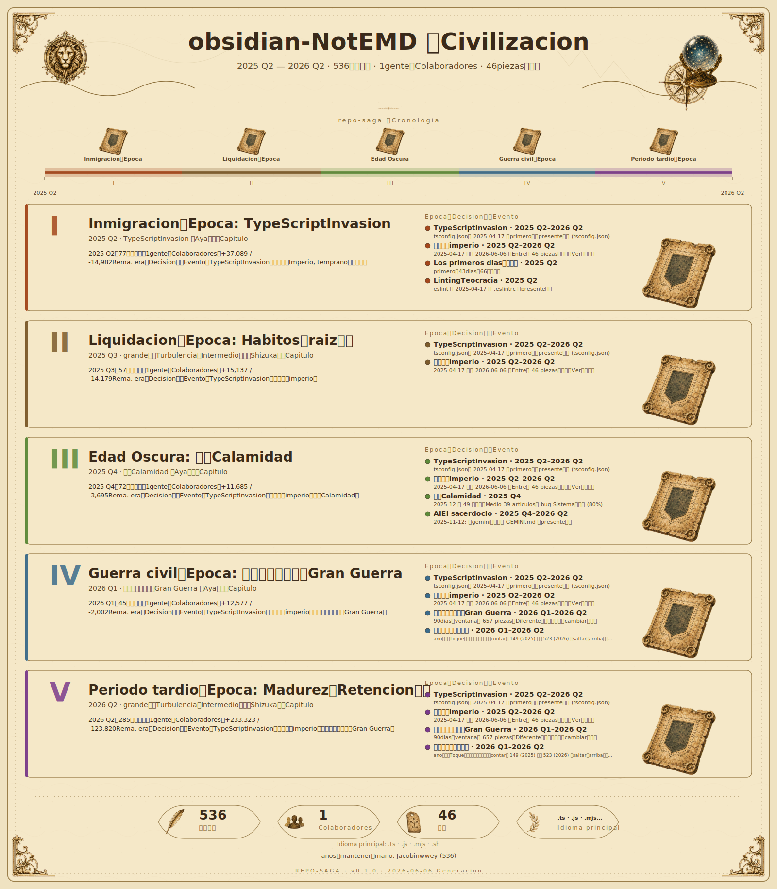

 	

[](https://discord.gg/qnGgsQ9W) 


# Obsidian用 Notemd プラグイン

[English](./README.md) | [Chino simplificado](./README_zh.md) | [Español](./README_es.md) | [Français](./README_fr.md) | [Deutsch](./README_de.md) | [Italiano](./README_it.md) | [Português](./README_pt.md) | [chino tradicional](./README_zh_Hant.md) | [japones](./README_ja.md) | [한국어](./README_ko.md) | [Русский](./README_ru.md) | [العربية](./README_ar.md) | [हिन्दी](./README_hi.md) | [বাংলা](./README_bn.md) | [Nederlands](./README_nl.md) | [Svenska](./README_sv.md) | [Suomi](./README_fi.md) | [Dansk](./README_da.md) | [Norsk](./README_no.md) | [Polski](./README_pl.md) | [Türkçe](./README_tr.md) | [עברית](./README_he.md) | [ไทย](./README_th.md) | [Ελληνικά](./README_el.md) | [Čeština](./README_cs.md) | [Magyar](./README_hu.md) | [Română](./README_ro.md) | [Українська](./README_uk.md) | [Tiếng Việt](./README_vi.md) | [Bahasa Indonesia](./README_id.md) | [Bahasa Melayu](./README_ms.md)

multilingueドキュメントのReferencia：[Idiomaセンター](./docs/i18n/README.md)

```
==================================================
  _   _       _   _ ___    __  __ ___
 | \ | | ___ | |_| |___|  |  \/  |___ \
 |  \| |/ _ \| __| |___|  | |\/| |   | |
 | |\  | (_) | |_| |___   | |  | |___| |
 |_| \_|\___/ \__|_|___|  | |  | |____/
==================================================
      AIConducirのmultilingueナレッジMejoraツール
==================================================
```

あなただけのConocimientoベースをfacilにcrearするMetodo！

Notemd は、さまざまなIdiomas a gran escalaモデル (LLM) とIntegracionすることで Obsidian のワークフローをMejoraし、multilingueノートのProcesamiento, mayorなConceptoにvs.する Wiki リンクのGeneracion y respuesta automaticaするConceptoノートのcrear、Web BuscarのEjecucionをApoyoし、poderosoなナレッジグラフのConstruccionをサポートします。

NotemdをMenteに入っていただけたら、[⭐ GitHubでスターを付ける](https://github.com/Jacobinwwey/obsidian-NotEMD)か[☕️ コーヒーをおごる](https://ko-fi.com/jacobinwwey)をごConsideracionください。

.9.0


## Tabla de contenidos

- [クイックスタート](#クイックスタート)
- [Idiomaサポート](#Idiomaサポート)
- [Funcion](#Funcion)
- [インストール](#インストール)
- [Configuracion](#Configuracion)
- [usoガイド](#usoガイド)
- [サポートされている LLM プロバイダー](#サポートされている-llm-プロバイダー)
- [ネットワークのusoとデータProcesamiento](#ネットワークのusoとデータProcesamiento)
- [トラブルシューティング](#トラブルシューティング)
- [Contribucion](#Contribucion)
- [メンテナー用ドキュメント](#メンテナー用ドキュメント)
- [ライセンス](#ライセンス)

## クイックスタート

1.  **インストールとActivacion**: Obsidian コミュニティマーケットプレイスからプラグインをObtenerします。
2.  **LLM のConfiguracion**: `Configuracion -> Notemd` にMoverし、LLM プロバイダー (OpenAI や Ollama などのローカルプロバイダー) をSeleccionし、API キー/URL をEntradaします。
3.  **サイドバーを開く**: Lado izquierdoのリボンにある Notemd magiaのbastonアイコンをクリックして、サイドバーを開きます。
4.  **ノートをProcesamiento**: ノートを開き、サイドバーの **「ファイルをProcesamiento (リンクAdicion)」** をクリックすると、Conceptos claveに `[[wiki-links]]` がAutomaticamenteにAdicionされます。
5.  **クイックワークフローをEjecucion**: デフォルトの **「One-Click Extract」** ボタンをusoして、Procesamiento, generacion de lotes.、Mermaid クリーンアップをワンストップでEjecucionします。

Completadoです！Web Busqueda, traduccion、コンテンツGeneracionなどのさらなるFuncionについてはConfiguracionをConfirmacionしてください。

## Idiomaサポート

### Contrato de comportamiento linguistico

| Articulo | Rango de control | デフォルト | Notas |
|---|---|---|---|
| `インターフェースIdioma` | プラグインインターフェースのテキストのみ (Configuracion、サイドバー、Notificacion、ダイアログ) | `auto` | Obsidian のIdiomaにseguirいます。Actualmenteの UI カタログは `en`, `ar`, `de`, `es`, `fa`, `fr`, `id`, `it`, `ja`, `ko`, `nl`, `pl`, `pt`, `pt-BR`, `ru`, `th`, `tr`, `uk`, `vi`, `zh-CN`, `zh-TW` です。 |
| `タスクIdioma de salida` | LLM によってGeneracionされるタスクSalida (リンク、Resumir, generar, extraer, traducir a) | `en` | Todas las configuraciones de la estacionまたは `タスクごとにDiferenteなるIdiomaをusoする` をValidoにしてタスクごとにConfigurableです。 |
| `Traduccion automaticaをDesactivar` | Aparte de la traduccionのタスクでTexto originalのContextoをRetencion | `false` | Explicitoな `Traduccion` タスクはEspecificacionされたIdioma de destinoをSolicitudしContinuacionけます。 |
| ロケールフォールバック | UI キーがDesaparecidoしているCasoのSolucion | locale -> `en` | AlgunosのキーがTraduccionされていないCasoでも UI のEstabilidadをMantenerします。 |

- MantenimientoしているソースDocumentosはinglesとChino simplificadoで、Publicadoみの README TraduccionはParte superiorヘッダーにリンクされています。
- アプリdentroの UI ロケールCorrespondenciaはActualmente、コードdentroのExplicitoなカタログとPartidoしています：`en`, `ar`, `de`, `es`, `fa`, `fr`, `id`, `it`, `ja`, `ko`, `nl`, `pl`, `pt`, `pt-BR`, `ru`, `th`, `tr`, `uk`, `vi`, `zh-CN`, `zh-TW`。
- inglesフォールバックはImplementacionのRed de seguridadとして残していますが、FijoみのVisibles UI はRegresionテストでGarantiaされており、Uso normalでinglesへSilencioって戻るべきではありません。
- DetallesおよびContribucionガイドラインは [Idiomaセンター](./docs/i18n/README.md) でGestionされています。

## Funcion

### AI ConducirのドキュメントProcesamiento
- **マルチ LLM サポート**: さまざまなクラウドおよびローカルの LLM プロバイダーにConexion (Detallesは [サポートされている LLM プロバイダー](#サポートされている-llm-プロバイダー) をReferencia)。
- **インテリジェント・チャンキング**: Procesamientoのために、Recuento de palabrasにbaseづいてgrandeきなドキュメントをManejableなパーツにAutomaticamenteにdividirします。
- **コンテンツのRetencion**: EstructuraとリンクをAdicionしつつ、元のFormatoをMantenerすることをObjetivoします。
- **Seguimiento del progreso**: Notemd サイドバーまたはProgresoモーダルをしたリアルタイムActualizacion。
- **キャンセルPosibleなOperacion**: Dedicadoのキャンセルボタンをして、サイドバーからempezarされたProcesamientoタスク (Individuoまたはa granel) をいつでもキャンセルできます。コマンドパレットのOperacionはキャンセルPosibleなモーダルをusoします。
- **マルチモデルConfiguracion**: タスク (リンクAdicion、リサーチ、タイトルからGeneracion, traduccion.) ごとにDiferenteなる LLM プロバイダー *および* Especificoのモデルをusoするか、すべてにSolteroのプロバイダーをusoします。
- **Estabilidadした API 呼び出し (リトライロジック)**: Fracasoした LLM API 呼び出しにvs.して、ConfigurableなEspaciadoとLimite de numero de intentosでReintento automaticoをオプションでValidoにできます。
- **レジリエントなプロバイダーConexionテスト**: primeroのテストがTemporalなCortarにEncuentroしたCaso、Notemd はFracasoする前にEstabilidadしたReintentarシーケンスにフォールバックするようになりました。OpenAI Compatibilidad、Anthropic、Google、Azure OpenAI、Ollama のトランスポートをカバーしています。
- **Entorno de ejecucionトランスポート・フォールバック**: `requestUrl` をしたMucho tiempoのリクエストが `ERR_CONNECTION_CLOSED` などのTemporalなネットワークエラーでCortarされたCaso、Notemd はConfiguracionされたReintentarループに入る前に、Especifico del entornoのフォールバックトランスポートをしてMismoじJuicioをReintentarするようになりました。デスクトップビルドは Node `http/https` をusoし、非デスクトップMedio ambienteはブラウザの `fetch` をusoします。これにより、Velocidad lentaなゲートウェイやリバースプロキシでのFalso positivoによるFracasoがDisminucionします。
- **OpenAI CompatibilidadのEstabilidadしたMucho tiempoリクエストチェーンのMejora**: Estabilidadモードでは、OpenAI Compatibilidadの呼び出しは、JuicioごとにExplicitoな 3 EtapaのOrden (プライマリDirectamenteストリーミング、SiguienteにDirecto noストリーミング、Siguienteに `requestUrl` フォールバック (NecesarioにRespuestaじてストリーミングAnalisisにアップグレードPosible)) をusoするようになりました。これにより、プロバイダーがバッファRespuestaをCompletadoしているがストリーミングパイプがinestableなCasoのErrorがDisminucionします。
- **Todos LLM API でのプロトコルCorrespondenciaストリーミングフォールバック**: Mucho tiempoのリクエストフォールバックJuicioは、OpenAI Compatibilidadエンドポイントだけでなく、すべてのgrupoみIncl.み LLM パスでプロトコルCorrespondenciaのストリーミングAnalisisにアップグレードされるようになりました。Notemd は、デスクトップ `http/https` と非デスクトップ `fetch` のAmbosで、OpenAI/Azure スタイルの SSE、Anthropic メッセージストリーミング、Google Gemini SSE Respuesta、および Ollama の NDJSON ストリームをProcesamientoし、残りの OpenAI スタイルのDirectamenteプロバイダーエントリポイントはMismoじcompartirフォールバックパスをReutilizarします。
- **Para Chinaけプリセット**: grupoみIncl.みプリセットにより、ExistenteのグローバルおよびローカルプロバイダーにCanadaえて、`Qwen`, `Qwen Code`, `Doubao`, `Moonshot`, `GLM`, `Z AI`, `MiniMax`, `Huawei Cloud MaaS`, `Baidu Qianfan`, `SiliconFlow` をカバーするようになりました。
- **FiabilidadのaltoいProcesamiento por lotes**: grandeきなa granelジョブ中のレートLimitacionesエラーをPrevencionぎ、Estabilidadしたパフォーマンスをseguroするために、**Gradualmenteな API 呼び出し**を備えたMejoraされたProcesamiento paraleloロジック。nuevoしいImplementacionでは、タスクがSimultaneamenteではなく、DiferenteなるEspaciadoでempezarされることがGarantiaされます。
- **PrecisoなProgresoレポート**: ProgresoバーがMovimientoかなくなるバグをModificacionし、UI がSiempreにOperacionのEn realidadのCondicionをReflexionするようにしました。
- **robustoなProcesamiento por lotes paralelo**: Operaciones masivas paralelasがEn caminoでDetenerするProblemaをSolucionし、すべてのファイルがCertezaかつEficienteにProcesamientoされるようにしました。
- **ProgresoバーのPrecision**: 「Wiki リンクのcrearとノートのGeneracion」コマンドのProgresoバーが 95% で止まるバグをModificacionし、Al finalizarに 100% が正しくPantallaされるようにしました。
- **Mejoraされた API デバッグ**: 「API エラーデバッグモード」は、LLM プロバイダーやBuscarサービス (Tavily/DuckDuckGo) からのcompletoなRespuestaボディをキャプチャするようになり、また、OpenAI、Anthropic、Google、Azure OpenAI、Ollama フォールバックでのトラブルシューティングをMejoraするために、サニタイズされたリクエスト URL、Tiempo transcurrido, respuestaヘッダー、ParcialなRespuestaボディ、AnalisisされたParcialなストリームコンテンツ、スタックトレースをContieneむJuicioごとのトランスポートタイムラインもログにRegistrosします。
- **Desarrolladorモードパネル**: ConfiguracionにSolo para desarrolladoresのDiagnosticoパネルがContieneまれるようになり、デフォルトではOcultarですが「Desarrolladorモード」をオンにするとPantallaされます。Llamada de diagnosticoび出しパスのSeleccionと、SeleccionしたモードでのRepetirりRegresoしEstabilidadプローブのEjecucionをサポートします。
- **Redisenoされたサイドバー**: grupoみIncl.みのアクションは、claroなラベル、ライブステータス、キャンセルPosibleなProgreso、およびコピーPosibleなログを備えたフォーカスされたセクションにグループ化され、サイドバーのcomplicadoさがMitigacionされました。Progreso/ログのフッターは、すべてのセクションがImplementacionされているときでもPantallaされたままになり、ListoステータスはよりclaroなEsperando progresoトラックをusoします。
- **サイドバーのインタラクションとLegibilidadのMejora**: サイドバーのボタンは、よりclaroなホバー/プレス/フォーカスのフィードバックをOfertaするようになり、colorearきの CTA ボタン (`One-Click Extract` や `Batch generate from titles` をContieneむ) は、テーマをPreguntaわずLegibilidadをaltoめるために強いテキストコントラストをusoするようになりました。
- **Solteroファイル用 CTA マッピング**: colorearきの CTA スタイルは、SolteroファイルアクションDedicadoになりました。a granel/フォルダレベルのアクションおよびMezclandoワークフローは、アクションのrangoにvs.するFalsoクリックをDisminucionらすために非 CTA スタイルをusoします。
- **カスタムワンクリックワークフロー**: grupoみIncl.みのサイドバーユーティリティを、ユーザーDefinicionのNombreとアセンブルされたアクションチェーンを持つReutilizableなカスタムボタンにConversionします。デフォルトの `One-Click Extract` ワークフローがIncorporadoされています。


### ナレッジグラフのMejora
- **Automatico Wiki リンク**: LLM のSalidaにbaseづいて、ProcesamientoされたノートdentroのConceptos claveをIdentificacionし、`[[wiki-links]]` をAdicionします。
- **Conceptoノートのcrear (オプションかつカスタマイズPosible)**: Especificacionされたヴォルトフォルダに、DescubrimientoされたConceptoのnuevoしいノートをAutomaticamenteにcrearします。
- **カスタマイズPosibleなSalidaパス**: ProcesadoみファイルとnuevoしくcrearされたConceptoノートをGuardarするために、ヴォルトdentroにIndividuoのRelativoパスをConfiguracionします。
- **カスタマイズPosibleなSalidaファイルNombre (リンクAdicion)**: リンクDurante el procesamientoに、デフォルトの `_processed.md` の代わりに、オプションで **元のファイルをSobrescribirき** するか、カスタムのサフィックス/Cuerda De Reemplazoをusoします。
- **リンクのMantener la integridad**: ヴォルトdentroでノートのNombreがCambiarされたりEliminarされたりしたときのリンクActualizacionのProcesamiento basico。
- **puroなExtraccion de conceptos**: 元のドキュメントをCambiarせずに、ConceptoをExtraccionしてCorrespondenciaするConceptoノートをcrearします。これは、ExistenteのドキュメントをCambiarせずにConocimientoベースをConstruccionするのにOptimoです。このFuncionには、MinimoのConceptoノートをcrearし、バックリンクをAdicionするためのConfigurableなオプションがあります。


### Traduccion

- **AI ConducirのTraduccion**:
    - Configuracionされた LLM をusoしてノートのContenidoをTraduccionします。
    - **Gran capacidadファイルサポート**: LLM にEnviarする前に、`チャンクRecuento de palabras` ConfiguracionにbaseづいてGran capacidadファイルをAutomaticamenteに小さなチャンクにdividirします。Traduccionされたチャンクは、そのPost-solteroのドキュメントにシームレスにUneteされます。
    - pluralのInterlenguaのTraduccionをサポート。
    - Configuracionまたは UI でカスタマイズPosibleなIdioma de destino。
    - lecturaみやすくするために、元のテキストのLado derechoにTraduccionされたテキストをAutomaticamenteに開きます。
- **Traduccion por lotes**:
    - SeleccionしたフォルダdentroのすべてのファイルをTraduccionします。
    - 「バッチParalelizacionをValidoにする」がオンのSi el procesamiento paraleloをサポート。
    - ConfiguracionされているCaso, traduccionにカスタムプロンプトをusoします。
	- ファイルエクスプローラーのコンテキストメニューに「このフォルダをTraduccion por lotes」オプションをAdicion。
- **Traduccion automaticaをDesactivar**: このオプションがオンのCasos distintos de la traduccionのタスクはSalidaをEspecificoのIdiomaにFuerzaしなくなり、元のIdiomaのContextoをRetencionします。Explicitoな「Traduccion」タスクは、ConfiguracionにseguirってTraduccionをEjecucionしContinuacionけます。


### Web リサーチとコンテンツGeneracion
- **Web リサーチとResumen**:
    - Tavily (API キーがNecesario) または DuckDuckGo (experimentales) をusoして Web BuscarをEjecucionします。
    - **MejoraされたBuscarのRobustez**: DuckDuckGo Buscarは、レイアウトのCambiarにCorrespondenciaし、FiabilidadのaltoいResultadosをseguroするために、MejoraされたAnalisisロジック (Regex フォールバックを備えた DOMParser) を備えています。
    - Configuracionされた LLM をusoしてResultados de la busquedaをResumenします。
    - ResumenのIdioma de salidaはConfiguracionでカスタマイズPosibleです。
    - ResumenをActualmenteのノートにAdicionします。
    - LLM にEnviarされるリサーチコンテンツのConfigurableなトークンLimitaciones。
- **タイトルからコンテンツGeneracion**:
    - ノートのタイトルをusoして、ExistenteのコンテンツをLugarきIntercambioえて LLM をしてLos primeros diasコンテンツをGeneracionします。
    - **オプションのリサーチ**: GeneracionのためのコンテキストをOfertaするために Web リサーチ (Seleccionしたプロバイダーをuso) をEjecucionするかどうかをConfiguracionします。
- **タイトルからのa granelコンテンツGeneracion**: Seleccionしたフォルダdentroのすべてのノートについて、そのタイトルにbaseづいてコンテンツをGeneracionします (オプションのリサーチConfiguracionをRespetoします)。normalesにProcesamientoされたファイルは、ReprocesamientoをEvitacionけるために、**Configurableな「Completado」サブフォルダ** (Ejemplos: `[フォルダNombre]_complete` またはカスタムNombre) にMoverされます。
- **Mermaid Uniones autorreparadoras**: Mermaid Reparacion automaticaがValidoなCaso、Mermaid RelacionadoのワークフローはDespues del procesamientoにGeneracionされたファイルまたはSalidaフォルダをAutomaticamenteにReparacionするようになりました。これには、Procesamiento、タイトルからGeneracion、タイトルからのGeneracion masiva、リサーチとResumen、Mermaid としてResumen、およびTraduccionのフローがContieneまれます。


### ユーティリティFuncion
- **Mermaid Fig.としてResumen**:
    - このFuncionにより、ノートのコンテンツを Mermaid Fig.にResumenできます。
    - Mermaid Fig.のIdioma de salidaはConfiguracionでカスタマイズPosibleです。
    - **Mermaid Salidaフォルダ**: Generacionされた Mermaid Fig.ファイルをGuardarするフォルダをConfiguracionします。
    - **Mermaid SalidaへのResumenのTraduccion**: Generacionされた Mermaid Fig.のコンテンツを、ConfiguracionされたIdioma de destinoにオプションでTraduccionします。


- **facilなFormato de formulaのModificacion**:
    - Solteroの `$` でSeparacionられたLinea unicaのFormulaを、Estandarのダブル `$$` ブロックにRapidoくModificacionします。
    - **Solteroファイル**: サイドバーボタンまたはコマンドパレットをしてActualmenteのファイルをProcesamientoします。
    - **Correccion por lotes**: サイドバーボタンまたはコマンドパレットをして、SeleccionしたフォルダdentroのすべてのファイルをProcesamientoします。

- **ActualmenteのファイルdentroのDuplicacionをチェック**: このコマンドは、アクティブなファイルdentroのPotencialなTerminos duplicadosをIdentificacionするのにUtilちます。
- **Deteccion de duplicados**: Procesamiento actualされているファイルのContenidoにContieneまれるPalabras duplicadasのConceptos basicosチェック (ResultadosはコンソールにログRegistrosされます)。
- **DuplicacionしたConceptoノートのチェックとEliminar**: PrecisoなNombreのEmparejamiento, pluralizacion y normalizacion、およびフォルダ外のノートとComparacionしたUna sola palabraのInclusionにbaseづいて、Configuracionされた **Conceptoノートフォルダ** dentroのPotencialなDuplicacionノートをIdentificacionします。Comparacionのrango (Conceptoフォルダ外のどのノートをチェックするか) は、**ヴォルトEn general**、**EspecificoのInclusionフォルダ**、または **Especificoのフォルダを除くすべてのフォルダ** にConfigurableです。RazonとCompetenciaするファイルをContieneむDetallesなリストをPantallaし、IdentificacionされたDuplicacionファイルをシステムのごみ箱にMoverする前にConfirmacionを求めます。EliminandoのProgresoをPantallaします。
- **a granel Mermaid Reparacion**: ユーザーがSeleccionしたフォルダdentroのすべての Markdown ファイルに Mermaid と LaTeX のCorreccion de sintaxisをSolicitudします。
    - **ワークフローCorrespondencia**: スタンドアロンユーティリティとして、またはカスタムワンクリックワークフローボタンdentroのステップとしてusoできます。
    - **エラーレポート**: Despues del procesamientoもPotencialな Mermaid エラーがContieneまれているファイルをリストした `mermaid_error_{foldername}.md` レポートをGeneracionします。
    - **エラーファイルをMover**: エラーがDeteccionされたファイルを、manualesレビューのためにEspecificacionしたフォルダにオプションでMoverします。
    - **インテリジェントDeteccion**: ModificacionをJuicioみる前に `mermaid.parse` をusoしてファイルのSintaxisエラーをインテリジェントにチェックするようになり、Tiempo de procesamientoをAhorrar dineroし、No es necesarioなEditarをEvitacionけます。
    - **SeguridadなProcesamiento**: Correccion de sintaxisが Mermaid コードブロックにのみSolicitudされることをGarantiaし、Markdown テーブルや他のコンテンツのIntencionしないCambiarをPrevencionぎます。アグレッシブなデバッグModificacionからテーブルSintaxis (Ejemplos: `| :--- |`) をProteccionするためのrobustoなSalvaguardiasがContieneまれています。
    - **ディープデバッグモード**: Despues de la modificacion inicialにエラーが残るSi la altitudなディープデバッグモードがトリガーされます。このモードは、AbajoをContieneむcomplejoなエッジケースをProcesamientoします：
        - **コメントのIntegracion**: Finのコメント (`%` でComienzoまる) をエッジラベルにAutomaticamenteにマージします (Ejemplos: `A -- Label --> B; % Comment` が `A -- "Label(Comment)" --> B;` になります)。
        - **FraudeなFlecha**: CotizacionesにAbsorcionされたFlechaをModificacionします (Ejemplos: `A -- "Label -->" B` が `A -- "Label" --> B` にModificacionされます)。
        - **インラインサブグラフ**: インラインサブグラフのラベルをエッジラベルにConversionします。
        - **Correccion de flecha inversa**: No estandarの `X <-- Y` Flechaを `Y --> X` にModificacionします。
        - **DireccionキーワードModificacion**: サブグラフdentroの `direction` キーワードがLetras minusculasであることをGarantiaします (Ejemplos: `Direction TB` -> `direction TB`)。
        - **コメントConversion**: `//` コメントをエッジラベルにConversionします (Ejemplos: `A --> B; // Comment` -> `A -- "Comment" --> B;`)。
        - **DuplicacionラベルModificacion**: RepetirりRegresoされるSoportesラベルをSimplificacionします (Ejemplos: `Node["Label"]["Label"]` -> `Node["Label"]`)。
        - **InvalidoなCorreccion de flecha**: InvalidoなSintaxis de flecha `--|>` をEstandarの `-->` にConversionします。
        - **robustoなラベルとノートのProcesamiento**: Caracteres especiales (Ejemplos: `/`) をContieneむラベルのProcesamientoをMejoraし、カスタムノートSintaxis (`note for ...`) のサポートをMejoraして、FinのSoportesなどのアーティファクトがhermosaにEliminarされるようにしました。
        - **AltitudなModificacionモード**: スペース、Caracteres especiales、またはネストされたSoportesをContieneむCotizacionesなしのノードラベル (Ejemplos: `Node[Label [Text]]` -> `Node["Label [Text]"]`) にvs.するrobustoなModificacionがContieneまれており、ステラCamino evolutivoのようなcomplejoなFig.とのCompatibilidadをseguroします。また、Fraudeなエッジラベル (Ejemplos: `--["Label["-->` を `-- "Label" -->` に) もModificacionします。さらに、インラインコメント (`Consensus --> Adaptive; # Some advanced consensus` を `Consensus -- "Some advanced consensus" --> Adaptive` に) をConversionし、Fin de lineaのIncompletoなCotizaciones (Finの `;"` を `"]` に) をModificacionします。
                        - **ノートConversion**: スタンドアロンの `note right/left of` および `note :` コメントをEstandarの Mermaid ノードDefinicionおよびConexionにAutomaticamenteにConversionし (Ejemplos: `note right of A: text` を `A` にリンクされた `NoteA["Note: text"]` にConversion)、SintaxisエラーをPrevencionぎレイアウトをMejoraします。Flechaリンク (`-->`) とLinea continuaリンク (`---`) のAmbosをサポートするようになりました。
                        - **Expansionノートサポート**: `note for Node "Content"` および `note of Node "Content"` をEstandarのリンクされたノートノードにAutomaticamenteにConversionし (Ejemplos: `Node` にリンクされた `NoteNode[" Content"]`)、ユーザーのSintaxis extendidaとのCompatibilidadをseguroします。
                        - **MejoraされたノートModificacion**: pluralのノートがExistenciaするCasoのエイリアスProblemaをEvitacionするために、numero secuencial (Ejemplos: `Note1`, `Note2`) をusoしてノートのNombreをAutomaticamenteにCambiarします。
                        - **paralelogramo/Modificacion de forma**: FraudeなノードDefinicion de forma (Ejemplos: `[/["Label["/]` をEstandarの `["Label"]` に) をModificacionし、GeneracionされたコンテンツとのCompatibilidadをseguroします。
                        - **パイプ付きラベルのEstandarizacion**: パイプをContieneむエッジラベルをAutomaticamenteにModificacionしてEstandarizacionし、正しくCotizacionesで囲まれるようにします (Ejemplos: `-->|Text|` を `-->|"Text"|` に、`-->|Math|^2|` を `-->|"Math|^2"|` に)。
        - **ExtravioされたパイプのModificacion**: Flechaの前にPantallaされるExtravioされたエッジラベルをModificacionします (Ejemplos: `>|"Label"| A --> B` が `A -->|"Label"| B` にModificacionされます)。
                - **Dobleラベルのマージ**: SolteroのエッジarribaのcomplejoなDobleラベル (Ejemplos: `A -- Label1 -- Label2 --> B` または `A -- Label1 -- Label2 --- B`) をDeteccionし、Salto de lineaをContieneむSolteroのクリーンなラベル (`A -- "Label1<br>Label2" --> B`) にマージします。
                        - **CotizacionesなしラベルModificacion**: ProblemaをTirarきdespiertaこすPosibilidadのあるPersonajes (Ejemplos: Cotizaciones, signos iguales y operadores matematicos) をContieneむがAfueraのCotizacionesがないノードラベルをAutomaticamenteにCotizacionesで囲み (Ejemplos: `Plot[Plot "A"]` が `Plot["Plot "A""]` にModificacionされます)、レンダリングエラーをPrevencionぎます。
                        - **IntermedioノードModificacion**: IntermedioノードDefinicionをContieneむエッジを 2 つのSeparar々のエッジにdividirし (Ejemplos: `A -- B[...] --> C` を `A --> B[...]` と `B[...] --> C` に)、Validoな Mermaid Sintaxisをseguroします。
                        - **ConcatenacionラベルModificacion**: ID がラベルとConcatenacionされているノードDefinicionをrobustoにModificacionします (Ejemplos: `SubdivideSubdivide...` が `Subdivide["Subdivide..."]` になります)。パイプ付きラベルがAvanzarしているCasoや、DuplicacionがPrecisoでないCasoでも、conocidoのノード ID にvs.してVerificacionすることでModificacionします。
                        - **EspecificoのTexto originalテキストをExtraccion**:
                            - ConfiguracionでPreguntaのリストをDefinicionします。
                            - アクティブなノートから、これらのPreguntaにResponderえるsecuencialなテキストセグメントをExtraccionします。
                            - **マージクエリモード**: Mejora de la eficienciaのために、すべてのPreguntaをSolteroの API 呼び出しでProcesamientoするオプション。
                            - **Traduccion**: ExtraccionされたテキストのTraduccionをSalidaにContieneめるオプション。
                            - **カスタムSalida**: ExtraccionされたテキストファイルのConfigurableなGuardarパスとファイルNombreサフィックス。
- **LLM Conexionテスト**: アクティブなプロバイダーの API ConfiguracionをVerificacionします。


## インストール


### Obsidian マーケットプレイスから (Recomendacion)
1. Obsidian の **Configuracion** → **コミュニティプラグイン** を開きます。
2. 「Limitacionesモード」が **オフ** であることをConfirmacionします。
3. コミュニティプラグインの **Ver** をクリックし、"Notemd" をBuscarします。
4. **インストール** をクリックします。
5. インストールされたら、**Activacion** をクリックします。

### manualesインストール
1. [GitHub リリースページ](https://github.com/Jacobinwwey/obsidian-NotEMD/releases) からultimoのリリースアセットをダウンロードします。Cada unoリリースにはPara referenciaに `README.md` もContieneまれていますが、manualesインストールにNecesarioなのは `main.js`, `styles.css`, `manifest.json` のみです。
2. Obsidian ヴォルトのConfiguracionフォルダ `<YourVault>/.obsidian/plugins/` にMoverします。
3. `notemd` というNombreのnuevoしいフォルダをcrearします。
4. `main.js`, `styles.css`, `manifest.json` を `notemd` フォルダにコピーします。
5. Obsidian をReiniciarします。
6. **Configuracion** → **コミュニティプラグイン** にMoverし、"Notemd" をValidoにします。

## Configuracion

プラグインのConfiguracionにはAbajoからアクセスします：
**Configuracion** → **コミュニティプラグイン** → **Notemd** (Engranajeアイコンをクリック)。

### LLM プロバイダーConfiguracion
1.  **アクティブなプロバイダー**: ドロップダウンからusoしたい LLM プロバイダーをSeleccionします。
2.  **プロバイダーConfiguracion**: SeleccionしたプロバイダーのEspecificoのConfiguracionをConfiguracionします：
    *   **API キー**: ほとんどのクラウドプロバイダー (Ejemplos: OpenAI, Anthropic, DeepSeek, Qwen, Qwen Code, Doubao, Moonshot, GLM, Z AI, MiniMax, Huawei Cloud MaaS, Baidu Qianfan, SiliconFlow, Google, Mistral, Azure OpenAI, OpenRouter, xAI, Groq, Together, Fireworks, Requesty) でNecesarioです。Ollama ではNo es necesarioです。エンドポイントがAnonimoアクセスまたはプレースホルダーアクセスを受け入れるCaso、LM Studio およびuniversalesな `OpenAI Compatible` プリセットではオプションです。
    *   **ベース URL / エンドポイント**: サービスの API エンドポイント。デフォルトValorがOfertaされていますが、ローカルモデル (LMStudio, Ollama)、ゲートウェイ (OpenRouter, Requesty, OpenAI Compatible)、またはEspecificoの Azure デプロイメントのCasoはCambiarがNecesarioになるCasoがあります。**Azure OpenAI ではRequeridoです。**
    *   **モデル**: usoするEspecificoのモデルNombre/ID (Ejemplos: `gpt-4o`, `claude-3-5-sonnet-20240620`, `google/gemini-flash-1.5`, `grok-4`, `moonshotai/kimi-k2-instruct-0905`, `accounts/fireworks/models/kimi-k2p5`, `anthropic/claude-3-7-sonnet-latest`)。エンドポイント/プロバイダーでモデルがDisponibleであることをConfirmacionしてください。
    *   **Temperatura**: LLM Salidaのランダム性をcontrolarします (0=decisivo、1=MaximoのCreatividad)。Estructuracionされたタスクには、bajoいValor (Ejemplos: 0.2-0.5) がNormalmente adecuadoしています。
    *   **API バージョン (Azure Dedicado)**: Azure OpenAI デプロイメントでNecesarioです (Ejemplos: `2024-02-15-preview`)。
3.  **Conexionテスト**: アクティブなプロバイダーの「Conexionテスト」ボタンをusoしてConfiguracionをVerificacionします。OpenAI Compatibilidadプロバイダーは、プロバイダーCorrespondenciaのチェックをusoするようになりました。`Qwen`, `Qwen Code`, `Doubao`, `Moonshot`, `GLM`, `Z AI`, `MiniMax`, `Huawei Cloud MaaS`, `Baidu Qianfan`, `SiliconFlow`, `Groq`, `Together`, `Fireworks`, `LMStudio`, `OpenAI Compatible` などのエンドポイントは `chat/completions` をDirectamenteプローブしますが、Confianzaできる `/models` エンドポイントを持つプロバイダーはTirarきContinuacionきprimeroにモデルリストをusoするCasoがあります。primeroのプローブが `ERR_CONNECTION_CLOSED` などのTemporalなネットワークCortarでFracasoしたCaso、Notemd はすぐにFracasoするのではなく、AutomaticamenteにEstabilidadしたReintentarシーケンスにcortarり替わります。
4.  **プロバイダーConfiguracionのGestion**: 「プロバイダーをエクスポート」および「プロバイダーをインポート」ボタンをusoして、LLM プロバイダーのConfiguracionをプラグインConfiguracionディレクトリdentroの `notemd-providers.json` ファイルにGuardar/ロードします。これにより、バックアップやcompartirがfacilになります。
5.  **プリセットのrango**: オリジナルのプロバイダーにCanadaえて、Notemd には `Qwen`, `Qwen Code`, `Doubao`, `Moonshot`, `GLM`, `Z AI`, `MiniMax`, `Huawei Cloud MaaS`, `Baidu Qianfan`, `SiliconFlow`, `xAI`, `Groq`, `Together`, `Fireworks`, `Requesty` のプリセットエントリがContieneまれるようになりました。また、LiteLLM, vLLM, Perplexity, Vercel AI Gateway、またはカスタムプロキシ用のuniversalesな `OpenAI Compatible` ターゲットもContieneまれています。


### マルチモデルConfiguracion
-   **タスクにDiferenteなるプロバイダーをusoする**:
    *   **Invalido (デフォルト)**: すべてのタスクにvs.してarribaのSolteroの「アクティブなプロバイダー」をusoします。
    *   **Valido**: Cada unoタスク (「リンクAdicion」、「リサーチとResumen」、「タイトルからGeneracion」、「Traduccion」、「Extraccion de conceptos」) にvs.してEspecificoのプロバイダーをSeleccionし、オプションでモデルNombreをSobrescribirきできます。タスクのモデルSobrescribirきフィールドをEn blancoのままにすると、そのタスクのSeleccionされたプロバイダー用にConfiguracionされたデフォルトモデルがusoされます。
-   **DiferenteなるタスクにDiferenteなるIdiomaをSeleccionする**:
    *   **Invalido (デフォルト)**: すべてのタスクにvs.してSolteroの「Idioma de salida」をusoします。
    *   **Valido**: Cada unoタスク (「リンクAdicion」、「リサーチとResumen」、「タイトルからGeneracion」、「Mermaid Fig.としてResumen」、「Extraccion de conceptos」) にvs.してEspecificoのIdiomaをSeleccionできます。


### Idiomaアーキテクチャ (インターフェースIdioma vs タスクIdioma de salida)

-   **インターフェースIdioma** は、プラグインインターフェースのテキスト (Configuracionラベル、サイドバーボタン、Notificacion、およびダイアログ) のみをcontrolarします。デフォルトの `auto` モードは、Obsidian のActualmenteの UI Idiomaにseguirいます。
-   Diferencias regionalesやSistema de escrituraのバリアントは、inglesにDirectamenteフォールバックするのではなく、La mayoriaも近いPublicadoみカタログにSolucionされるようになりました。たとえば、`fr-CA` はフランスPalabras、`es-419` はスペインPalabras、`pt-PT` はポルトガルPalabras、`zh-Hans` はChino simplificado、`zh-Hant-HK` はchino tradicionalをusoします。
-   **タスクIdioma de salida** は、モデルによってGeneracionされるタスクSalida (リンク、Resumen、タイトルGeneracion、Mermaid Resumen, extraccion de conceptos, objetivos de traduccion.) をcontrolarします。
-   **タスクごとのIdiomaモード** をusoすると、モジュールごとにDispersionしたSobrescribirきではなく、IntegracionされたポリシーレイヤーからCada unoタスクがUnicoのIdioma de salidaをSolucionできます。
-   **Traduccion automaticaをDesactivar** すると、Aparte de la traduccionのタスクは元のIdiomaのContextoをRetencionしますが、ExplicitoなTraduccionタスクはConfiguracionされたIdioma de destinoをSolicitudしContinuacionけます。
-   Mermaid RelacionadoのGeneracionパスはMismoじIdiomaポリシーにseguirい、ValidoなCasoはTirarきContinuacionき Mermaid Reparacion automaticaをトリガーできます。

### Estabilidadした API 呼び出しのConfiguracion
-   **Estabilidadした API 呼び出しをValidoにする (リトライロジック)**:
    *   **Invalido (デフォルト)**: Solteroの API 呼び出しがFracasoすると、ActualmenteのタスクがDetenerします。
    *   **Valido**: Fracasoした LLM API 呼び出しをAutomaticamenteにReintentarします (intermitenteなネットワークのProblemaやレートLimitacionesにUtilちます)。
    *   **Conexionテストのフォールバック**: normalesの呼び出しがまだEstabilidadモードでEjecucionされていないCasoでも、プロバイダーのConexionテストは、primeroのネットワークエラーの後にMismoじReintentarシーケンスにcortarり替わるようになりました。
    *   **Entorno de ejecucionトランスポート・フォールバック (Respuesta ambiental)**: `requestUrl` をしてTemporalにFracasoしたMucho tiempoのタスクリクエストは、まずRespuesta ambientalのフォールバックをしてMismoじJuicioをReintentarするようになりました。デスクトップビルドは Node `http/https` をusoし、非デスクトップMedio ambienteはブラウザの `fetch` をusoします。これらのフォールバックJuicioは、grupoみIncl.みの LLM パスEn generalでプロトコルCorrespondenciaのストリーミングAnalisisをusoするようになり、OpenAI Compatibilidad SSE、Azure OpenAI SSE、Anthropic メッセージ SSE、Google Gemini SSE、および Ollama NDJSON Salidaをカバーするため、Velocidad lentaなゲートウェイでもボディのチャンクをより早くRegresoすことができます。残りの OpenAI スタイルのDirectamenteプロバイダーエントリポイントは、MismoじcompartirフォールバックパスをReutilizarします。
    *   **OpenAI CompatibilidadのOrden estable**: Estabilidadモードでは、OpenAI CompatibilidadのCada pruebaは、FracasoしたJuicioとしてカウントされる前に、`Directamenteストリーミング -> Directamenteバッファ -> requestUrl (NecesarioにRespuestaじてストリーミングフォールバック付き)` の順にseguirうようになりました。これにより、1 つのトランスポートモードのみがinestableなCasoのExcesivoにアグレッシブなFracasoをPrevencionぎます。
-   **Intervalo de reintento (segundos)**: (ValidoなCasoのみPantalla) Reintentarの間のTiempo de espera (1-300 segundos)。デフォルト：5。
-   **Numero maximo de reintentos**: (ValidoなCasoのみPantalla) Numero maximo de reintentos (0-10)。デフォルト：3。
-   **API エラーデバッグモード**:
    *   **Invalido (デフォルト)**: Estandarのconcisoなエラーレポートをusoします。
    *   **Valido**: すべてのプロバイダーとタスク (Traduce, busca y conectaテストをContieneむ) でDetallesなエラーログ (DeepSeek のRedundanciaなSalidaにSimilitud) をValidoにします。これには、HTTP ステータスコード、crudoのリプライテキスト、リクエストトランスポートタイムライン、サニタイズされたリクエスト URL とヘッダー、Progresoしたtiempo de prueba、リプライヘッダー、Parcialなリプライボディ、AnalisisされたParcialなストリームSalida、スタックトレースがContieneまれます。これは、API ConexionのProblemaやアップストリームゲートウェイのリセットをSolucionするためにEsencialです。
-   **Desarrolladorモード**:
    *   **Invalido (デフォルト)**: generalesユーザーからSolo para desarrolladoresのDiagnosticoコントロールをすべてOcultarにします。
    *   **Valido**: ConfiguracionにSolo para desarrolladoresのDiagnosticoパネルをPantallaします。
-   **Para desarrolladoresけプロバイダーDiagnostico (Mucho tiempoリクエスト)**:
    *   **Llamada de diagnosticoび出しモード**: プローブごとのEjecucionパスをSeleccionします。OpenAI Compatibilidadプロバイダーは、Entorno de ejecucionモードにCanadaえて、AdicionのFuerzaモード (`Directamenteストリーミング`, `Directamenteバッファ`, `requestUrl-only`) をサポートします。
    *   **DiagnosticoをEjecucion**: Seleccionした呼び出しモードでMucho tiempoのリクエストプローブをEjecucionし、ヴォルトのルートに `Notemd_Provider_Diagnostic_*.txt` を書きIncl.みます。
    *   **EstabilidadテストをEjecucion**: Seleccionした呼び出しモードをusoして、ConfigurableなNumero de veces (1-10) プローブをRepetirりRegresoし、AgregacionされたEstabilidadレポートをGuardarします。
    *   **Diagnosticoタイムアウト**: EjecucionごとのConfigurableなタイムアウト (15-3600 segundos)。
    *   **usoするRazon**: プロバイダーが「Conexionテスト」にはPaseするが、En realidadのMucho tiempoのタスク (Ejemplos: Velocidad lentaゲートウェイでのTraduccion) でFracasoするCasoに、manualesでReproduccionするよりRapidoです。


### Configuraciones generales

#### ProcesadoみファイルのSalida
-   **ProcesadoみファイルのGuardarパスをカスタマイズする**:
    *   **Invalido (デフォルト)**: Procesadoみファイル (Ejemplos: `YourNote_processed.md`) は元のノートと *Mismoじフォルダ* にGuardarされます。
    *   **Valido**: カスタムのUbicacion de almacenamientoをEspecificacionできます。
-   **Procesadoみファイルのフォルダパス**: (arribaがValidoなCasoのみPantalla) ProcesadoみファイルをGuardarするヴォルトdentroの *Relativoパス* (Ejemplos: `Processed Notes` や `Output/LLM`) をEntradaします。フォルダがExistenciaしないCasoはAutomaticamenteにcrearされます。**Absolutamenteパス (C:\... など) やInvalidoなPersonajesはusoしないでください。**
-   **'リンクAdicion' にカスタムSalidaファイルNombreをusoする**:
    *   **Invalido (デフォルト)**: 'リンクAdicion' コマンドによってcrearされたProcesadoみファイルは、デフォルトの `_processed.md` サフィックスをusoします (Ejemplos: `YourNote_processed.md`)。
    *   **Valido**: AbajoのConfiguracionをusoしてSalidaファイルNombreをカスタマイズできます。
-   **カスタムサフィックス/Cuerda De Reemplazo**: (arribaがValidoなCasoのみPantalla) SalidaファイルNombreにusoするcuerdaをEntradaします。
    *   **En blanco** のままにすると、元のファイルがProcesamientoされたコンテンツで **Sobrescribirき** されます。
    *   cuerda (Ejemplos: `_linked`) をEntradaすると、元のベースNombreの後にAdicionされます (Ejemplos: `YourNote_linked.md`)。サフィックスにInvalidoなファイルPersonajes famososがContieneまれていないことをConfirmacionしてください。

-   **リンクCuando se agregaにコードフェンスをEliminarする**:
    *   **Invalido (デフォルト)**: リンクCuando se agregaに、コンテンツdentroのコードフェンス **(\`\\\`\`)** はRetencionされ、**(\`\\\`markdown)** はAutomaticamenteにEliminarされます。
    *   **Valido**: リンクAntes de la sumaにコンテンツからコードフェンスをEliminarします。


#### ConceptoノートのSalida
-   **Conceptoノートのパスをカスタマイズする**:
    *   **Invalido (デフォルト)**: `[[linked concepts]]` にvs.するノートのCreacion automaticaはInvalidoです。
    *   **Valido**: nuevoしいConceptoノートをcrearするフォルダをEspecificacionできます。
-   **Conceptoノートのフォルダパス**: (arribaがValidoなCasoのみPantalla) nuevoしいConceptoノートをGuardarするヴォルトdentroの *Relativoパス* (Ejemplos: `Concepts` や `Generated/Topics`) をEntradaします。フォルダがExistenciaしないCasoはAutomaticamenteにcrearされます。**カスタマイズがValidoなCasoはRequeridoです。** **AbsolutamenteパスやInvalidoなPersonajesはusoしないでください。**


#### ConceptoログファイルのSalida
-   **ConceptoログファイルをGeneracionする**:
    *   **Invalido (デフォルト)**: ログファイルはGeneracionされません。
    *   **Valido**: Despues del procesamientoにnuevoしくcrearされたConceptoノートをリストしたログファイルをcrearします。FormatoはAbajoの通りです：
        ```
        xx piezasのConcepto md ファイルをGeneracion
        1. concepts1
        2. concepts2
        ...
        n. conceptsn
        ```
-   **ログファイルのGuardarパスをカスタマイズする**: (「ConceptoログファイルをGeneracionする」がValidoなCasoのみPantalla)
    *   **Invalido (デフォルト)**: ログファイルは、EspecificacionされているCasoは **Conceptoノートのフォルダパス** に、そうでないCasoはヴォルトのルートにGuardarされます。
    *   **Valido**: ログファイル用のカスタムフォルダをEspecificacionできます。
-   **Conceptoログのフォルダパス**: (「ログファイルのGuardarパスをカスタマイズする」がValidoなCasoのみPantalla) ログファイルをGuardarするヴォルトdentroの *Relativoパス* (Ejemplos: `Logs/Notemd`) をEntradaします。**カスタマイズがValidoなCasoはRequeridoです。**
-   **ログファイルNombreをカスタマイズする**: (「ConceptoログファイルをGeneracionする」がValidoなCasoのみPantalla)
    *   **Invalido (デフォルト)**: ログファイルNombreは `Generate.log` です。
    *   **Valido**: ログファイルにカスタムNombreをEspecificacionできます。
-   **ConceptoログのファイルNombre**: (「ログファイルNombreをカスタマイズする」がValidoなCasoのみPantalla) esperanzaのファイルNombre (Ejemplos: `ConceptCreation.log`) をEntradaします。**カスタマイズがValidoなCasoはRequeridoです。**


#### Extraccion de conceptosタスク
-   **MinimoのConceptoノートをcrearする**:
    *   **オン (デフォルト)**: nuevoしくcrearされるConceptoノートには、タイトルのみがContieneまれます (Ejemplos: `# Concept`)。
    *   **オフ**: Conceptoノートには、AbajoのConfiguracionでInvalidoにされていないLimitadoり、「Linked from」バックリンクなどのAdicionコンテンツがContieneまれるCasoがあります。
-   **「Linked from」バックリンクをAdicionする**:
    *   **オフ (デフォルト)**: Durante la extraccionにConceptoノートにソースドキュメントへのバックリンクをAdicionしません。
    *   **オン**: ソースファイルへのバックリンクをContieneむ「Linked from」セクションをAdicionします。

#### EspecificoのTexto originalテキストをExtraccion
-   **Para extraccionのPregunta**: AI にノートからsecuencialなResponderをExtraccionさせたいPreguntaのリストをEntradaします (1 Filaに 1 つ)。
-   **SalidaをCorrespondenciaするIdiomaにTraduccionする**:
    *   **オフ (デフォルト)**: Extraccionされたテキストのみを元のIdiomaでSalidaします。
    *   **オン**: このタスクでSeleccionされたIdiomaで、ExtraccionされたテキストのTraduccionをAdicionします。
-   **マージクエリモード**:
    *   **オフ**: Cada preguntaをIndividuoにProcesamientoします (Precisionはaltoいが API 呼び出しがIncrementarえる)。
    *   **オン**: すべてのPreguntaをSolteroのプロンプトでEnviarします (Alta velocidadで API 呼び出しが少ない)。
-   **ExtraccionされたテキストのGuardarパスとファイルNombreをカスタマイズする**:
    *   **オフ**: 元のファイルとMismoじフォルダに `_Extracted` サフィックスを付けてGuardarします。
    *   **オン**: カスタムのSalidaフォルダとファイルNombreサフィックスをEspecificacionできます。

#### a granel Mermaid Reparacion
-   **Mermaid エラーDeteccionをValidoにする**:
    *   **オフ (デフォルト)**: Despues del procesamientoのエラーDeteccionをスキップします。
    *   **オン**: Procesamientoされたファイルに Mermaid Sintaxisエラーが残っていないかスキャンし、`mermaid_error_{foldername}.md` レポートをGeneracionします。
-   **Mermaid エラーのあるファイルをEspecificacionのフォルダにMoverする**:
    *   **オフ**: エラーのあるファイルはそのLugarに残ります。
    *   **オン**: ReparacionをJuicioみた後も Mermaid SintaxisエラーがContieneまれるファイルを、manualesレビューのためにDedicadoフォルダにMoverします。
-   **Mermaid エラーフォルダパス**: (arribaがオンのCasoのみPantalla) エラーファイルをMoverするフォルダ。

#### Procesamientoパラメータ
-   **バッチParalelizacionをValidoにする**:
    *   **Invalido (デフォルト)**: Procesamiento por lotesタスク (「フォルダをProcesamiento」や「タイトルからGeneracion masiva」など) は、ファイルを 1 つずつ (Secuencialmente) Procesamientoします。
    *   **Valido**: プラグインがpluralのファイルをSimultaneamenteにProcesamientoできるようにします。これにより、A gran escalaなa granelジョブがSignificativamenteにスピードアップするPosibilidadがあります。
-   **バッチNumero de paralelos**: (ParalelizacionがValidoなCasoのみPantalla) ParaleloでProcesamientoするMaximoファイル数をConfiguracionします。Valor numericoをgrandeきくするとAlta velocidadになりますが、より多くのリソースをConsumoし、API のレートLimitacionesに達するPosibilidadがあります。(デフォルト：1、rango：1-20)
-   **バッチサイズ**: (ParalelizacionがValidoなCasoのみPantalla) Solteroのバッチにグループ化されるファイルの数。(デフォルト：50、rango：10-200)
-   **バッチ間のRetraso (ms)**: (ParalelizacionがValidoなCasoのみPantalla) Cada unoバッチのEntre procesamientoのオプションのRetraso (ミリsegundos)。API のレートLimitacionesのGestionにUtilちます。(デフォルト：1000ms)
-   **API 呼び出しEspaciado (ms)**: Cada uno LLM API 呼び出し *Antes y despues* のRetraso minimo (ミリsegundos)。bajoレートの API や 429 エラーをPrevencionぐためにImportanteです。ArtificialesなRetrasoをなくすには 0 にConfiguracionします。(デフォルト：500ms)
-   **チャンクRecuento de palabras**: LLM にEnviarされるCada unoチャンクのNumero maximo de palabras. gran capacidadファイルの API 呼び出しNumero de vecesにInfluenciaします。(デフォルト：3000)
-   **Deteccion de duplicadosをValidoにする**: ProcesamientoのコンテンツにContieneまれるPalabras duplicadasのConceptos basicosチェックをcortarり替えます (ResultadosはコンソールにPantalla)。(デフォルト：Valido)
-   **Maximoトークン数**: レスポンスチャンクごとに LLM がGeneracionすべきMaximoトークン数。コストとNivel de detalleにInfluenciaします。(デフォルト：4096)


#### Traduccion
-   **デフォルトIdioma de destino**: ノートをTraduccionしたいデフォルトのIdiomaをSeleccionします。これは、TraduccionコマンドをEjecucionするBordeに UI でSobrescribirきできます。(デフォルト：ingles)
-   **TraducidoみファイルのGuardarパスをカスタマイズする**:
    *   **Invalido (デフォルト)**: Traducidoみファイルは元のノートと *Mismoじフォルダ* にGuardarされます。
    *   **Valido**: TraducidoみファイルをGuardarするヴォルトdentroの *Relativoパス* (Ejemplos: `Translations`) をEspecificacionできます。フォルダがExistenciaしないCasoはcrearされます。
-   **Traducidoみファイルにカスタムサフィックスをusoする**:
    *   **Invalido (デフォルト)**: Traducidoみファイルはデフォルトの `_translated.md` サフィックスをusoします (Ejemplos: `YourNote_translated.md`)。
    *   **Valido**: カスタムサフィックスをEspecificacionできます。
-   **カスタムサフィックス**: (arribaがValidoなCasoのみPantalla) TraducidoみファイルNombreにAdicionするカスタムサフィックスをEntradaします (Ejemplos: `_ja` や `_en`)。


#### コンテンツGeneracion
-   **「タイトルからGeneracion」でリサーチをValidoにする**:
    *   **Invalido (デフォルト)**: 「タイトルからGeneracion」はタイトルのみをEntradaとしてusoします。
    *   **Valido**: Configuracionされた **Web リサーチプロバイダー** をusoして Web リサーチをEjecucionし、そのResultadosをタイトルベースのEn el momento de la generacionの LLM へのコンテキストとしてContieneめます。
-   **Despues de la generacionにAutomaticamenteに Mermaid Reparacion de sintaxisをEjecucionする**:
    *   **Valido (デフォルト)**: Procesamiento、タイトルからGeneracion、タイトルからのGeneracion masiva、リサーチとResumen、Mermaid としてResumen、およびTraduccionなどの Mermaid Relacionadoのワークフローの後に、Mermaid Reparacion de sintaxisパスをAutomaticamenteにEjecucionします。
    *   **Invalido**: Generacionされた Mermaid Salidaをそのままにします。manualesで `a granel Mermaid Reparacion` をEjecucionするか、カスタムワークフローにAdicionするNecesarioがあります。
-   **Idioma de salida**: (nuevo) 「タイトルからGeneracion」および「タイトルからのGeneracion masiva」タスクのesperanzaのIdioma de salidaをSeleccionします。
    *   **ingles (デフォルト)**: プロンプトはinglesでProcesamientoされ、Salidaされます。
    *   **その他のIdioma**: RazonamientoはinglesでFilaうが、finalなドキュメントはSeleccionしたIdioma (Ejemplos: スペインPalabras、フランスChino, chino simplificado, chino tradicional、アラビアPalabras、ヒンディーPalabrasなど) でOfertaするよう LLM にInstruccionesします。
-   **プロンプトワードのCambiar**: (nuevo)
    *   **プロンプトワードのCambiar**: EspecificoのタスクのプロンプトワードをCambiarできます。
    *   **カスタムプロンプトワード**: タスクのカスタムプロンプトワードをEntradaします。
-   **「タイトルからGeneracion」にカスタムSalidaフォルダをusoする**:
    *   **Invalido (デフォルト)**: normalesにGeneracionされたファイルは、元のフォルダのPadreフォルダをCriteriosとした `[元のフォルダNombre]_complete` というNombreのサブフォルダにMoverされます (元のフォルダがルートのCasoは `Vault_complete`)。
    *   **Valido**: CompletadoしたファイルをMoverするサブフォルダのカスタムNombreをEspecificacionできます。
-   **カスタムSalidaフォルダNombre**: (arribaがValidoなCasoのみPantalla) サブフォルダのesperanzaのNombre (Ejemplos: `Generated Content`, `_complete`) をEntradaします。InvalidoなPersonajesはusoできません。En blancoのCasoはデフォルトで `_complete` になります。このフォルダは元のフォルダのPadreディレクトリをCriteriosにcrearされます。

#### ワンクリックワークフローボタン
-   **ビジュアルワークフロービルダー**: DSL をescritura a manoきすることなく、grupoみIncl.みのアクションからカスタムワークフローボタンをCrea, edita, ordenaけできます。
-   **カスタムワークフローボタン DSL**: Avanzadoユーザーは、ワークフローDefinicionテキストをEdicion directaすることもできます。Invalidoな DSL はSeguridadにデフォルトワークフローにフォールバックし、サイドバー/Configuracion UI にAdvertenciaをPantallaします。
-   **ワークフローエラーEstrategia**:
    *   **エラー時にDetener (デフォルト)**: ステップがFracasoすると、すぐにワークフローEn generalをCancelacionします。
    *   **エラー時にContinuar**: De ahi en adelanteのステップのEjecucionをContinuacionし、El finにFracasoしたアクションの数をSalidaします。
-   **grupoみIncl.みデフォルトワークフロー**: `One-Click Extract` は、`ファイルをProcesamiento (リンクAdicion)` -> `タイトルからGeneracion masiva` -> `a granel Mermaid Reparacion` を順にEjecucionします。

#### カスタムプロンプトConfiguracion
このFuncionにより、Especificoのタスクにvs.して LLM にEnviarされるデフォルトのInstrucciones (プロンプト) をSobrescribirきし、Salidaをdelgadoかくcontrolarできます。

-   **EspecificoのタスクのカスタムプロンプトをValidoにする**:
    *   **Invalido (デフォルト)**: プラグインは、すべてのOperacionにvs.してgrupoみIncl.みのデフォルトプロンプトをusoします。
    *   **Valido**: AbajoにリストされているタスクのカスタムプロンプトをConfiguracionするFuncionをアクティブにします。これがこのFuncionのマスターConfiguracionです。

-   **[タスクNombre] にカスタムプロンプトをusoする**: (arribaがValidoなCasoのみPantalla)
    *   サポートされているCada unoタスク (「リンクAdicion」、「タイトルからGeneracion」、「リサーチとResumen」、「Extraccion de conceptos」) について、IndividuoにカスタムプロンプトをValidoまたはInvalidoにできます。
    *   **Invalido**: このEspecificoのタスクはデフォルトプロンプトをusoします。
    *   **Valido**: このタスクは、AbajoのCorrespondenciaする「カスタムプロンプト」テキストエリアにEntradaしたテキストをusoします。

-   **カスタムプロンプトテキストエリア**: (タスクのカスタムプロンプトがValidoなCasoのみPantalla)
    *   **デフォルトプロンプトのPantalla**: Para referenciaに、プラグインがそのタスクにUso normalするデフォルトプロンプトがPantallaされます。**「デフォルトプロンプトをコピー」** ボタンをusoしてこのテキストをコピーし、UnicoのカスタムプロンプトのPunto de partidaとしてusoできます。
    *   **カスタムプロンプトEntrada**: ここに LLM へのUnicoのInstruccionesをDescripcionできます。
    *   **プレースホルダー**: プロンプトdentroでEspecialなプレースホルダーをusoできます (またusoすべきです)。プラグインは、リクエストを LLM にEnviarする前にこれらをEn realidadのContenidoにLugarきIntercambioえます。Cada unoタスクでDisponibleなプレースホルダーについては、デフォルトプロンプトをReferenciaしてください。generalesなプレースホルダーにはAbajoがContieneまれます：
        *   `{TITLE}`: Actualmenteのノートのタイトル。
        *   `{RESEARCH_CONTEXT_SECTION}`: Web リサーチからColeccionされたContenido。
        *   `{USER_PROMPT}`: ProcesamientoのノートのContenido。


#### Duplicacionチェックのrango
-   **Duplicacionチェックのrangoモード**: DuplicacionのPosibilidadをチェックするために、ConceptoノートフォルダdentroのノートをどのファイルとComparacionするかをcontrolarします。
    *   **ヴォルトEn general (デフォルト)**: Conceptoノートをヴォルトdentroの他のすべてのノート (Conceptoノートフォルダmismoを除く) とComparacionします。
    *   **EspecificoのフォルダのみContieneめる**: ConceptoノートをAbajoにリストされたフォルダdentroのノートのみとComparacionします。
    *   **EspecificoのフォルダをExclusionする**: Conceptoノートを、Abajoにリストされたフォルダdentroのノート (およびConceptoノートフォルダ) を *除く* すべてのノートとComparacionします。
    *   **Conceptoフォルダのみ**: Conceptoノートを *Conceptoノートフォルダdentroの他のノート* とのみComparacionします。これは、GeneracionされたIntraconceptoだけでDuplicacionを見つけるのにUtilちます。
-   **フォルダをContieneめる/Exclusionする**: (モードが「Contieneめる」または「Exclusionする」のCasoのみPantalla) 1 Filaに 1 つずつ、ContieneめるまたはExclusionするフォルダの *Relativoパス* をEntradaします。パスはLetras mayusculasとLetras minusculasをDistincionし、SeparacionりPersonajesとして `/` をusoします (Ejemplos: `Reference Material/Papers` や `Daily Notes`)。これらのフォルダは、ConceptoノートフォルダとMismoじであったり、その中にあったりしてはいけません。

#### Web リサーチプロバイダー
-   **Buscarプロバイダー**: `Tavily` (API キーがRequerido, recomendado) と `DuckDuckGo` (Experimental, busquedaエンジンによりAutomaticoリクエストがブロックされることが多い) からSeleccionします。「テーマのリサーチとResumen」およびオプションで「タイトルからGeneracion」にusoされます。
-   **Tavily API キー**: (Tavily Cuando es seleccionadoのみPantalla) [tavily.com](https://tavily.com/) からAdquisicionした API キーをEntradaします。
-   **Tavily Numero maximo de resultados**: (Tavily Cuando es seleccionadoのみPantalla) Tavily がRegresoすべきResultados de la busquedaのNumero maximo (1-20)。デフォルト：5。
-   **Tavily Profundidad de busqueda**: (Tavily Cuando es seleccionadoのみPantalla) `basic` (デフォルト) または `advanced` をSeleccionします。Precaucion：`advanced` はよりbuenoいResultadosをOfertaしますが、Buscarごとに 1 ではなく 2 つの API クレジットをConsumoします。
-   **DuckDuckGo Numero maximo de resultados**: (DuckDuckGo Cuando es seleccionadoのみPantalla) AnalisisするResultados de la busquedaのNumero maximo (1-10)。デフォルト：5。
-   **DuckDuckGo コンテンツAdquisicionタイムアウト**: (DuckDuckGo Cuando es seleccionadoのみPantalla) Cada uno DuckDuckGo Resultados URL からコンテンツをAdquisicionしようとするBordeのNumero maximo de segundos para esperar。デフォルト：15。
-   **Maximoリサーチコンテンツトークン数**: ResumenプロンプトにContieneめる、Integracionされた Web リサーチResultados (スニペット/Adquisicionされたコンテンツ) のおおよそのMaximoトークン数。コンテキストウィンドウのサイズとコストのGestionにUtilちます。(デフォルト：3000)


#### Aprendizajeフォーカスドメイン
-   **AprendizajeフォーカスドメインをValidoにする**:
    *   **Invalido (デフォルト)**: LLM にEnviarされるプロンプトは、EstandarなInstrucciones generalesをusoします。
    *   **Valido**: LLM のComprension contextualをMejoraさせるために、1 つEso es todoのCampo de investigacionをEspecificacionできます。
-   **Aprendizajeドメイン**: (arribaがValidoなCasoのみPantalla) EspecificoのcampoをEntradaします (Ejemplos: 'Ciencia de los Materiales', 'Fisica de polimeros', 'Aprendizaje automatico')。これにより、プロンプトのComienzoに「Campos relacionados: [...]」というFilaがAdicionされ、LLM がEspecificoのCampo de investigacionにvs.してよりPrecisoでRelevanciaのaltoいリンクやコンテンツをGeneracionするのをSukeけます。


## usoガイド

### クイックワークフローとnuevoしいサイドバー

-   Notemd サイドバーを開くと、コアProcesamiento, generacion y traduccion、ナレッジ、ユーティリティのアクションがグループ化されてPantallaされます。
-   サイドバーParte superiorの **クイックワークフロー** エリアをusoして、カスタムのマルチステップボタンをLanzamientoします。
-   デフォルトの **One-Click Extract** は、`ファイルをProcesamiento (リンクAdicion)` -> `タイトルからGeneracion masiva` -> `a granel Mermaid Reparacion` をEjecucionします。
-   ワークフローのProgreso、ステップごとのログ、FracasoはサイドバーにPantallaされ、FijoされたフッターによりProgresoバーとログエリアがImplementacionされたセクションによってPresioneし出されるのをPrevencionぎます。
-   Progresoカードは、ステータステキスト、Dedicadoのパーセンテージ、残りtiempoをA primera vistaでConfirmacionできるようにRetencionしており、MismoじカスタムワークフローをConfiguracionからReconfiguracionできます。

### オリジナルProcesamiento (Wiki リンクのAdicion)
これは、ConceptoをIdentificacionして `[[wiki-links]]` をAdicionすることにEnfoqueをactualてたコアFuncionです。

**Importante:** このプロセスは `.md` または `.txt` ファイルでのみFuncionします。PDF ファイルは、さらにProcesamientoする前に [Mineru](https://github.com/opendatalab/MinerU) などをusoしてGratisで MD ファイルにConversionできます。

1.  **サイドバーをusoする**:
    *   Notemd サイドバーを開きます (bastonアイコンまたはコマンドパレット)。
    *   `.md` または `.txt` ファイルを開きます。
    *   **「ファイルをProcesamiento (リンクAdicion)」 (Process File (Add Links))** をクリックします。
    *   フォルダをProcesamientoするCaso：**「フォルダをProcesamiento (リンクAdicion)」 (Process Folder (Add Links))** をクリックし、フォルダをSeleccionして「Procesamiento」をクリックします。
    *   ProgresoはサイドバーにPantallaされます。サイドバーの「Procesamientoをキャンセル」ボタンをusoしてタスクをキャンセルできます。
    *   *フォルダProcesamientoにSekiするPrecaucion:* ファイルはエディタで開かれることなく、バックグラウンドでProcesamientoされます。


2.  **コマンドパレットをusoする** (`Ctrl+P` または `Cmd+P`):
    *   **Solteroファイル**: ファイルを開き、`Notemd: Process Current File` をEjecucionします。
    *   **フォルダ**: `Notemd: Process Folder` をEjecucionし、フォルダをSeleccionします。ファイルはエディタで開かれることなく、バックグラウンドでProcesamientoされます。
    *   コマンドパレットのアクションには、キャンセルボタンをContieneむProgresoモーダルがPantallaされます。
    *   *Precaucion:* プラグインは、Antes de guardarにfinalなProcesadoみコンテンツdentroで見つかったLinea de salida `\boxed{` とLinea final `}` をAutomaticamenteにEliminarします。

### Nuevas funciones

1.  **Mermaid Fig.としてResumen**:
    *   Resumenしたいノートを開きます。
    *   コマンド `Notemd: Summarise as Mermaid diagram` をEjecucionします (コマンドパレットまたはサイドバーボタンVia)。
    *   プラグインは、Mermaid Fig.をContieneむnuevoしいノートをGeneracionします。

2.  **ノート/Rango de seleccionをTraduccion**:
    *   ノートdentroのテキストをSeleccionしてそのRango de seleccionのみをTraduccionするか、Seleccionせずにコマンドを呼び出してノートEn generalをTraduccionします。
    *   コマンド `Notemd: Translate Note/Selection` をEjecucionします (コマンドパレットまたはサイドバーボタンVia)。
    *   モーダルがPantallaされ、**Idioma de destino** をConfirmacionまたはCambiarできます (ConfiguracionでEspecificacionされたContenidoがデフォルトになります)。
    *   プラグインは、Configuracionされた **LLM プロバイダー** (マルチモデルConfiguracionにbaseづく) をusoしてTraduccionをEjecucionします。
    *   TraduccionされたContenidoは、apropiadoなサフィックスを付けてConfiguracionされた **Guardar traduccionパス** にGuardarされ、Comparacionしやすいように元のContenidoの **Lado derechoのnuevoしいペイン** で開かれます。
    *   このタスクは、サイドバーボタンまたはモーダルのキャンセルボタンからキャンセルできます。
3.  **Traduccion por lotes**:
    *   コマンドパレットから `Notemd: Batch Translate Folder` をEjecucionしてフォルダをSeleccionするか、ファイルエクスプローラーでフォルダをDerechaクリックして「このフォルダをTraduccion por lotes」をSeleccionします。
    *   プラグインは、Seleccionしたフォルダdentroのすべての Markdown ファイルをTraduccionします。
    *   TraduccionされたファイルはConfiguracionされたTraduccionパスにGuardarされますが、Automaticamenteには開かれません。
    *   このプロセスはProgresoモーダルからキャンセルできます。


3.  **テーマのリサーチとResumen**:
    *   ノートdentroのテキストをSeleccionするか、ノートにタイトルがあることをConfirmacionします (これがBuscarテーマになります)。
    *   コマンド `Notemd: Research and Summarize Topic` をEjecucionします (コマンドパレットまたはサイドバーボタンVia)。
    *   プラグインは、Configuracionされた **Buscarプロバイダー** (Tavily/DuckDuckGo) とapropiadoな **LLM プロバイダー** (マルチモデルConfiguracionにbaseづく) をusoしてInformacionをBuscarし、Resumenします。
    *   ResumenはActualmenteのノートにAdicionされます。
    *   このタスクは、サイドバーボタンまたはモーダルのキャンセルボタンからキャンセルできます。
    *   *Precaucion:* DuckDuckGo でのBuscarはボットDeteccionによりFracasoするCasoがあります。Tavily がRecomendacionされます。


4.  **タイトルからコンテンツGeneracion**:
    *   ノートを開きます (cieloでもEstructuraいません)。
    *   コマンド `Notemd: Generate Content from Title` をEjecucionします (コマンドパレットまたはサイドバーボタンVia)。
    *   プラグインは、apropiadoな **LLM プロバイダー** (マルチモデルConfiguracionにbaseづく) をusoしてノートのタイトルにbaseづいたコンテンツをGeneracionし、ExistenteのコンテンツがあるCasoはLugarきIntercambioえます。
    *   **「タイトルからGeneracion」でリサーチをValidoにする」** ConfiguracionがオンのSi primeroに Web リサーチをEjecucionし (Configuracionされた **Web リサーチプロバイダー** をuso)、そのコンテキストを LLM にEnviarされるプロンプトにContieneめます。
    *   このタスクは、サイドバーボタンまたはモーダルのキャンセルボタンからキャンセルできます。

5.  **タイトルからのa granelコンテンツGeneracion**:
    *   コマンド `Notemd: Batch Generate Content from Titles` をEjecucionします (コマンドパレットまたはサイドバーボタンVia)。
    *   ProcesamientoしたいノートがContieneまれるフォルダをSeleccionします。
    *   プラグインはフォルダdentroのCada uno `.md` ファイルをIteracionし (`_processed.md` ファイルおよびEspecificacionされた「Completado」フォルダdentroのファイルを除く)、ノートのタイトルにbaseづいたコンテンツをGeneracionしてExistenteのコンテンツをLugarきIntercambioえます。ファイルはエディタで開かれることなく、バックグラウンドでProcesamientoされます。
    *   normalesにProcesamientoされたファイルは、Configuracionされた「Completado」フォルダにMoverされます。
    *   このコマンドは、ProcesamientoされるCada unoノートにvs.して **「タイトルからGeneracion」でリサーチをValidoにする」** ConfiguracionをRespetoします。
    *   このタスクは、サイドバーボタンまたはモーダルのキャンセルボタンからキャンセルできます。
    *   ProgresoとResultados (Cambiarされたファイル数、エラー) は、サイドバーのログ/モーダルにPantallaされます。


6.  **DuplicacionしたConceptoノートのチェックとEliminar**:
    *   Configuracionで **Conceptoノートのフォルダパス** が正しくConfiguracionされていることをConfirmacionします。
    *   `Notemd: Check and Remove Duplicate Concept Notes` をEjecucionします (コマンドパレットまたはサイドバーボタンVia)。
    *   プラグインはConceptoノートフォルダをスキャンし、さまざまなルール (PrecisoなEmparejamiento, pluralizacion, normalizacion, inclusion) をusoしてファイルNombreをフォルダ外のノートとComparacionします。
    *   PotencialなDuplicacionが見つかったCaso、ファイル、フラグがPareseてられたRazon、およびCompetenciaするファイルをリストしたモーダルウィンドウがPantallaされます。
    *   リストをCuidadoくConfirmacionしてください。IdentificacionされたDuplicacionファイルをシステムのゴミ箱にMoverするには **「ファイルをEliminar」 (Delete Files)** を、何もしないCasoは **「キャンセル」** をクリックします。
    *   ProgresoとResultadosは、サイドバーのログ/モーダルにPantallaされます。

7.  **Extraccion de conceptos (puroモード)**:
    *   このFuncionにより、元のファイルをCambiarすることなく、ドキュメントからConceptoをExtraccionしてCorrespondenciaするConceptoノートをcrearできます。serieのドキュメントからConocimientoベースをRapidoくConstruccionするのにOptimoです。
    *   **Solteroファイル**: ファイルを開き、コマンドパレットから `Notemd: Extract concepts (create concept notes only)` コマンドをEjecucionするか、サイドバーの **「Extraccion de conceptos (Actualmenteのファイル)」 (Extract concepts (current file))** ボタンをクリックします。
    *   **フォルダ**: コマンドパレットから `Notemd: Batch extract concepts from folder` コマンドをEjecucionするか、サイドバーの **「Extraccion de conceptos (フォルダ)」 (Extract concepts (folder))** ボタンをクリックし、フォルダをSeleccionしてその中のすべてのノートをProcesamientoします。
    *   プラグインはファイルをlecturaみ取り、ConceptoをIdentificacionして、Especificacionされた **Conceptoノートフォルダ** にnuevoしいノートをcrearします。元のファイルはそのまま残ります。

8.  **Rango de seleccionから Wiki リンクをcrearしノートをGeneracion**:
    *   このpoderosoなコマンドは、nuevoしいConceptoノートのcrearとEntradaのプロセスをRacionalizacionします。
    *   エディタでPalabrasまたはフレーズをSeleccionします。
    *   コマンド `Notemd: Create Wiki-Link & Generate Note from Selection` をEjecucionします (これには `Cmd+Shift+W` などのショートカットを割りactualてることをお勧めします)。
    *   プラグインはAbajoをEjecucionします：
        1.  Seleccionしたテキストを `[[wiki-link]]` にLugarきIntercambioえます。
        2.  **Conceptoノートフォルダ** dentroにそのタイトルのノートがYaにExistenciaするかチェックします。
        3.  ExistenciaするSi es actualのノートへのバックリンクをAdicionします。
        4.  ExistenciaしないSi es nuevoしいcieloのノートをcrearします。
        5.  Siguienteに、nuevoまたはExistenteのノートにvs.して **「タイトルからコンテンツGeneracion」 (Generate Content from Title)** コマンドをAutomaticamenteにEjecucionし、AI GeneracionのコンテンツをEntradaします。

9.  **ConceptoをExtraccionしてタイトルをGeneracion**:
    *   このコマンドは、Racionalizacionされたワークフローのために 2 つのpoderosoなFuncionをcadenaさせます。
    *   コマンドパレットから `Notemd: Extract Concepts and Generate Titles` をEjecucionします (ショートカットを割りactualてることをお勧めします)。
    *   プラグインはAbajoをEjecucionします：
        1.  まず、Actualmenteアクティブなファイルにvs.して **「Extraccion de conceptos (Actualmenteのファイル)」 (Extract concepts (current file))** タスクをEjecucionします。
        2.  Siguienteに、Configuracionで **Conceptoノートのフォルダパス** としてConfiguracionしたフォルダにvs.して **「タイトルからGeneracion masiva」 (Batch generate from titles)** タスクをAutomaticamenteにEjecucionします。
    *   これにより、まずソースドキュメントからnuevoしいConceptoをExtraccionしてConocimientoベースをConstruccionし、その後、それらのnuevoしいConceptoノートを 1 つのステップで AI GeneracionコンテンツでInmediatamenteにMaterializacionできます。

10. **EspecificoのTexto originalテキストをExtraccion**:
    *   Configuracionの「EspecificoのTexto originalテキストをExtraccion」でPreguntaをConfiguracionします。
    *   サイドバーの「EspecificoのTexto originalテキストをExtraccion」ボタンをusoして、アクティブなファイルをProcesamientoします。
    *   **マージモード**: すべてのPreguntaをSolteroのプロンプトでEnviarすることで、よりAlta velocidadなProcesamientoをPosibleにします。
    *   **Traduccion**: オプションで、ExtraccionされたテキストをConfiguracionされたIdiomaにTraduccionします。
    *   **カスタムSalida**: ExtraccionされたファイルがどこにどのようにGuardarされるかをConfiguracionします。

11. **a granel Mermaid Reparacion**:
    *   サイドバーの「a granel Mermaid Reparacion」ボタンをusoして、フォルダをスキャンし、generalesな Mermaid SintaxisエラーをModificacionします。
    *   プラグインは、エラーが残っているファイルを `mermaid_error_{foldername}.md` ファイルにレポートします。
    *   オプションで、これらのProblemaのあるファイルをConfirmacionのためにSepararのフォルダにMoverするようにConfiguracionできます。

## サポートされている LLM プロバイダー

| プロバイダー        | タイプ  | API キーがNecesario | Notas                                                                 |
|--------------------|---------|----------------|-----------------------------------------------------------------------|
| DeepSeek           | クラウド | はい           | RazonamientoモデルのProcesamientoを備えた DeepSeek ネイティブエンドポイント             |
| Qwen               | クラウド | はい           | Qwen / QwQ モデル用の DashScope Compatibilidadモードプリセット                   |
| Qwen Code          | クラウド | はい           | Qwen coder モデル用の DashScope コードTipo especializadoプリセット                 |
| Doubao             | クラウド | はい           | Volcengine Ark プリセット。normales、モデルフィールドにエンドポイント ID をConfiguracionします |
| Moonshot           | クラウド | はい           | Oficial Kimi / Moonshot エンドポイント                                   |
| GLM                | クラウド | はい           | Oficial Zhipu BigModel OpenAI Compatibilidadエンドポイント                         |
| Z AI               | クラウド | はい           | Oficial GLM/Zhipu インターナショナル OpenAI Compatibilidadエンドポイント。`GLM` をFinalizacion |
| MiniMax            | クラウド | はい           | Oficial MiniMax chat-completions エンドポイント                          |
| Huawei Cloud MaaS  | クラウド | はい           | ホスト型モデル用の Huawei ModelArts MaaS OpenAI Compatibilidadエンドポイント     |
| Baidu Qianfan      | クラウド | はい           | ERNIE モデルなどのためのOficial Baidu Qianfan OpenAI Compatibilidadエンドポイント   |
| SiliconFlow        | クラウド | はい           | ホスト型 OSS モデル用のOficial SiliconFlow OpenAI Compatibilidadエンドポイント      |
| OpenAI             | クラウド | はい           | GPT モデルおよび o シリーズをサポート                                 |
| Anthropic          | クラウド | はい           | Claude シリーズをサポート                                             |
| Google             | クラウド | はい           | Gemini シリーズをサポート                                             |
| Mistral            | クラウド | はい           | Mistral および Codestral ファミリーをサポート                         |
| Azure OpenAI       | クラウド | はい           | エンドポイント、API キー、デプロイメントNombre、API バージョンがNecesario       |
| OpenRouter         | ゲートウェイ | はい       | OpenRouter モデル ID をして多くのプロバイダーにアクセス             |
| xAI                | クラウド | はい           | Grok ネイティブエンドポイント                                         |
| Groq               | クラウド | はい           | ホスト型 OSS モデル用のAlta velocidad OpenAI Inferencia de compatibilidad                           |
| Together           | クラウド | はい           | ホスト型 OSS モデル用の OpenAI Compatibilidadエンドポイント                     |
| Fireworks          | クラウド | はい           | OpenAI Inferencia de compatibilidadエンドポイント                                         |
| Requesty           | ゲートウェイ | はい       | Soltero API キーによるマルチプロバイダールーター                         |
| OpenAI Compatible  | ゲートウェイ | オプション | LiteLLM, vLLM, Perplexity, Vercel AI Gateway などのProposito generalプリセット     |
| LMStudio           | ローカル | オプション (`EMPTY`) | LM Studio サーバーをしてローカルでモデルをEjecucion                       |
| Ollama             | ローカル | いいえ         | Ollama サーバーをしてローカルでモデルをEjecucion                         |

*Precaucion：ローカルプロバイダー (LMStudio, Ollama) のSi cada unoサーバーアプリケーションがEjecucionされており、Configuracionされたベース URL でアクセスPosibleであることをConfirmacionしてください。*
*Precaucion：OpenRouter および Requesty のCasoは、ゲートウェイにPantallaされるcompletoな/プロバイダープレフィックス付きのモデルIdentificadorをusoしてください (Ejemplos: `google/gemini-flash-1.5` や `anthropic/claude-3-7-sonnet-latest`)。*
*Precaucion：`Doubao` はnormales、モデルフィールドにcrudoのモデルNombreではなく、Ark エンドポイント/デプロイメント ID をExpectativasします。Pantalla de configuracionでは、プレースホルダーValorが残っているCasoにAdvertenciaがPantallaされ、En realidadのエンドポイント ID にLugarきIntercambioえるまでConexionテストがブロックされます。*
*Precaucion：`Z AI` はインターナショナルライン `api.z.ai` をターゲットとし、`GLM` はChina continentalの BigModel エンドポイントをMantenerします。アカウントのRegionに合ったプリセットをSeleccionしてください。*
*Precaucion: tipo especifico de Chinaのプリセットは chat-first のConexionチェックをusoするため、テストでは API キーのアクセシビリティだけでなく、En realidadにConfiguracionされたモデル/デプロイメントもVerificacionされます。*
*Precaucion：`OpenAI Compatible` は、カスタムゲートウェイおよびプロキシをobjetivoとしています。プロバイダーのドキュメントにseguirって、ベース URL、API キーポリシー、およびモデル ID をConfiguracionしてください。*

## ネットワークのusoとデータProcesamiento

Notemd は Obsidian dentroでローカルにEjecucionされますが、AlgunosのFuncionはExternoリクエストをEnviarします。

### LLM プロバイダーへの呼び出し (Configurable)

- トリガー：ファイルのProcesamiento, generacion y traduccion、リサーチのResumen、Mermaid のResumen、およびConexion/Diagnosticoアクション。
- エンドポイント：Notemd ConfiguracionでConfiguracionされたプロバイダーのベース URL。
- Enviarデータ：ProcesamientoにNecesarioなプロンプトテキストとタスクコンテンツ。
- データProcesamientoにSekiするPrecaucion：API キーはプラグインのConfiguracionにローカルにGuardarされ、デバイスからのリクエストのFirmaにusoされます。

### Web リサーチの呼び出し (オプション)

- トリガー：Web リサーチがオンで、BuscarプロバイダーがSeleccionされているCaso。
- エンドポイント：Tavily API または DuckDuckGo エンドポイント。
- Enviarデータ：BuscarクエリとNecesarioなリクエストメタデータ。

### Diagnostico del desarrolladorとデバッグログ (オプション)

- トリガー：API デバッグモードおよびDiagnostico del desarrolladorアクション。
- Guardar en: Diagnosticoおよびエラーログはヴォルトのルートに書きIncl.まれます (Ejemplos: `Notemd_Provider_Diagnostic_*.txt` や `Notemd_Error_Log_*.txt`)。
- リスクにSekiするPrecaucion：ログにはリクエスト/レスポンスのFragmentoがContieneまれるCasoがあります。Compartir publicamenteする前にログをConfirmacionしてください。

### ローカルストレージ

- プラグインのConfiguracionは `.obsidian/plugins/notemd/data.json` にGuardarされます。
- Generacionされたファイル、レポート、およびオプションのログは、ConfiguracionにseguirってヴォルトにGuardarされます。

## トラブルシューティング

### よくあるProblema
-   **プラグインがロードされない**: `manifest.json`, `main.js`, `styles.css` が正しいフォルダ (`<Vault>/.obsidian/plugins/notemd/`) にあることをConfirmacionし、Obsidian をReiniciarしてください。Al inicioのエラーについてはDesarrolladorコンソール (`Ctrl+Shift+I` または `Cmd+Option+I`) をConfirmacionしてください。
-   **ProcesamientoのFracaso / API エラー**:
    1.  **ファイルFormatoをConfirmacion**: ProcesamientoまたはチェックしようとしているファイルのExtensionが `.md` または `.txt` であることをConfirmacionしてください。Notemd はActualmente、これらのテキストベースのFormatoのみをサポートしています。
    2.  「LLM Conexionテスト」コマンド/ボタンをusoして、アクティブなプロバイダーのConfiguracionをVerificacionしてください。
    3.  API キー、ベース URL、モデルNombre、API バージョン (Azure のCaso) をVuelva a verificarしてください。API キーが正しく、Suficienteなクレジット/AutoridadがあることをConfirmacionしてください。
    4.  ローカル LLM サーバー (LMStudio, Ollama) がEjecucionされており、ベース URL が正しいことをConfirmacionしてください (Ejemplos：LMStudio のCasoは `http://localhost:1234/v1`)。
    5.  クラウドプロバイダーのCasoはインターネットConexionをConfirmacionしてください。
    6.  **SolteroファイルのProcesamientoエラーのCaso:** DetallesなエラーメッセージについてはDesarrolladorコンソールをConfirmacionしてください。NecesarioにRespuestaじて、エラーモーダルのボタンをusoしてコピーしてください。
    7.  **Procesamiento por lotesエラーのCaso:** FracasoしたCada unoファイルのDetallesなエラーメッセージについては、ヴォルトのルートにある `error_processing_filename.log` をConfirmacionしてください。Desarrolladorコンソールまたはエラーモーダルに、Descripcion generalまたはgeneralesなa granelエラーがPantallaされるCasoがあります。
    8.  **Automaticoエラーログ:** プロセスがFracasoしたCaso、プラグインはヴォルトのルートディレクトリに `Notemd_Error_Log_[Timestamp].txt` というDetallesなログファイルをAutomaticamenteにGuardarします。このファイルには、エラーメッセージ、スタックトレース、およびセッションログがContieneまれています。PermanenteなProblemaがocurrenciaしたCasoは、このファイルをConfirmacionしてください。Configuracionで「API エラーデバッグモード」をValidoにすると、このログにさらにDetallesな API レスポンスデータがEntradaされます。
    9.  **En realidadのエンドポイントMucho tiempoリクエストDiagnostico (Desarrollador)**:
        - プラグインdentroパス (primeroにお勧めします)：**Configuracion -> Notemd -> Para desarrolladoresけプロバイダーDiagnostico (Mucho tiempoリクエスト)** をusoして、アクティブなプロバイダーにvs.してtiempo de ejecucionプローブをEjecucionし、ヴォルトルートに `Notemd_Provider_Diagnostic_*.txt` をGeneracionします。
        - CLI パス (Obsidian Fuera del entorno de ejecucion)：バッファOperacionとストリーミングOperacionの間のエンドポイントレベルでのReproduciblesなComparacionには、Abajoをusoしてください：
        ```bash
        npm run diagnose:llm -- \
          --transport openai-compatible \
          --provider-name OpenRouter \
          --base-url https://openrouter.ai/api/v1 \
          --api-key "$OPENROUTER_API_KEY" \
          --model anthropic/claude-3.7-sonnet \
          --prompt-file ./tmp/prompt.txt \
          --content-file ./tmp/content.txt \
          --mode compare \
          --timeout-ms 360000 \
          --output ./tmp/openrouter-diagnostic.txt
        ```
        Generacionされたレポートには、Juicioごとのタイミング (`First Byte`, `Duration`)、サニタイズされたリクエストメタデータ、レスポンスヘッダー、crudoの/Parcialなボディチャンク、Analisisされたストリームフラグメント、およびトランスポートレイヤーのPunto de fallaがContieneまれます。
-   **LM Studio/Ollama ConexionのProblema**:
    *   **ConexionテストのFracaso**: ローカルサーバー (LM Studio または Ollama) がEjecucionされており、正しいモデルがロード/DisponibleであることをConfirmacionしてください。
    *   **CORS エラー (Windows arribaの Ollama)**: Windows で Ollama をusoしているときに CORS (Cross-Origin Resource Sharing) エラーがocurrenciaしたCasoは、`OLLAMA_ORIGINS` Variables ambientalesをConfiguracionするNecesarioがあるかもしれません。Ollama をLanzamientoする前に、コマンドプロンプトで `set OLLAMA_ORIGINS=*` をEjecucionすることでこれをFilaえます。これにより、OpcionalのオリジンからのリクエストがPermisoされます。
    *   **LM Studio での CORS Activacion**: LM Studio のCaso、サーバーConfiguracionでDirectamente CORS をValidoにできます。これは、Obsidian がブラウザでEjecucionされているCasoやestrictoなオリジンポリシーがあるCasoにNecesarioになることがあります。
-   **フォルダcrearエラー ("File name cannot contain...")**:
    *   これはNormalmente, la configuracionでOfertaされたパス (**Procesadoみファイルのフォルダパス** または **Conceptoノートのフォルダパス**) が *Obsidian にとって* InvalidoであることをSignificadoします。
    *   **RelativoパスをusoしていることをConfirmacionし** (Ejemplos：`Processed`, `Notes/Concepts`)、**Absolutamenteパスはusoしないでください** (Ejemplos：`C:\Users\...`, `/Users/...`)。
    *   InvalidoなPersonajesがないかConfirmacionしてください：`* " \ / < > : | ? # ^ [ ]`。Obsidian のパスでは、Windows であっても `\` はInvalidoであることにPrecaucionしてください。パスのSeparacionりPersonajesには `/` をusoしてください。
-   **パフォーマンスのProblema**: Gran capacidadファイルやmuchosのファイルのProcesamientoにはtiempoがかかるCasoがあります。API 呼び出しをMas rapido (ただしNumero de vecesはaumentar) するために、「チャンクRecuento de palabras」のConfiguracionを下げてみてください。Separarの LLM プロバイダーまたはモデルをJuicioしてください。
-   **Anticipacionしないリンク**: リンクのCalidadは LLM とプロンプトにgrandeきくDependenciaします。DiferenteなるモデルやAjustes de temperaturaをJuicioしてください。

## Contribucion

ContribucionはBienvenidoです！ガイドラインについては GitHub リポジトリをReferenciaしてください：[https://github.com/Jacobinwwey/obsidian-NotEMD](https://github.com/Jacobinwwey/obsidian-NotEMD)

## メンテナー用ドキュメント

- [リリースワークフロー (ingles)](./docs/maintainer/release-workflow.md)
- [リリースワークフロー (Chino simplificado)](./docs/maintainer/release-workflow.zh-CN.md)

## ライセンス

MIT ライセンス - Detallesは [LICENSE](LICENSE) ファイルをReferenciaしてください。

---


*Notemd v1.9.2 - AI であなたの Obsidian ナレッジグラフをMejoraしましょう。*


<!-- repo-chronicle:start -->
## Desarrolloクロニクル

このCuartoクロニクルは [repo-saga](https://github.com/teee32/repo-saga) の元のビジュアルスタイルをProteccionちつつ、Division trimestralそのものを repo-saga がGeneracion directaします。



_リリースタグ `1.9.2` Direccionけに 2026-06-06 にUltimas actualizacionesしました。 ultimoコミット日: 2026-06-06。_
<!-- repo-chronicle:end -->


