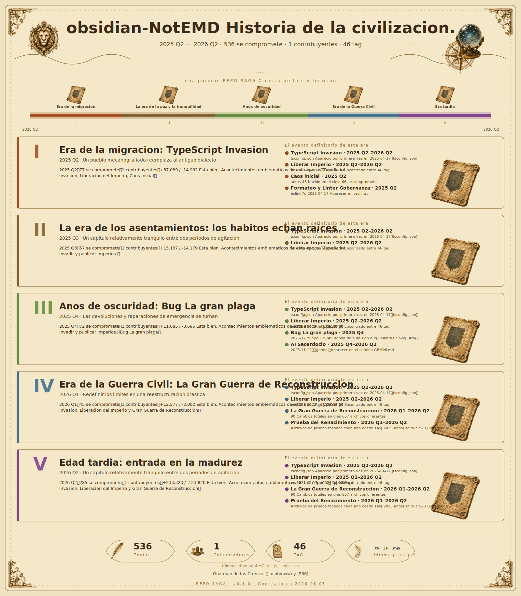

 	

[](https://discord.gg/qnGgsQ9W) 


# Notemd Obsidian Complementos

[English](./README.md) | [Chino simplificado](./README_zh.md) | [Español](./README_es.md) | [Français](./README_fr.md) | [Deutsch](./README_de.md) | [Italiano](./README_it.md) | [Português](./README_pt.md) | [Chino tradicional](./README_zh_Hant.md) | [japones](./README_ja.md) | [한국어](./README_ko.md) | [Русский](./README_ru.md) | [العربية](./README_ar.md) | [हिन्दी](./README_hi.md) | [বাংলা](./README_bn.md) | [Nederlands](./README_nl.md) | [Svenska](./README_sv.md) | [Suomi](./README_fi.md) | [Dansk](./README_da.md) | [Norsk](./README_no.md) | [Polski](./README_pl.md) | [Türkçe](./README_tr.md) | [עברית](./README_he.md) | [ไทย](./README_th.md) | [Ελληνικά](./README_el.md) | [Čeština](./README_cs.md) | [Magyar](./README_hu.md) | [Română](./README_ro.md) | [Українська](./README_uk.md) | [Tiếng Việt](./README_vi.md) | [Bahasa Indonesia](./README_id.md) | [Bahasa Melayu](./README_ms.md)

Mas documentacion en idiomas: consulte [Centro de idiomas](./docs/i18n/README_zh.md)
Explore la documentacion del almacen: consulte [Centro de documentos](./docs/README.zh-CN.md)

```
=============================================
  _   _       _   _ ___    __  __ ___
 | \ | | ___ | |_| |___|  |  \/  |___ \
 |  \| |/ _ \| __| |___|  | |\/| |   | |
 | |\  | (_) | |_| |___   | |  | |___| |
 |_| \_|\___/ \__|_|___|  | |  | |____/
=============================================
      AIHerramienta de mejora de conocimientos en varios idiomas impulsada por el conductor
=============================================
```

Una manera facil de crear tu propia base de conocimientos！

Notemd Trabajando con varios modelos de lenguaje grandes. (LLM) Integracion para mejorar tu Obsidian Workflow admite el procesamiento de notas en varios idiomas, genera automaticamente enlaces wiki para conceptos clave, crea notas conceptuales correspondientes, realiza busquedas y resumenes en la web, traduce contenido y resume comoMermaidLos mapas cerebrales, etc., ayudan a crear un potente grafico de conocimiento.。

Si te gusta usar Notemd，Por favor considere [⭐ dar GitHub Agrega estrellas](https://github.com/Jacobinwwey/obsidian-NotEMD) o [☕️ Una taza de cafe por favor](https://ko-fi.com/jacobinwwey)。

**Version:** 1.9.2

 


## Tabla de contenidos
- [Inicio rapido](#Inicio rapido)
- [Soporte de idiomas](#Soporte de idiomas)
- [Caracteristicas funcionales](#Caracteristicas funcionales)
- [Instalacion](#Instalacion)
- [Configuracion](#Configuracion)
- [Guia del usuario](#Guia del usuario)
- [apoyadoLLMProveedor](#apoyadollmProveedor)
- [Uso de la red y procesamiento de datos](#Uso de la red y procesamiento de datos)
- [Solucion de problemas](#Solucion de problemas)
- [Contribucion](#Contribucion)
- [Documentacion del mantenedor](#Documentacion del mantenedor)
- [Licencia](#Licencia)

## Inicio rapido

1.  **Instalacion y activacion**：de Obsidian Complemento de adquisicion de mercado。
2.  **Configuracion LLM**：Entra `Configuracion -> Notemd`，Elige tu LLM Proveedores (p. ej. OpenAI O un proveedor local como Ollama），y entra API clave/URL。
3.  **Abre la barra lateral**：Haga clic en en la barra de herramientas izquierda. Notemd Icono de varita magica para abrir la barra lateral。
4.  **Notas del proceso**：Abre cualquier nota y haz clic en la barra lateral. **“Procesamiento de archivos (Agregar enlaces)”**，Agregue automaticamente conceptos clave `[[wiki-links]]` Enlaces。
5.  **Ejecute un flujo de trabajo rapido**：Utilice el valor predeterminado **“One-Click Extract”** Boton para procesamiento en serie con un solo clic, generacion de lotes y Mermaid Reparacion。

¡Hecho! Explore mas configuraciones para desbloquear funciones como busqueda web, traduccion, generacion de contenido y mas。

## Soporte de idiomas

### Contrato de conducta verbal

| Enfoque | Alcance del control | Valor predeterminado | Descripcion |
|---|---|---|---|
| `Idioma de la interfaz` | Solo afecta la copia de la interfaz del complemento (configuracion, barra lateral, mensajes, ventanas emergentes)） | `auto` | Seguir Obsidian Idioma; actual UI El paquete de idiomas es `en`、`ar`、`de`、`es`、`fa`、`fr`、`id`、`it`、`ja`、`ko`、`nl`、`pl`、`pt`、`pt-BR`、`ru`、`th`、`tr`、`uk`、`vi`、`zh-CN`、`zh-TW`。 |
| `Idioma de salida de la tarea` | Impacto LLM Salida de la tarea (enlace, resumen, generacion, extraccion, destino de traduccion)） | `en` | Puede utilizar el idioma global o habilitar "Establecer idioma por tarea"”。 |
| `Desactivar la traduccion automatica.` | Las tareas que no son de traduccion mantienen el contexto original. | `false` | Las tareas de "traduccion" explicitas todavia se realizan en el idioma de destino.。 |
| Locale Revertir | UI Estrategia alternativa cuando falta redaccion publicitaria | Actual locale -> `en` | Pertenece a la red de seguridad de la capa de implementacion; apoyado locale La interfaz visible ha sido cubierta por pruebas de regresion y ya no deberia volver silenciosamente al ingles durante el uso normal.。 |

- Mantener los documentos fuente como English + Chino simplificado, publicado README La traduccion aparece en el encabezado de arriba.。
- En la aplicacion UI locale Las anulaciones ahora son coherentes con los directorios de idiomas explicitos en el codigo.：`en`、`ar`、`de`、`es`、`fa`、`fr`、`id`、`it`、`ja`、`ko`、`nl`、`pl`、`pt`、`pt-BR`、`ru`、`th`、`tr`、`uk`、`vi`、`zh-CN`、`zh-TW`。
- English El respaldo sigue siendo una red de seguridad para la capa de implementacion, pero cuenta con soporte. locale La interfaz visible ha sido cubierta por pruebas de regresion y ya no deberia volver silenciosamente al ingles durante el uso normal.。
- Para obtener mas detalles y pautas de contribucion, consulte [Centro de idiomas](./docs/i18n/README_zh.md)。

## Caracteristicas funcionales

### AIProcesamiento de documentos impulsado
- **Mas LLM Apoyo**: Conectese a varias nubes y localmente LLM Proveedor (ver [apoyadoLLMProveedor](#apoyadollmProveedor)）。
- **Fragmentacion inteligente**: Divida automaticamente documentos grandes en partes manejables segun el recuento de palabras para su procesamiento.。
- **Retencion de contenido**: Trate de mantener el formato de contenido original mientras agrega estructura y enlaces.。
- **Seguimiento del progreso**: Pase Notemd Barra lateral o modo de progreso para actualizaciones en tiempo real。
- **La operacion se puede cancelar.**: Cualquier tarea de procesamiento (unica o por lotes) se puede cancelar mediante el boton de cancelacion dedicado en la barra lateral. Las operaciones del panel de comandos utilizan una ventana modal y tambien se pueden cancelar。
- **Configuracion multimodelo**: Utilice diferentes para diferentes tareas (agregar enlaces, investigar, generar titulares) LLM Proveedor*y*Modelos especificos, o utilizar un unico proveedor para todas las tareas。
- **estable API Llamar (logica de reintento)）**: Opcional por falla LLM API Llame para habilitar el reintento automatico y configurar el intervalo de reintento y el numero de limites de intentos.。
- **Mas robusto Provider Prueba de conexion**: cuando Provider Cuando la primera prueba de conexion encuentra una desconexion instantanea，Notemd Ahora volvera a la secuencia de reintento estable antes de determinar la falla, cubriendo OpenAI-compatible、Anthropic、Google、Azure OpenAI con Ollama Enlaces de transmision de categoria 5。
- **Reversion del transporte del entorno de ejecucion**: Cuando lleva mucho tiempo Provider La solicitud es `requestUrl` a `ERR_CONNECTION_CLOSED` Esperando una interrupcion transitoria por error de red，Notemd Ahora primero cambiara al transporte alternativo que coincida con el entorno de ejecucion dentro de la misma llamada: para uso de escritorio Node `http/https`，Usar el navegador en un entorno que no sea de escritorio `fetch`；Solo cuando la reversion tambien falle, se ingresara la secuencia de reintento estable configurada, lo que reducira las fallas de falsos positivos en puertas de enlace lentas o servidores proxy inversos.。
- **OpenAI-compatible Refuerzo de enlace de solicitud largo estable**: En modo estable，OpenAI-compatible Cada llamada ahora presionara `Tipo de flujo directo -> Conexion directa sin streaming -> requestUrl` Pruebe en secuencia (si es necesario `requestUrl` Aun puede actualizar al analisis de transmision) y luego decidir si desea ingresar al siguiente reintento. Esto puede reducir“Provider Fallo falso causado por "En realidad, se han devuelto resultados que no son de transmision, pero el enlace de transmision es inestable"。
- **todos LLM API Alternativa de transmision basada en protocolos**: Las solicitudes de reversion de larga duracion ya no cubren unicamente OpenAI-compatible Provider，En cambio, se extiende a todos los integrados. LLM Camino。Notemd Ahora en el escritorio `http/https` Frente a los que no son de escritorio `fetch` Etapa de reversion, manejada por separado OpenAI/Azure Estilo SSE、Anthropic Messages SSE、Google Gemini SSE，y Ollama de NDJSON Salida de streaming, otros conectados directamente OpenAI Estilo Provider El portal tambien reutilizara el mismo conjunto de rutas de respaldo compartidas.。
- **Distrito Chino Provider Mejora predeterminada**: Suplemento incorporado `Qwen`、`Qwen Code`、`Doubao`、`Moonshot`、`Xiaomi MiMo`、`GLM`、`Z AI`、`MiniMax`、`Huawei Cloud MaaS`、`Baidu Qianfan`、`SiliconFlow` Espere a que los proveedores de servicios de modelos de nube mas utilizados en China lo preestablezcan.。
- **Procesamiento por lotes confiable**: Logica de procesamiento concurrente mejorada, a traves de**escalonadoAPILlamar**para evitar errores de limitacion de velocidad y garantizar un rendimiento estable en trabajos por lotes grandes. La nueva implementacion garantiza que las tareas se inicien en diferentes intervalos en lugar de al mismo tiempo.。
- **Informes de progreso precisos**: Se corrigio un error por el cual la barra de progreso podia atascarse, asegurando que la interfaz de usuario siempre refleje el verdadero estado de la operacion.。
- **Procesamiento por lotes paralelo robusto**: Resuelva el problema de la detencion prematura de las operaciones de procesamiento por lotes en paralelo, garantizando que todos los archivos puedan procesarse de manera confiable y eficiente.。
- **Precision de la barra de progreso**: Se corrigio la barra de progreso del comando "Crear enlace Wiki y generar notas" atascada.95%error, asegurese de que se muestre correctamente ahora100%completo。
- **MejoradoAPIDepuracion**: “APIEl "Modo de depuracion de errores" ahora no solo captura errores de LLM Proveedores y servicios de busqueda（Tavily/DuckDuckGo）El cuerpo completo de la respuesta tambien registrara el cronograma de transmision ampliado por la dimension del intento, incluidas las solicitudes posteriores a la desensibilizacion. URL、Consumo de tiempo, encabezados de respuesta, cuerpos de respuesta parciales, contenido de transmision parcial analizado e informacion de pila, lo que lo hace mas adecuado para el posicionamiento. OpenAI-compatible、Anthropic、Google、Azure OpenAI、Ollama Espere a que aparezca el enlace. 429/500 Errores, desconexiones de puerta de enlace y otros API Fracaso。
- **Panel del modo desarrollador**: Agregue independencia en la configuracion Developer El panel de diagnostico, oculto por defecto, solo se puede abrir“Developer mode”Mostrado mas tarde. Este panel admite la seleccion del metodo de llamada de diagnostico y puede realizar multiples rondas de pruebas de estabilidad de una manera especifica.。
- **Liberacion de restricciones de archivos de entrada bajo el control de cambio del desarrollador**: Agregado en la configuracion del desarrollador. `Liberar restricciones de archivos de entrada` Switch, usado para liberar el plano actual solo para tareas de entrada que retienen el archivo original `.md` / `.txt` Restricciones. Despues de abrir，`Translate current file`、`Batch translate folder`、`Extract concepts（Actual/Carpeta）`、`Summarise as Mermaid diagram`、`Generate diagram`、`Check duplicates in current file` Ademas, puede leer mas archivos de texto y aprobar. Obsidian PDF Extraer texto en tiempo de ejecucion PDF；Implica reescribir el texto original、Markdown Los procesos con dependencias estructurales o comparaciones textuales siguen restringidos。
- **Barra lateral refactorizada**: Las acciones integradas se agrupan por proposito y brindan etiquetas mas claras, estado en tiempo real, progreso cancelable y registros copiables para reducir significativamente el desorden causado por la acumulacion de botones. Incluso si se expanden todos los grupos, las areas de progreso y registro en la parte inferior permaneceran visibles.，Ready La pista de progreso en espera en el estado tambien es mas facil de identificar。
- **Mejorar la interaccion y la legibilidad de la barra lateral**: Los botones de la barra lateral complementan el desplazamiento mas claro/Presione/Comentarios enfocados；`One-Click Extract`、`Batch generate from titles` Espera el color CTA Los botones tambien mejoran el contraste del texto, haciendolo mas legible bajo diferentes temas.。
- **Fila unica CTA Reglas de mapeo**: Color CTA Ahora solo se utiliza para la accion "Procesamiento de un solo archivo"; lote/Las acciones a nivel de carpeta y los flujos de trabajo que contienen pasos por lotes utilizan CTA Estilo para reducir el riesgo de juzgar erroneamente el rango de accion.。
- **Personaliza el flujo de trabajo con un solo clic**: Las operaciones integradas de la barra lateral se pueden ensamblar en botones personalizados reutilizables, que admiten la asignacion de nombres de usuarios y la organizacion de acciones. Estan integrados de forma predeterminada. `One-Click Extract` flujo de trabajo。
- **Resumen de actualizacion de la ventana emergente de bienvenida**: Al instalar por primera vez, la ventana emergente de bienvenida ahora muestra el resumen de actualizacion de las dos ultimas versiones en un area desplazable, lo que facilita a los usuarios la configuracion. Provider Comprenda rapidamente las nuevas capacidades antes。
- **Restablecer configuracion**: La pagina de configuracion ahora proporciona "Reinicio completo" y "Reinicio parcial" (conservados Provider Configuracion)" dos botones de cierre para facilitar una rapida restauracion de la configuracion predeterminada。
- **Archivos de filtrado de tareas de carpeta**: Las tareas de carpeta ahora admiten archivos de filtro con nombre reutilizables, que cubren regex/glob、`relativePath` / `basename` Control de rango de subcarpetas y objetivos coincidentes。

### Mejora del grafico de conocimiento
- **Enlace wiki automatico**: Basado en LLM Salida, identifique los conceptos centrales en las notas en las que trabajo y agregue `[[Enlace wiki]]`。
- **Creacion de notas conceptuales (opcional y personalizable).）**: En el designado vault Cree automaticamente nuevas notas en carpetas para conceptos descubiertos.。
- **Ruta de salida personalizable**: En tu vault Configure rutas relativas separadas para guardar archivos procesados y notas conceptuales recien creadas.。
- **Nombre del archivo de salida personalizable (agregar enlace）**: Cuando trabaje con archivos para agregar enlaces, puede elegir**Sobrescribir el archivo original**O use un sufijo personalizado/Reemplace la cadena en lugar de la predeterminada `_processed.md`。
- **Mantenimiento de la integridad del enlace.**: en vault Funcion basica de actualizar enlaces al cambiar el nombre o eliminar notas.。
- **Extraccion pura de conceptos**: Extraiga conceptos y cree las notas conceptuales correspondientes sin modificar el documento original. Esto es ideal para completar la base de conocimientos a partir de documentos existentes sin cambiarlos. Esta funcion tiene opciones configurables para crear notas conceptuales minimas y agregar vinculos de retroceso.。
- **Guardia delantera de generacion conceptual**: Cuando la ruta de la nota conceptual no esta habilitada o configurada segun sea necesario, una ventana emergente solicitara el proceso relevante y podra saltar directamente a la ubicacion de configuracion correspondiente.。
- **Supresion de sinonimos de concepto**: Opcionalmente, deje que el modelo procese archivos./Al extraer carpetas y conceptos, trate de evitar extraer sinonimos, conceptos centrales semanticamente similares o palabras clave casi duplicadas.。
- **Recuperacion del conocimiento local**: `Generar a partir del titulo`、`Generacion por lotes a partir de titulos.`、`Investigacion y resumen`、`Generar graficos` Ahora es opcional acceder a la configuracion de soporte y busqueda de la base de conocimientos local. Vault Archivos relativos/Rutas de carpetas y fuentes de bases de conocimientos cubiertas por tarea; El contexto se construye completamente localmente dentro del complemento y no depende de servicios de recuperacion en la nube ni de procesos externos residentes.。
- **Division del capitulo + TOC Extraccion**: Las notas se pueden dividir en archivos de capitulos segun el nivel del titulo y se puede generar una banda junto al archivo fuente. front-matter metadata Enlazable TOC；Los productos viejos tambien se limpiaran durante la ejecucion repetida.。

### Traduccion

- **AI Traduccion dirigida**：
    - Usar configurado LLM Traducir el contenido de las notas.。
    - **Soporte para archivos grandes**：Al enviar a LLM Anteriormente, se basaria en `Numero de palabras en fragmentos` Configuracion para dividir automaticamente archivos grandes en partes mas pequenas. Los fragmentos traducidos se vuelven a fusionar sin problemas en un solo documento.。
    - Admite traduccion entre varios idiomas.。
    - Disponible en Configuracion o UI Personaliza el idioma de destino en。
    - Abra automaticamente el texto traducido a la derecha del texto original para facilitar la lectura.。
- **Traduccion por lotes**:
    - Traduce todos los archivos en la carpeta seleccionada con un solo clic.。
    - Cuando "Habilitar paralelizacion por lotes" esta activado, se admite el procesamiento paralelo。
    - Utilice indicaciones personalizadas para la traduccion si esta configurado。
	- Agregue la opcion "Traducir esta carpeta por lotes" al menu contextual del explorador de archivos.。
- **Desactivar la traduccion automatica.**: Cuando esta opcion esta habilitada, las tareas que no sean de traduccion ya no forzaran la salida a un idioma especifico, conservando asi el contexto del idioma original. Las tareas explicitas de "traduccion" seguiran realizando traducciones segun lo configurado。

### Investigacion web y generacion de contenidos.
- **Investigacion web y resumenes**:
    - ApoyoTavily（RequeridoAPI Key）conDuckDuckGo（Experimental) Dos servicios de busqueda web.。
    - **Estabilidad de busqueda mejorada**: DuckDuckGo La busqueda ahora tiene una logica de analisis mejorada.（DOMParser con Regex respaldo) para manejar cambios de diseno y garantizar la confiabilidad de los resultados。
    - Uso automaticoLLMResuma los resultados de la busqueda y adjuntelos a la nota actual.。
    - Puede personalizar el idioma de salida del resumen en la configuracion.。
    - Longitud maxima de contenido configurable para investigacion。
- **Generar contenido basado en titulos**:
    - Utilice titulos de notas para aprobarLLMGenera contenido y reemplaza el texto original.。
    - Investigacion automatica opcional de paginas web antes de la generacion para enriquecer el contexto de generacion.。
- **Generar contenido basado en titulos en lotes**:
    - Procese por lotes todas las notas en la carpeta seleccionada con un solo clic, omitiendo automaticamente los archivos procesados.。
    - Nombre de subcarpeta "Completa" configurable para evitar procesamiento repetido。
- **Mermaid Reparar acoplamientos automaticamente**:
    - Cuando esta habilitado Mermaid Despues de la reparacion automatica, procesamiento, generacion por titulo, generacion de lotes por titulo, investigacion y resumen, resumido como Mermaid、Traduccion, etc. Mermaid Los procesos relevantes se repararan automaticamente despues de la salida, lo que reducira los residuos de sintaxis de los graficos y la repeticion del trabajo manual.。

### Funciones practicas
- **Resumido comoMermaidGraficos**:
    - Esta funcion le permite resumir el contenido de la nota comoMermaidGraficos。
    - Se puede personalizar en la configuracion.MermaidIdioma de salida para graficos。
    - **Mermaid Carpeta de salida**: Generacion de configuracionMermaidLa carpeta donde se guarda el archivo del grafico. Si se deja en blanco, el grafico se guardara en la misma carpeta que la nota original.。
    - **La traduccion se resume comoMermaidSalida**: Opcionalmente genere elMermaidTraduccion del contenido del grafico al idioma de destino configurado。


- **Modificacion del formato de formula simple.**:
    - Convierte rapidamente una sola linea `$` Convertir formulas matematicas separadas a estandar `$$` bloquear。
    - **Fila unica**: Trabaje con el archivo actual a traves de los botones de la barra lateral o el panel de comando。
    - **Reparacion por lotes**: Procese todos los archivos en la carpeta seleccionada mediante el boton de la barra lateral o el panel de comando。

- **Compruebe si hay duplicados en el archivo actual.**: Este comando ayuda a identificar posibles terminos duplicados en archivos activos。
- **Repetir la prueba**: Verifique si hay palabras duplicadas en el contenido del procesamiento actual (los resultados se envian a la consola）。
- **Verifique y elimine notas conceptuales duplicadas.**: Nombre de archivo completo (exacto/Numeros plurales/Estandarizacion/Contiene relaciones) detecta posibles duplicados dentro y fuera de la carpeta de notas conceptuales, admite un rango de deteccion personalizado, se enumerara en detalle antes de la operacion y requiere confirmacion manual。
- **loteMermaidReparacion**: Seleccione todos los archivos en la carpeta seleccionada.MarkdownSolicitud de archivoMermaidyLaTeXCorreccion gramatical。
    - **Se puede utilizar como paso del flujo de trabajo.**: Ademas de ejecutarse individualmente, tambien se puede combinar como un paso en un flujo de trabajo personalizado con un solo clic.。
    - **Informe de errores**: Generar `mermaid_error_{foldername}.md` Informe, enumerando el potencial.MermaidArchivo incorrecto。
    - **Mueve el archivo equivocado**: Opcionalmente, mueva los archivos con errores detectados a una carpeta designada para su revision manual.。
    - **Deteccion inteligente**: Antes de intentar una reparacion, utilice `mermaid.parse` Verifique de manera inteligente los archivos en busca de errores de sintaxis, ahorrando tiempo de procesamiento y evitando ediciones innecesarias。
    - **Manejo seguro**: Asegurese de que las correcciones de sintaxis solo se apliquen a Mermaid Bloques de codigo para evitar modificaciones accidentales Markdown Formularios u otros contenidos. Contiene instrucciones para la sintaxis tabular (p. ej. `| :--- |`）Medidas de proteccion solidas para evitar reparaciones accidentales mediante funciones de depuracion en profundidad。
    - **Modo de depuracion profunda**: Si el error persiste despues de la solucion inicial, se activara el modo de depuracion profunda avanzada. Este modo maneja casos extremos complejos, incluidos：
        - **Integracion de anotaciones**: Convierta automaticamente los comentarios finales (que terminan en `%` al principio) se fusionaron en etiquetas de lineas de conexion (p. ej.，`A -- Label --> B; % Comment` convertirse `A -- "Label(Comment)" --> B;`）。
        - **Flecha mal formada**: Corrija las flechas que estan absorbidas por las comillas (p. ej. `A -- "Label -->" B` Enmendado a `A -- "Label" --> B`）。
        - **Subgrafos en linea**: Convierta etiquetas de subfiguras en linea en etiquetas de linea de conector。
        - **Correccion de flecha inversa**: Utilice no estandar `X <-- Y` La flecha se corrige a `Y --> X`。
        - **Correccion de palabras clave de direccion**: Asegurese de que dentro del subgrafo `direction` Las palabras clave estan en minusculas (p. ej. `Direction TB` -> `direction TB`）。
        - **Conversion de anotaciones**: voluntad `//` Convierta comentarios en etiquetas de lineas de conexion (p. ej. `A --> B; // Comentarios` -> `A -- "Comentarios" --> B;`）。
        - **Correccion de etiquetas duplicadas**: Simplifique las etiquetas de corchetes repetidas (p. ej. `Node["Etiquetas"]["Etiquetas"]` -> `Node["Etiquetas"]`）。
        - **Reparacion de flecha no valida**: Reemplazar la sintaxis de flecha no valida `--|>` Convertir a estandar `-->`。
        - **Procesamiento solido de etiquetas y anotaciones**: Procesamiento mejorado de caracteres que contienen caracteres especiales (como `/`）Manejo de etiquetas y mejor soporte para sintaxis de comentarios personalizados（`note for ...`），Asegurese de eliminar completamente los residuos, como los soportes finales.。
        - **Modo de reparacion avanzada**: Contiene correcciones solidas para etiquetas de nodos sin comillas que contienen espacios, caracteres especiales o parentesis anidados (por ejemplo, cambiar `Node[Etiquetas [Texto]]` Convertir a `Node["Etiquetas [Texto]"]`）。
        - **Conversion de anotaciones**: Automaticamente `note right/left of` E independiente `note :` Convertir comentarios a estandar. Mermaid Definiciones y conexiones de nodos (por ejemplo, colocacion `note right of A: text` Convertir a `NoteA["Note: text"]` y conectarse a `A`），Prevenga errores de sintaxis y mejore el diseno.。
        - **Soporte extendido para anotaciones**: Automaticamente `note for Node "Content"` y `note of Node "Content"` Convierta a un nodo de anotacion de enlace estandar (p. ej. `NoteNode[" Content"]` Conectate a `Node`），Garantizar la compatibilidad con la sintaxis de la extension del usuario.。
        - **Correccion de comentarios mejorada**: Utilice automaticamente numeros secuenciales (p. ej. `Note1`, `Note2`）Cambie el nombre de los comentarios para evitar problemas de alias cuando existen varios comentarios.。
        - **paralelogramo/Reparacion de formas**: Corrija la definicion de forma de nodo mal formada, como `[/["Etiquetas["/]` Convertir a estandar `["Etiquetas"]`，Garantizar la compatibilidad con el contenido generado.。
        - **Estandarizar las etiquetas de las tuberias**: Reparar y estandarizar automaticamente las etiquetas de las lineas de conexion que contienen caracteres de tuberia para garantizar que se haga referencia a ellas correctamente (por ejemplo, reemplazar `-->|Texto|` Convertir a `-->|"Texto"|`）。
        - **Reparacion de tuberias desalineadas.**: Se corrigieron las etiquetas de conectores desalineadas que aparecian antes de las flechas (p. ej. `>|"Etiquetas"| A --> B` Enmendado a `A -->|"Etiquetas"| B`）。
        - **Fusionar etiquetas duales**: Detectar y fusionar etiquetas dobles complejas en un solo borde (p. ej.，`A -- Etiquetas1 -- Etiquetas2 --> B` o `A -- Etiquetas1 -- Etiquetas2 --- B`），Conviertalo en una unica etiqueta clara con saltos de linea.（`A -- "Etiquetas1<br>Etiquetas2" --> B`）。
        - **Correccion de etiquetas sin comillas**: Agregue automaticamente comillas a las etiquetas de los nodos que contienen caracteres potencialmente problematicos (como comillas, signos iguales, operadores matematicos) pero que carecen de comillas externas (por ejemplo, reemplazar `Plot[Plot "A"]` Enmendado a `Plot["Plot "A""]`），Prevenir errores de renderizado。
        - **Correccion de la etiqueta de conexion**: Reparar con fuerza ID Definiciones de nodos conectados a etiquetas (p. ej.，`SubdivideSubdivide...` convertirse `Subdivide["Subdivide..."]`），Capacidad para verificar nodos conocidos incluso cuando estan precedidos por etiquetas de tuberia o duplicacion incompleta ID Hacer reparaciones。
        -   **Extraiga contenido original especifico**:    - Definir la lista de preguntas en la configuracion.。
    - Extraiga pasajes de texto textuales de las notas de la actividad que respondan a estas preguntas.。
    - **Modo de consulta combinado**: Opcional en un solo API Manejar todos los problemas durante la llamada para mejorar la eficiencia.。
    - **Traduccion**: Opcionalmente, incluya una traduccion del texto extraido en el resultado.。
    - **Salida personalizada**: Ruta de guardado configurable y sufijo de nombre de archivo para archivos de texto extraidos。
- **LLMPrueba de conexion**: Verifica todas las configuraciones con un clicLLMProveedor de serviciosAPIEstado de la conexion。

## Instalacion


### PaseObsidianMercado (recomendado）
1. abiertoObsidian **Configuracion** → **Complementos comunitarios**。
2. Asegurate de que el modo restringido este desactivado。
3. Haga clic en el complemento comunitario "Examinar" y busque“Notemd”。
4. Haga clic en "Instalar"”。
5. Despues de la instalacion, haga clic en "Habilitar”。

### Instalacion manual
1. de [GitHubPagina de lanzamiento](https://github.com/Jacobinwwey/obsidian-NotEMD/releases) Descargue los ultimos activos publicados. cada uno Release Tambien vendra con `README.md` Como documento de paquete, pero la instalacion manual solo requiere `main.js`、`styles.css`、`manifest.json`。
2. Entra `<Tu boveda>/.obsidian/plugins/` Tabla de contenidos。
3. nuevo `notemd` Carpeta, voluntad `main.js`、`styles.css`、`manifest.json` Copiar aqui。
4. ReiniciarObsidian。
5. Habilitelo en "Complemento comunitario"NotemdComplementos。

## Configuracion

Ingresar configuracion：**Configuracion** → **Complementos comunitarios** → **Notemd**（Icono de engranaje）。

### LLM Configuracion del proveedor

1. **Proveedor de actividades**: Seleccione el que desea usar en el menu desplegable. LLM Proveedor。

2. Configuracion del proveedor

   : Configurar ajustes especificos para el proveedor seleccionado：

   - **API clave**: La mayoria de los proveedores de nube (p. ej. OpenAI、Anthropic、DeepSeek、Qwen、Qwen Code、Doubao、Moonshot、Xiaomi MiMo、GLM、Z AI、MiniMax、Huawei Cloud MaaS、Baidu Qianfan、SiliconFlow、Google、Mistral、Azure OpenAI、OpenRouter、xAI、Groq、Together、AIHubMix、GitHub Models、PPIO、Fireworks、Nebius、Cerebras、Hugging Face、Vercel AI Gateway、Requesty）Necesidad。Ollama No requerido。LMStudio、LiteLLM、`New API`、`OVMS` y generales `OpenAI Compatible` El valor predeterminado se puede dejar en blanco en algunos puntos finales que permiten claves anonimas o de marcador de posicion。
   - **Conceptos basicos URL / Punto final**: Servicio API Punto final. Se proporcionan valores predeterminados, pero es posible que necesite（LMStudio、Ollama）、Puerta de enlace（OpenRouter、Requesty、OpenAI Compatible）O especifico Azure Implementar y modificar este elemento.。**Azure OpenAI Requerido。**
   - **modelo**: El nombre del modelo especifico a utilizar./ID（Por ejemplo `gpt-4o`, `claude-3-5-sonnet-20240620`, `google/gemini-flash-1.5`, `grok-4`, `moonshotai/kimi-k2-instruct-0905`, `accounts/fireworks/models/kimi-k2p5`, `anthropic/claude-3-7-sonnet-latest`）。Asegurese de que el modelo este en su punto final/Disponible en proveedor。
   - **API Version (solo Azure）**: Azure OpenAI Necesidades de implementacion (p. ej. `2024-02-15-preview`）。
   - **Configuracion avanzada**: `Temperature`、`Top-p`、reasoning hint、DeepSeek thinking mode、provider nivel output-token override Los ingresos unificados se recaudaran de otros proyectos de suboptimizacion. **Mostrar configuracion avanzada**。Si cierto provider Ya guardado advanced override，Esta area se ampliara de forma predeterminada para evitar que los comportamientos existentes se oculten silenciosamente.。
   - **Obtenga la lista de modelos**: apoyado provider Puede consultar directamente la disponibilidad del punto final. model ID，Pero no reemplazara al manual `Model` Entra. El soporte actualmente limitado cubre un lote de verificados OpenAI-compatible `/models` Predeterminado: incluir DeepSeek / OpenAI / Mistral，`Qwen`、`Qwen Code`、`Doubao`、`Moonshot`、`Xiaomi MiMo`、`GLM`、`Z AI`、`MiniMax`、`Baidu Qianfan`、`SiliconFlow` Esperando el punto final de alojamiento de China，`Groq`、`Fireworks`、`Nebius`、`Cerebras`、`Hugging Face` Espere a que lleguen los puntos finales de inferencia de alta velocidad，`OpenRouter`、`Requesty`、`LiteLLM`、`AIHubMix`、`GitHub Models`、`PPIO`、`New API` Espere la puerta de enlace y el local. `LMStudio`、`OVMS` Servicio. Tambien cubre Together Dedicado `/models` Formulario de respuesta、Anthropic `GET /models`、xAI Dedicado `/v1/language-models` Y un recurso limitado a `/v1/models`、Huawei Cloud MaaS Dedicado `v2/models` Interfaz de registro de modelos、GitHub Models Limitado `catalog/models` + `/v1/models` Fusion de doble fuente、PPIO Limitado chat + embedding + reranker Fusion de tres vias、OVMS Vaya primero a lo local `/v3/models` Y un recurso limitado a legacy `/v1/config`、Vercel AI Gateway Al funcionario `/v1/models` con `v3/ai/config` Fusion limitada de fuente dual de、Ollama tags con Google Gemini model listing。`OpenRouter` Ahora habra fusion limitada chat con embedding catalog，y Anthropic con Google en provider Volver a paginacion catalog Los resultados del modelo tambien se fusionaran mediante un recorrido delimitado de varias paginas. mas amplio OpenAI-compatible Los enlaces de descubrimiento ahora tambien se devuelven en el directorio de modelos. `next_url`、`links.next`、`nextPageToken`、`next_cursor` Espera continuation realiza la misma paginacion limitada al senalar, por lo que es mas grande gateway catalog No se truncara silenciosamente a la primera pagina y el modelo valido que se obtuvo con exito no se perdera cuando fallen las paginas siguientes. Para lo cual se devolvera un directorio de modelos mas amplio provider，Los resultados del descubrimiento actual daran prioridad deliberadamente a retener modelos adecuados para la tarea de generacion para evitar embedding、reranker、speech、classifier Espere a que los elementos llenen el selector de modelos; compartir parser Ahora tambien podemos aprovechar proxies mas amplios/catalog Metadatos, incluidos `list`/`items`、`rows`/`records`、`value`/`values`、object-shaped catalogs、Anidacion `data`/`result` Recogida y alojamiento registry en `types` Clasificacion、`publisherModels` Registro de primera clase、`data.provider_models` / `result.data.publisherModels` Este tipo de directorio empaquetado、`registry` / `registries` / `services` Este tipo de directorio empaquetado、LiteLLM elegante `litellm_params` + `model_info` Metadatos、endpoint-type metadata、Muestra etiquetas al instante、max-output-token Consejos y capability/modality/status Las senales tambien se pueden identificar `uid`、`identifier`、`modelId`、`provider_model_id` Este tipo de campo de identificacion primaria mas amplio y el `models/<id>`、`publishers/<owner>/models/<id>` Dichos nombres de recursos se normalizan a aquellos que se pueden usar directamente. model id，Intente filtrar modelos de salida inutilizables o no textuales evitando todos provider alias Todos ampliados a opciones independientes.。`Azure OpenAI` permanecer manual-first。generales `OpenAI Compatible` Los ajustes preestablecidos ahora seran conocidos host（Como por ejemplo OpenRouter、Requesty、Together、xAI、Huawei Cloud MaaS、Vercel AI Gateway、`AIHubMix`、`GitHub Models`、`PPIO`、locales LiteLLM Agencia de estilo, y OVMS Estilo local `/v3` Actualice automaticamente al descubrimiento limitado correspondiente en el punto final) family；Si no se conocen host，El estandar seguira estando expuesto en el punto final personalizado. `/models` Pruebe el descubrimiento remoto universal. compartido OpenAI-compatible URL La normalizacion ahora tambien tolera que los usuarios cambien la base. URL Complete directamente `/responses`、`/chat/completions` o `/models`；Incluso si la direccion pegada por el usuario todavia contiene query string o hash fragment，Tampoco deja de recibir la lista de modelos o la llamada real. Cuando este preajuste universal apunta a OpenAI、DashScope/Qwen、Xiaomi MiMo、Fireworks、Hugging Face Tal funcionario conocido host horas，model-aware token guidance Incluso ahora bare model ID Reutilizar aguas arriba provider es conocido output-token cap，En lugar de depender mucho de provider-prefixed model name。La lista obtenida es solo una sugerencia temporal y el usuario aun guarda el valor verdadero persistente. `Model` cuerda。

3. **Prueba de conexion**: Utilice el boton "Probar conexion" de su proveedor activo para verificar su configuracion.。OpenAI-compatible El proveedor ahora presionara provider Estrategia de prueba de seleccion automatica de funciones.：`Qwen`、`Qwen Code`、`Doubao`、`Moonshot`、`Xiaomi MiMo`、`GLM`、`Z AI`、`MiniMax`、`Huawei Cloud MaaS`、`Baidu Qianfan`、`SiliconFlow`、`Groq`、`Together`、`Fireworks`、`LMStudio` con `OpenAI Compatible` Detectara directamente `chat/completions`，Y con estabilidad `/models` El servicio de punto final seguira dando prioridad a la deteccion de la lista de modelos. Si la primera deteccion se encuentra `ERR_CONNECTION_CLOSED` Este tipo de desconexion momentanea de la red，Notemd Cambiara automaticamente a una secuencia de reintento estable en lugar de informar un error inmediatamente。

4. **Administrar la configuracion del proveedor**: Utilice los botones Exportar proveedores e Importar proveedores para exportar su LLM La configuracion del proveedor se guarda en el directorio de configuracion del complemento. `notemd-providers.json` Archivar o cargar desde. Esto facilita la copia de seguridad y el intercambio.。

5. **Cobertura predeterminada**: Ademas del proveedor original，Notemd Ahora tambien integrado `Qwen`、`Qwen Code`、`Doubao`、`Moonshot`、`Xiaomi MiMo`、`GLM`、`Z AI`、`MiniMax`、`Huawei Cloud MaaS`、`Baidu Qianfan`、`SiliconFlow`、`xAI`、`Groq`、`Together`、`AIHubMix`、`GitHub Models`、`PPIO`、`New API`、`OVMS`、`Fireworks`、`LiteLLM`、`Nebius`、`Cerebras`、`Hugging Face`、`Vercel AI Gateway`、`Requesty` y generales `OpenAI Compatible` Ajustes preestablecidos para personalizar servidores proxy。


### Configuracion multimodelo

- Utilice diferentes proveedores para las tareas

  :

  - **Desactivar (Predeterminado)**: Utilice un unico "Proveedor de actividades" seleccionado anteriormente para todas las tareas”。
  - **Habilitar**: Le permite seleccionar un proveedor especifico para cada tarea (Agregar enlace, Investigacion y resumen, Generar a partir del titulo, Extraer conceptos)*y*Opcionalmente, anule el nombre del modelo. Si el campo de anulacion de modelo para una tarea se deja en blanco, se utilizara el modelo predeterminado configurado por el proveedor seleccionado para la tarea.。
- **Elija diferentes idiomas para diferentes tareas**:
    *   **Desactivar (Predeterminado)**: Utilice un unico “lenguaje de salida” para todas las tareas”。
    *   **Habilitar**: Le permite agregar enlaces a cada tarea (Agregar enlace, Investigacion y resumen, Generar a partir del titulo, Resumir comoMermaidDiagrama", "Extraer conceptos") Seleccione un idioma especifico。


### Arquitectura del lenguaje (lenguaje de interfaz y lenguaje de salida de tareas）

- **Idioma de la interfaz**Controle unicamente la copia de la interfaz del complemento (configuracion, botones de la barra lateral, mensajes, ventanas emergentes). Predeterminado `auto` Seguira Obsidian Idioma actual de la interfaz。
- Area/Las variantes del sistema de escritura ahora se asignan preferentemente al directorio de idiomas publicado mas cercano, en lugar de recurrir directamente al ingles. Por ejemplo，`fr-CA` Usa frances，`es-419` Usa espanol，`pt-PT` Usa portugues，`zh-Hans` Utilice chino simplificado，`zh-Hant-HK` Utilice chino tradicional。
- **Idioma de salida de la tarea**Controlar el idioma del contenido generado por el modelo (agregar enlaces, resumenes de investigacion, generar por titulo、Mermaid Resumen, extraccion de conceptos, objetivos de traduccion.）。
- **Presione el modo de idioma de la tarea**Analice el lenguaje de salida de cada tarea a traves de una capa de estrategia unificada para evitar la desviacion del comportamiento causada por ramas de lenguaje dispersas en cada modulo.。
- **Desactivar la traduccion automatica.**Posteriormente, las tareas que no son de traduccion conservan el contexto del idioma de origen; Las tareas explicitas de "traduccion" todavia se realizan en el idioma de destino.。
- Mermaid Los enlaces generados relevantes son consistentes con la estrategia de lenguaje unificado mencionada anteriormente y continuaran admitiendo la transmision automatica. Mermaid Reparacion。

### Estabilidad API Configuracion de llamadas

- Habilitar la estabilizacion API Llamar (logica de reintento)）

  :

  - **Desactivar (Predeterminado)**: Soltero API Si no se llama, se detendra la tarea actual.。
  - **Habilitar**: El reintento automatico fallo LLM API Llamada (util para problemas intermitentes de red o limitacion de velocidad)）。
  - **Reversion de la prueba de conexion**: Incluso si la llamada normal actualmente no habilita el modo estable por adelantado，Provider La prueba de conexion tambien cambiara a la misma secuencia de reintento despues de encontrar un error de red transitorio por primera vez.。
  - **Respaldo del transporte en tiempo de ejecucion (consciente del entorno）**: Si se solicita una tarea que requiere mucho tiempo `requestUrl` Desconexion instantanea，Notemd Se volvera a intentar la misma llamada utilizando el transporte alternativo que coincida con el entorno actual: Escritorio Node `http/https`，Utilice el navegador en un entorno que no sea de escritorio `fetch`。La fase de reversion ahora analizara varias salidas de transmision segun los protocolos, cubriendo OpenAI-compatible / Azure OpenAI de SSE、Anthropic Messages SSE、Google Gemini SSE，y Ollama de NDJSON，Deje que la puerta de enlace lenta regrese lo antes posible. body Fragmentacion; el resto esta directamente conectado OpenAI Estilo Provider El portal tambien reutilizara este enlace alternativo compartido.。
  - **OpenAI-compatible Secuencia de modo estable**: En modo estable，OpenAI-compatible Una sola llamada ira primero `Tipo de flujo directo`，Intentalo inmediatamente despues del fracaso. `Conexion directa sin streaming`，Salir al final `requestUrl`（Con analisis alternativo de transmision si es necesario). Despues de que las tres etapas fallen, se contara en el siguiente reintento estable para evitar errores prematuros cuando un determinado enlace de transmision tiembla.。

- **Intervalo de reintento (segundos）**: (Solo visible cuando esta habilitado) Tiempo de espera entre reintentos（1-300 segundos). Valor predeterminado：5。

- **Numero maximo de reintentos**: (Solo visible cuando esta habilitado) Numero maximo de reintentos（0-10）。Valor predeterminado：3。
- **API Modo de depuracion de errores**:
    *   **Desactivar (Predeterminado)**: Utilice informes de errores concisos estandar。
    *   **Habilitar**: Para todos Provider Active el registro de errores detallado (similar a DeepSeek Salida detallada). El registro ahora contendra HTTP Codigo de estado, texto de respuesta original, cronograma de transmision de la solicitud y solicitud insensibilizada URL/Encabezados de solicitud, tiempo de intento unico, encabezados de respuesta, cuerpo de respuesta parcial, salida de transmision parcial analizada e informacion de pila, para solucion de problemas API Los problemas de conectividad y los restablecimientos de la puerta de enlace ascendente son particularmente criticos。
- **Modo desarrollador**:
    *   **Desactivar (Predeterminado)**: Ocultar controles de diagnostico especificos del desarrollador para evitar un mal funcionamiento por parte de usuarios comunes.。
    *   **Habilitar**: Visualizacion independiente en la pagina de configuracion. Developer Panel de diagnostico。
- **Diagnostico del proveedor del desarrollador (solicitudes largas）**:
    *   **Metodo de llamada de diagnostico**: Puede seleccionar la ruta de llamada para el diagnostico.。OpenAI-compatible Provider Apoyo adicional para forzar `Tipo de flujo directo`、`Conexion directa sin streaming`、`requestUrl-only`。
    *   **Ejecutar diagnosticos**: Ejecute una sonda de solicitud larga utilizando el metodo de llamada actual e informela en su totalidad. `Notemd_Provider_Diagnostic_*.txt` Escriba en el directorio raiz del almacen.。
    *   **Realizar pruebas de estabilidad**: Ejecute rondas configurables con el metodo de llamada actual.（1-10）Llamadas repetidas para generar un informe de estabilidad agregado.。
    *   **Tiempo de espera de diagnostico**: Tiempo de espera de diagnostico unico configurable（15-3600 segundos）。
    *   **Escenarios aplicables**: Localice rapidamente problemas de enlace cuando la "conexion de prueba" tiene exito pero las tareas realmente largas (como la traduccion en puertas de enlace lentas) aun fallan rapidamente。


### Configuraciones generales

#### Procesar la salida del archivo

- Personalice la ruta para guardar los archivos procesados.

  :

  - **Desactivar (Predeterminado)**: Documentos procesados (p. ej. `YourNote_processed.md`）Guardar con notas originales*La misma carpeta*Medio。
  - **Habilitar**: Le permite especificar una ubicacion de guardado personalizada.。

- **Procesamiento de rutas de carpetas de archivos**: (Solo visible cuando las opciones anteriores estan habilitadas) Entrada vault Adentro*Camino relativo*（Por ejemplo `Processed Notes` o `Output/LLM`），Los archivos procesados deben guardarse en esta ruta. Si la carpeta no existe, se creara automaticamente。**No utilice rutas absolutas (como C:...）O caracter no valido。**

- Utilice un nombre de archivo de salida personalizado para "Agregar enlace"

  :

  - **Desactivar (Predeterminado)**: Los archivos de proceso creados por el comando "Agregar enlace" utilizan el valor predeterminado `_processed.md` Sufijo (p. ej. `YourNote_processed.md`）。
  - **Habilitar**: Le permite personalizar el nombre del archivo de salida usando la configuracion a continuacion。

- Sufijo personalizado/Reemplace la cuerda

  : (Solo visible cuando las opciones anteriores estan habilitadas) Ingrese la cadena utilizada para generar el nombre del archivo.。

  - Si te quedas**Vacio**，Se procesara el contenido del archivo original.**Cobertura**。
  - Si ingresas una cadena (p. ej. `_linked`），Se agregara al nombre base original (p. ej. `YourNote_linked.md`）。Asegurese de que el sufijo no contenga caracteres de nombre de archivo no validos。

- Eliminar la valla de codigo al agregar un enlace

  :

  - **Desactivar (Predeterminado)**: Valla de codigo al agregar enlaces **(`)\** permanecera en el contenido, mientras \**(`markdown)** Se eliminara automaticamente.。
  - **Habilitar**: Elimine las barreras de codigo del contenido antes de agregar enlaces.。


#### Resultado de la nota conceptual

- Personaliza la ruta de la nota conceptual

  :

  - **Desactivar**: Deshabilitado como `[[El concepto de vinculos]]` Crea notas automaticamente。
  - **Habilitar (predeterminado）**: Le permite especificar la carpeta en la que crear nuevas notas conceptuales.。

- **Ruta de la carpeta de notas conceptuales**: (Solo visible cuando las opciones anteriores estan habilitadas) Entrada vault Adentro*Camino relativo*（Por ejemplo `Concepts` o `Generated/Topics`），Las nuevas notas conceptuales deberian guardarse en esta ruta. Si la carpeta no existe, se creara automaticamente。**Requerido si la personalizacion esta habilitada。** **No utilice rutas absolutas ni caracteres no validos。**

- **Ventana emergente de aviso de configuracion previa**: Para **Procesamiento de archivos/Carpeta (agregar enlace）**、**Extraer conceptos** Ademas del flujo de trabajo que contiene estos pasos, si la ruta de la nota conceptual no esta actualmente habilitada y configurada correctamente, el complemento mostrara un mensaje emergente para proporcionar **Configurar**、**Esta vez no hay aviso**、**No vuelvas a preguntar** Tres opciones。


#### Salida del archivo de registro conceptual

- Generar archivos de registro de conceptos.

  :

  - **Desactivar (Predeterminado)**: No se generan archivos de registro。
  - **Habilitar**: Despues del procesamiento, cree un archivo de registro que enumere las notas conceptuales recien creadas. El formato es el siguiente.： `Generar xx conceptos md Documentacion 1. Concepto1 2. Concepto2 ... n. Concepton`

- Personalizar la ruta para guardar el archivo de registro

  : (Solo visible cuando "Generar archivo de registro de concepto" esta habilitado)

  - **Desactivar (Predeterminado)**: Los archivos de registro se guardan en**Ruta de la carpeta de notas conceptuales**（si se especifica), de lo contrario se guarda en vault Directorio raiz。
  - **Habilitar**: Le permite especificar una carpeta personalizada para archivos de registro.。

- **Ruta de la carpeta de registro de conceptos**: (Solo visible cuando "Personalizar ruta para guardar el archivo de registro" esta habilitado) Entrada vault Adentro*Camino relativo*（Por ejemplo `Logs/Notemd`），Los archivos de registro deben guardarse en esta ruta.。**Requerido si la personalizacion esta habilitada。**

- Personalizar el nombre del archivo de registro

  : (Solo visible cuando "Generar archivo de registro de concepto" esta habilitado)

  - **Desactivar (Predeterminado)**: El nombre del archivo de registro es `Generate.log`。
  - **Habilitar**: Le permite especificar nombres personalizados para archivos de registro.。

- **Nombre del archivo de registro de conceptos**: (Solo visible cuando "Nombre de archivo de registro personalizado" esta habilitado) Ingrese el nombre del archivo deseado (p. ej. `ConceptCreation.log`）。**Requerido si la personalizacion esta habilitada。**


#### Tarea de concepto de extraccion
- **Crea notas conceptuales minimas**:
    - **Habilitar (predeterminado）**：Las notas conceptuales recien creadas solo contendran titulos (p. ej. `# Concepto`）。
    - **Cerrar**：Las notas conceptuales pueden contener contenido adicional, como vinculos de retroceso "Enlace desde" (si las configuraciones a continuacion no estan deshabilitadas）。
- **Agregue vinculos de retroceso "Enlace desde"**:
    - **Apagado (predeterminado）**：Los vinculos de retroceso a los documentos fuente no se agregan en las notas conceptuales durante la extraccion.。
    - **Enciende**：Agregue una seccion "Enlace desde" con vinculos de retroceso a los archivos fuente.。
- **Reemplazar sinonimos al extraer conceptos**:
    - **Apagado (predeterminado）**：Mantenga sin cambios las indicaciones de extraccion existentes。
    - **Enciende**：Estara alli **Procesamiento de archivos/Carpeta (agregar enlace）** con **Extraer conceptos** Agregue restricciones antes del mensaje para evitar extraer sinonimos, conceptos centrales con semantica similar o casi duplicados de palabras clave.。

#### Extraiga contenido original especifico
-   **Problemas de extraccion**: Ingrese su deseadoAILista de preguntas con respuestas extraidas palabra por palabra de notas (una por linea）。
-   **Extraccion por lotes de contenido original especifico.**: Ademas de los comandos de un solo archivo, barra lateral / El generador de flujo de trabajo ahora tambien admite `.md` / `.txt` Ejecucion de archivos con el mismo conjunto de problemas de extraccion.。
-   **Traducir el resultado al idioma apropiado.**:
    *   **Cerrar (Predeterminado)**: Salida del texto extraido solo en el idioma original.。
    *   **Enciende**: Adjunte una traduccion del texto extraido en el idioma seleccionado para esta tarea。
-   **Modo de consulta combinado**:
    *   **Cerrar**: Trate cada problema individualmente (mas preciso peroAPILlama para mas）。
    *   **Enciende**: Envie todas las preguntas en un solo mensaje (mas rapido yAPIHaz menos llamadas）。
-   **Personalice la ruta para guardar el texto extraido y el nombre del archivo**:
    *   **Cerrar**: Guardelo en la misma carpeta que el archivo original, con el sufijo `_Extracted`。
    *   **Enciende**: Le permite especificar una carpeta de salida personalizada y un sufijo de nombre de archivo.。

#### loteMermaidReparacion
-   **HabilitarMermaidDeteccion de errores**:
    *   **Cerrar**: Omitir la deteccion de errores despues del procesamiento。
    *   **Habilitar (predeterminado）**: Escanear archivos procesados en busca de restosMermaidError de sintaxis y generar. `mermaid_error_{foldername}.md` Informe。
-   **existiraMermaidArchivo incorrecto movido a la carpeta especificada**:
    *   **Cerrar**: Los archivos con errores permanecen en su lugar。
    *   **Enciende**: Aun contendra despues de los intentos de reparacion.MermaidLos archivos con errores de sintaxis se mueven a una carpeta dedicada para su revision manual.。
-   **MermaidRuta de carpeta incorrecta**: (Solo visible cuando las opciones anteriores estan habilitadas) Mover la carpeta de archivos incorrecta。

#### Parametros de procesamiento

- **Habilite la paralelizacion por lotes**:
    - **Desactivar (Predeterminado)**: Las tareas por lotes como "Procesar carpeta" o "Creacion por lotes a partir del titulo" procesaran los archivos uno por uno (en serie)。
    - **Habilitar**: Permite que los complementos procesen varios archivos simultaneamente, lo que puede acelerar significativamente trabajos por lotes grandes。
- **Numero de concurrencia de procesamiento por lotes**: (Solo visible cuando la paralelizacion esta habilitada) Establezca el numero maximo de archivos que se procesaran en paralelo. Los numeros mas altos pueden ser mas rapidos pero consumen mas recursos y pueden alcanzarAPILimitacion de tarifas. (Predeterminado：1，Alcance：1-20）
- **Tamano del lote**: (Solo visible cuando la paralelizacion esta habilitada) Numero de archivos agrupados en un solo lote. (Predeterminado：50，Alcance：10-200）
- **Retraso del intervalo de lote (milisegundos）**: (Solo visible cuando la paralelizacion esta habilitada) Manejar un retraso opcional (en milisegundos) entre cada lote, lo que ayuda con la gestion.APILimitacion de tarifas. (Predeterminado：1000milisegundos）
- **API Intervalo de llamada (milisegundos）**: Cada individuo LLM API Retraso minimo antes y despues de la llamada (en milisegundos). Para tarifas bajas API O prevenir 429 Los errores importan. establecer en 0 No indica retrasos artificiales. (Predeterminado：500milisegundos）
- **Numero maximo de fichas**: LLM El numero maximo global de tokens que se deben generar por bloque de respuesta. Afecta costos y detalles. Si actualmente provider Complete la "Salida del proveedor" en la configuracion avanzada Token Anule el limite superior", esto se usara primero provider limite de nivel. Si el elemento todavia se encuentra en la linea base predeterminada alojada automaticamente, el cambio de modelo tambien actualizara automaticamente los resultados conocidos para ese modelo. Token Techo. (Predeterminado：8192）
- **Numero de palabras en fragmentos**: Enviar a LLM Numero maximo de palabras por bloque. Afecta a archivos grandes API Numero de llamadas. El valor recomendado predeterminado es **Numero maximo de fichas** un tercio y redondeado hacia arriba; Si no ha personalizado este valor, el complemento completara automaticamente el valor de fragmentacion recomendado al modificar la cantidad maxima de tokens o cambiar a otro modelo de limite conocido. (valor predeterminado：3000）
- **Habilite la deteccion de duplicados**: Alternar comprobaciones basicas para manejar palabras duplicadas en el contenido (resultados en la consola). (Predeterminado: habilitado）


#### Filtrado de archivos de tareas de carpeta
- **Modo de filtro**: Puedes optar por no filtrar las tareas de carpeta o hacer clic en `contains`、`regex`、`glob` Archivos coincidentes。
- **Objetivo del partido**: Haga clic en el archivo `relativePath` o `basename` Haz una combinacion。
- **Rango de subcarpetas**: Cada tipo de tarea de carpeta puede conservar la compatibilidad con el comportamiento anterior o especificar explicitamente la inclusion./Excluir subcarpetas；Translate El valor predeterminado sigue siendo "Solo directorio actual" a menos que lo anule activamente.。
- **Modo avanzado de control de cambio de desarrollador**: Regex / glob Filtrado, filtrado de archivos guardados, cobertura de rango de subcarpetas、preset chips Y mas complejo batch Las ventanas emergentes de carpetas estan ocultas de forma predeterminada. Solo abrelo primero `Developer mode`，Luego abrelo en la configuracion del desarrollador. `Advanced batch file selection`，Apareceran estos controles avanzados y ventanas emergentes complejas; de lo contrario batch Mantenga las tareas de carpetas mas concisas legacy Proceso de seleccion。

#### Recuperacion del conocimiento local
- **Permitir la recuperacion del conocimiento local**:
    *   **Apagado (predeterminado）**: `Generar a partir del titulo`、`Generacion por lotes a partir de titulos.`、`Investigacion y resumen`、`Generar graficos` No inyectar contexto de recuperacion local。
    *   **Enciende**: Se recuperara del configurado Vault Archivos relativos/Indice en la ruta de la carpeta Markdown / Text Archivar e inyectar el contexto local que mejor coincida en la tarea anterior.。
- **Ruta predeterminada de la base de conocimientos**: Uno por linea Vault Ruta relativa de archivo o carpeta. La indexacion y la recuperacion se ejecutan localmente en el complemento y no dependen de servicios externos.。
- **Cubra las rutas de la base de conocimientos por tarea**: `Generar a partir del titulo`、`Generacion por lotes a partir de titulos.`、`Investigacion y resumen`、`Generar graficos` Puedes configurar tus propios archivos por separado./Lista de rutas de carpetas; automaticamente vuelve a la ruta predeterminada de la base de conocimientos cuando se deja en blanco。
- **Tamano de la ventana corrediza**: Controla cada punto de vida hacia adelante./Fusionar el rango de capitulos adyacentes del mismo archivo al reves y luego inyectar mensajes juntos。
- **Excluir archivo actual**: Evite recuperar el archivo que se esta procesando actualmente en su propio contexto de solicitud.。

#### Restablecer configuracion
- **Reinicio completo**: Restaurar todas las configuraciones a los valores predeterminados del complemento。
- **Reinicio parcial**: no lo hara Provider Restaure la configuracion predeterminada manteniendo Provider Seleccion, modelos y guardados. Provider Configuracion。

#### Traduccion
- **Idioma de destino**：Idioma de destino predeterminado opcional, que se puede anular al ordenar。
- **Ruta para guardar el archivo de traduccion/Sufijo**：Personalice la ruta para guardar y el sufijo del nombre del archivo de los resultados de la traduccion.（Notemd: Translate Note/Selection）。


#### Mermaid Configuracion
- **Mermaid Carpeta de salida**: Generacion de configuracionMermaidLa carpeta donde se guarda el archivo del grafico. Si se deja en blanco, el grafico se guardara en la misma carpeta que la nota original.。
- **La traduccion se resume comoMermaidSalida**: Opcionalmente genere elMermaidTraduccion del contenido del grafico al idioma de destino configurado。

#### Generacion de contenido

- Habilitar la investigacion en "Generar a partir de titulos"

  :

  - **Desactivar (Predeterminado)**: “Generar a partir del titulo usando solo el titulo como entrada。
  - **Habilitar**: Usar configurado**Proveedor de investigaciones en linea**Realice una investigacion web e incluya los hallazgos como contexto en los titulares. LLM Aviso。

- **Reparacion automatica tras generacion.MermaidGramatica**:
    - **Habilitar (Predeterminado)**: En procesamiento, generacion a partir de titulos, generacion por lotes a partir de titulos, investigacion y resumen, resumido comoMermaidGraficos, traducciones, etc. Mermaid Una vez finalizado el proceso correspondiente, se ejecutara automaticamente. Mermaid Correccion gramatical。
    - **Desactivar**: Sin procesamiento automatico Mermaid Salida, debe ejecutar manualmente "batchMermaidArreglar” o agregarlo a un flujo de trabajo personalizado。

- Idioma de salida

  : (nuevo) Seleccione el idioma de salida requerido para las tareas "Generar a partir de titulos" y "Generar de forma masiva a partir de titulos".。

  - **ingles (Predeterminado)**: Procesamiento rapido y salida en ingles.。
  - **Otros idiomas**: InstruccionesLLMRazon en ingles, pero en el idioma de tu eleccion (Por ejemplo, espanol, frances, chino simplificado, chino tradicional, arabe, hindi, etc.) Proporcionar documentacion final。

- Cambiar palabra de aviso

  : (nuevo)

  - **Cambiar palabra de aviso**: Le permite cambiar las palabras clave para tareas especificas.。
  - **Palabras de aviso personalizadas**: Ingrese una palabra personalizada para su tarea.。

- Utilice una carpeta de salida personalizada para "Generar desde el encabezado"

  :

  - **Desactivar (Predeterminado)**: Los archivos generados exitosamente se moveran a un directorio con un nombre relativo al directorio principal de la carpeta original. `[Nombre de la carpeta original]_complete` En una subcarpeta de (o si la carpeta original es el directorio raiz `Vault_complete`）。
  - **Habilitar**: Le permite especificar nombres personalizados para subcarpetas de archivos completados movidos.。

- **Personalizar el nombre de la carpeta de salida**: (Solo visible cuando las opciones anteriores estan habilitadas) Ingrese el nombre deseado para la subcarpeta (p. ej. `Generated Content`, `_complete`）。No se permiten caracteres no validos. Si se deja en blanco, el valor predeterminado es `_complete`。Esta carpeta se crea en el directorio principal de la carpeta original.。

#### Boton de flujo de trabajo con un clic

- **Generador de flujo de trabajo visual**：No se requiere escritura a mano DSL，Cree, edite y ordene botones de flujo de trabajo personalizados a partir de acciones integradas。
- **Flujo de trabajo personalizado DSL**：Los usuarios avanzados aun pueden editar las definiciones de texto directamente. si DSL Si hay un problema con la configuracion, el complemento volvera de forma segura al flujo de trabajo predeterminado y establecera el/Advertencia en la barra lateral。
- **Estrategia de error en el flujo de trabajo**：
    - **Detener en caso de error (predeterminado）**：Cancele todo el flujo de trabajo inmediatamente si falla algun paso。
    - **Continuar si ocurre un error**：Continue con los pasos siguientes y totalice el numero de fallas al final.。
- **Flujo de trabajo predeterminado integrado**：`One-Click Extract` Concatenacion predeterminada `Procesar archivos (agregar enlaces）` -> `Generar contenido por lotes a partir de titulos.` -> `loteMermaidReparacion`。

#### Configuracion personalizada de palabras de aviso
Esta funcion le permite anular los mensajes enviados aLLMInstrucciones predeterminadas (palabras clave) para tareas especificas, lo que permite un control preciso sobre la salida.。

-   **Habilite palabras de aviso personalizadas para tareas especificas**：
    *   **Deshabilitado (predeterminado）**：El complemento utiliza su palabra de aviso predeterminada incorporada para todas las operaciones.。
    *   **Habilitar**：Active la capacidad de configurar palabras de aviso personalizadas para las tareas que se enumeran a continuacion. Este es el interruptor principal para esta funcion.。

-   **para[Nombre de la tarea]Utilice palabras personalizadas**：（Solo��Visible cuando las funciones anteriores estan habilitadas）
    *   Para cada tarea admitida (Agregar enlace, Generar a partir de titulo, Investigacion y resumen, Extraer conceptos), puede habilitar o deshabilitar sus palabras personalizadas de forma individual.。
    *   **Desactivar**：Esta tarea en particular utilizara la palabra de aviso predeterminada.。
    *   **Habilitar**：Esta tarea utilizara el texto que proporcione en el area de texto "Palabra de mensaje personalizada" correspondiente a continuacion.。

-   **Personaliza el area de texto de la palabra emergente.**：（Solo visible cuando las palabras de aviso personalizadas para tareas estan habilitadas）
    *   **Visualizacion de palabras de aviso predeterminadas**：Para su referencia, el complemento muestra las palabras de aviso predeterminadas que se usan comunmente para esta tarea. puedes usar**“Copie la palabra de aviso predeterminada”**Boton para copiar este texto como punto de partida para su propia palabra personalizada。
    *   **Entrada de palabras personalizadas**：Puedes escribir el tuyo aquiLLMInstrucciones。
    *   **Marcadores de posicion**：Puede utilizar marcadores de posicion especiales en la palabra emergente y el complemento enviara la solicitud aLLMAnteriormente seria reemplazado por contenido real. Consulte las palabras de aviso predeterminadas para ver los marcadores de posicion disponibles para cada tarea. Los marcadores de posicion comunes incluyen：
        *   `{TITLE}`：El titulo de la nota actual.。
        *   `{RESEARCH_CONTEXT_SECTION}`：Contenido recopilado de investigaciones web.。
        *   `{USER_PROMPT}`：Contenido de la nota en tramite。


#### Repetir el alcance de la inspeccion

- Patron de rango de verificacion repetido

  : Controle con que archivos se comparan las notas de la carpeta Notas conceptuales para encontrar posibles duplicados.。

  - **entero Vault (Predeterminado)**: Combine notas conceptuales con vault Compare todas las demas notas (excluyendo la carpeta Notas conceptuales)。
  - **Incluir solo carpetas especificas**: Compare las notas conceptuales solo con las notas de las carpetas que se enumeran a continuacion。
  - **Excluir carpetas especificas**: Combine notas conceptuales con*Quitar*Compare todas las notas excepto las notas en las carpetas que se enumeran a continuacion (y la carpeta Notas conceptuales)。
  - **Solo carpeta de conceptos**: Solo asocie notas conceptuales con*Otras notas en la carpeta de notas conceptuales.*Haz comparaciones. Esto ayuda a encontrar duplicados unicamente dentro de los conceptos generados.。

- **Contiene/Excluir carpetas**: (Solo visible cuando el modo es "Incluir" o "Excluir") Ingrese los nombres de las carpetas que desea incluir o excluir.*Camino relativo*，**Un camino por linea**。Las rutas distinguen entre mayusculas y minusculas y se utilizan `/` Como separador (p. ej. `Reference Material/Papers` o `Daily Notes`）。Estas carpetas no pueden ser las mismas que las Notas conceptuales o estar dentro de ellas.。

#### Proveedor de investigaciones en linea

- **Proveedor de busqueda**: en `Tavily`（Necesidad API Clave, recomendado) y `DuckDuckGo`（Elija entre solicitudes experimentales y automatizadas que a menudo son bloqueadas por los motores de busqueda). para "Tema de investigacion y resumen" y opcional "Generar a partir del titulo”。
- **Tavily API clave**: (Solo al seleccionar Tavily Siempre visible) Ingresa tu [tavily.com](https://tavily.com/) adquirido API clave。
- **Tavily Numero maximo de resultados**: (Solo al seleccionar Tavily Siempre visible) Tavily Numero maximo de resultados de busqueda que se deben devolver（1-20）。Valor predeterminado：5。
- **Tavily Profundidad de busqueda**: (Solo al seleccionar Tavily Siempre visible) Seleccione `basic`（Predeterminado) o `advanced`。Atencion：`advanced` Proporciona mejores resultados, pero cuesta mas por busqueda. 2  API Puntos en lugar de 1 。
- **DuckDuckGo Numero maximo de resultados**: (Solo al seleccionar DuckDuckGo Siempre visible) Numero maximo de resultados de busqueda para analizar（1-10）。Valor predeterminado：5。
- **DuckDuckGo Tiempo de espera para la recuperacion de contenido**: (Solo al seleccionar DuckDuckGo Siempre visible) Intente comenzar desde cada DuckDuckGo Resultados URL Numero maximo de segundos de espera al recuperar contenido. Valor predeterminado：15。
- **Numero maximo de tokens de contenido de investigacion**: Los resultados combinados de la investigacion de la red (fragmentos) se incluiran en el mensaje de resumen/El numero maximo aproximado de tokens que se pueden recuperar). Ayuda a gestionar el tamano y el costo de la ventana de contexto. (valor predeterminado：3000）


#### Centrarse en areas de estudio
-   **Habilitar areas de aprendizaje enfocadas**:
    *   **Desactivar (Predeterminado)**: Enviar aLLMUtilice instrucciones universales estandar para palabras clave.。
    *   **Habilitar**: Permite especificar uno o mas estudios���Dominios a mejorarLLMCapacidad de comprension contextual。
-   **Areas de estudio**: (Solo visible cuando las opciones anteriores estan habilitadas) Ingrese su campo especifico, como "Ciencia de materiales", "Fisica de polimeros", "Aprendizaje automatico". Esto agregara una linea "Campos relacionados" al comienzo de la palabra del mensaje.: [...]”，ayudaLLMGenere enlaces y contenido mas precisos y relevantes para su area de investigacion especifica.。


## Guia del usuario

### Flujo de trabajo rapido y nueva barra lateral

-   abierto Notemd Despues de la barra lateral, puede ver las acciones integradas agrupadas por procesamiento central, generacion, traduccion, organizacion del conocimiento, herramientas practicas, etc.。
-   La parte superior de la barra lateral. **Flujo de trabajo rapido** Area para ejecutar botones personalizados de varios pasos。
-   Predeterminado **One-Click Extract** Ejecutara `Procesar archivos (agregar enlaces）` -> `Generar contenido por lotes a partir de titulos.` -> `loteMermaidReparacion`。
-   El estado, el registro y la informacion de falla de cada paso se mostraran en la barra lateral, y el area fija en la parte inferior protegera la barra de progreso y la ventana de registro para que no sean comprimidas por el grupo expandido.。
-   La tarjeta de progreso muestra el texto del estado, las etiquetas de porcentaje independientes y el tiempo restante por separado, lo que facilita juzgar rapidamente el estado de ejecucion actual; Los flujos de trabajo personalizados tambien se pueden reconfigurar en la pagina de configuracion.。

### Procesamiento sin procesar (agregar enlace wiki）

**Atencion：** Este proceso, que reescribe archivos fuente, seguira estando estrictamente limitado a `.md` o `.txt`。Incluso si esta habilitado en la configuracion del desarrollador `Liberar restricciones de archivos de entrada`，Tampoco te dejare ir aqui. PDF U otros formatos extendidos para garantizar la estabilidad semantica de los enlaces agregados y la comparacion del texto fuente. Si es necesario PDF，Uselo primero [Mineru](https://github.com/opendatalab/MinerU) Espere a que la herramienta se convierta. Markdown。

1.  **Operaciones de la barra lateral**：
    *   abierto Notemd Barra lateral (icono de varita/Panel de comando）。
    *   Abre el objetivo.`.md`o`.txt`Documentacion。
    *   Haga clic en Procesar archivo (Agregar enlace）”(Notemd: Process Current File)。
    *   Procesamiento de carpetas: haga clic en "Procesar carpeta (Agregar enlace）”(Notemd: Process Folder)，Seleccione la carpeta y haga clic en Procesar.”。
    *   El progreso se muestra en tiempo real y la tarea se puede cancelar en cualquier momento (boton de la barra lateral）。
    *   *Los archivos de procesamiento por lotes se ejecutan en segundo plano y no se abrira el editor.。*

2.  **Funcionamiento del panel de mando**（`Ctrl+P` o `Cmd+P`）：
    *   Archivo unico: abrir y ejecutar `Notemd: Procesar el archivo actual (Notemd: Process Current File)`。
    *   Carpeta: Ejecutar `Notemd: Trabajar con carpetas (Notemd: Process Folder)`，Seleccione la carpeta de destino. El procesamiento por lotes no abre el editor。
    *   La ventana emergente de progreso se puede cancelar en cualquier momento.。
    *   *El complemento elimina automaticamente el comienzo del contenido.`\boxed{`Y el final`}（Si corresponde) luego guarde。*

### Nuevas funciones (traduccion, investigacion web y generacion de contenido).）

1.  **Resumido comoMermaidGraficos**：
    *   Abre la nota que deseas resumir.。
    *   Ejecute el comando `Notemd: Resumido comoMermaidGraficos` (A traves del panel de comando o botones de la barra lateral)。
    *   El complemento generara un mensaje conMermaidNuevas notas sobre los graficos。

2.  **Notas de traduccion/circunscripcion**：
    *   Seleccione el texto para traducir solo el area seleccionada, o traduzca el texto completo si no hay ningun area seleccionada.。
    *   correr `Notemd: Notas de traduccion/circunscripcion (Notemd: Translate Note/Selection)`。
    *   Ventana emergente de confirmacion/Modifique el idioma de destino (se utilizan las configuraciones predeterminadas）。
    *   Guarde el contenido traducido en la ruta especificada y abralo en un nuevo panel a la derecha del texto original.。
    *   Las tareas se pueden cancelar en cualquier momento.。

3.  **Traduccion por lotes**：
    *   Ejecutar desde el panel de comando `Notemd: Carpetas de traduccion por lotes` y seleccione una carpeta, o haga clic derecho en una carpeta en el explorador de archivos y seleccione "Traducir esta carpeta por lotes"”。
    *   El complemento traducira todos los archivos en la carpeta seleccionada. Markdown Documentacion。
    *   El archivo traducido se guardara en la ruta de traduccion configurada, pero no se abrira automaticamente.。
    *   Este proceso se puede cancelar mediante el modo de progreso.。

3.  **Investigacion y temas abstractos.**：
    *   Seleccione texto o use el titulo de la nota como tema de busqueda。
    *   correr `Notemd: Temas de investigacion y resumenes. (Notemd: Research and Summarize Topic)`。
    *   Configurar el servicio de busqueda yLLMColaboracion automatica, los resultados se adjuntan a la nota actual.。
    *   Las tareas se pueden cancelar en cualquier momento.。
    *   *DuckDuckGo Puede deberse a un fallo del mecanismo antirrastreo. RecomendadoTavily。*

4.  **Generar contenido a partir de titulos.**：
    *   Abra cualquier nota (puede estar vacia）。
    *   correr `Notemd: Generar contenido a partir de titulos. (Notemd: Generate Content from Title)`。
    *   LLMGenera contenido basado en el titulo y reemplaza el texto original.。
    *   Investigacion automatica opcional primero para enriquecer el contexto.。
    *   Las tareas se pueden cancelar en cualquier momento.。

5.  **Generar contenido por lotes a partir de titulos.**：
    *   correr `Notemd: Generar contenido por lotes a partir de titulos. (Notemd: Batch Generate Content from Titles)`。
    *   Seleccione la carpeta a procesar y omita automaticamente los archivos completados.。
    *   Los archivos procesados exitosamente se mueven automaticamente a la subcarpeta designada "Completo"。
    *   Las tareas se pueden cancelar en cualquier momento.。

6.  **Extraer conceptos (modo puro)）**:
    *   Esta funcion le permite extraer conceptos de documentos y crear notas conceptuales correspondientes, mientras*No*Cambie el archivo original. Es excelente para completar rapidamente su base de conocimientos a partir de un conjunto de documentos.。
    *   **Fila unica**：Abra un archivo y ejecutelo desde el panel de comandos. `Notemd: Extraer conceptos (crear solo notas conceptuales)）` comando, o haga clic en la barra lateral **“Extraer conceptos (archivo actual）”** Boton。
    *   **Carpeta**：Ejecutar desde el panel de comando `Notemd: Concepto de extraccion por lotes` comando, o haga clic en la barra lateral **“Extraer conceptos (carpeta）”** boton y seleccione una carpeta para trabajar con todas las notas que contiene。
    *   El complemento leera el archivo, reconocera los conceptos y **Carpeta de notas conceptuales** Cree nuevas notas para ellos en , mientras que los archivos originales permanecen sin cambios.。

7.  **Cree enlaces wiki y genere notas a partir de selecciones.**：
    *   Este poderoso comando simplifica el proceso de creacion y llenado de nuevas notas conceptuales.。
    *   Selecciona una palabra o frase en el editor.。
    *   Ejecute el comando `Notemd: Cree enlaces wiki y genere notas a partir de selecciones.` (Se recomienda asignar una tecla de acceso directo para esto, como `Cmd+Shift+W`)。
    *   El complemento：
        1.  Reemplace el texto seleccionado con `[[Enlace wiki]]`。
        2.  Revisa tu **Carpeta de notas conceptuales** Si ya existe una nota con este titulo en。
        3.  Si esta presente, agrega un vinculo de retroceso a la nota actual.。
        4.  Si no existe, creara una nueva nota vacia.。
        5.  Luego se ejecutara automaticamente en notas nuevas o existentes. **“Generar contenido a partir de titulos.”** Comando, usoAIRellenalo con contenido generado.。

8.  **Extraer conceptos y generar titulos.**：
    *   Este comando vincula dos potentes funciones para un flujo de trabajo optimizado.。
    *   Ejecute el comando desde el panel de comando. `Notemd: Extraer conceptos y generar titulos.` (Se recomienda asignar una tecla de acceso directo a este)。
    *   El complemento：
        1.  Primero, ejecute en el archivo actualmente activo. **“Extraer conceptos (archivo actual）”** Tarea。
        2.  Luego se configurara automaticamente en **Ruta de la carpeta de notas conceptuales** Ejecutar en la carpeta. **“Generacion por lotes a partir de titulos.”** Tarea。
    *   Esto le permite primero completar su base de conocimientos extrayendo nuevos conceptos de los documentos fuente y luego usarlos inmediatamente en un solo paso.AIGenere contenido para desarrollar estas nuevas notas conceptuales.。

### Herramientas practicas

1.  **Buscar duplicados**：
    *   Abre el objetivo.`.md`o`.txt`Documentacion。
    *   correr `Notemd: Compruebe si hay duplicados en el archivo actual. (Notemd: Check for Duplicates in Current File)`。
    *   Envie los resultados a la consola del desarrollador y a la barra de notificaciones./Barra lateral。

2.  **PruebasLLMConexion**：
    *   correr `Notemd: PruebasLLMConexion (Notemd: Test LLM Connection)`。
    *   Verifique el proveedor de servicios de activacion actual.APIConfiguracion, los resultados se muestran en la barra de notificaciones y en la barra lateral.。

3.  **loteMermaidReparacion**：
    *   correr `Notemd: Reparacion por lotesMermaidGramatica (Notemd: Batch Fix Mermaid Syntax)`。
    *   Para todos los archivos en la carpeta seleccionada por el usuarioMarkdownSolicitud de archivoMermaidyLaTeXCorreccion gramatical。
    *   **Informe de errores**: Generar `mermaid_error_{foldername}.md` Informe, enumerando el potencial.MermaidArchivo incorrecto。
    *   **Mueve el archivo equivocado**: Opcionalmente, mueva los archivos con errores detectados a una carpeta designada para su revision manual.。
    *   **Modo de reparacion avanzada**: Contiene correcciones solidas para etiquetas de nodos sin comillas que contienen espacios, caracteres especiales o parentesis anidados (por ejemplo, cambiar `Node[Etiquetas [Texto]]` Convertir a `Node["Etiquetas [Texto]"]`）。

4.  **Verifique y elimine notas conceptuales duplicadas.**：
    *   Ejecute este comando despues de configurar la carpeta de notas conceptuales.。
    *   correr `Notemd: Verifique y elimine notas conceptuales duplicadas. (Notemd: Check and Remove Duplicate Concept Notes)`。
    *   Detectar y avisar automaticamente de todos los posibles duplicados, lo que requiere confirmacion manual para eliminarlos.。
    *   El progreso y los resultados se muestran en la barra lateral./Barra de notificaciones。

5.  **Extraiga contenido original especifico**:
    *   Configure su pregunta en la configuracion en "Extraer contenido original especifico"。
    *   Utilice el boton "Extraer contenido sin procesar especifico" en la barra lateral para procesar el archivo actualmente activo.。
    *   Utilice "Extraccion por lotes de contenido sin procesar especifico" en la barra lateral o flujo de trabajo para procesar todos los archivos de soporte en una carpeta seleccionada。
    *   **Modo de fusion**: Acelere las cosas enviando todas las preguntas en un solo mensaje。
    *   **Traduccion**: Opcionalmente, traduzca el texto extraido al idioma configurado。
    *   **Salida personalizada**: Configure la ubicacion para guardar y el metodo de los archivos extraidos.。

## apoyadoLLMProveedor

| Proveedor             | Escribe   | Necesidad API clave        | Descripcion                                                              |
|--------------------|--------|----------------------|-------------------------------------------------------------------|
| DeepSeek           | Nube     | Si                   | DeepSeek Punto final nativo, procesado reasoning Diferencias de modelo                      |
| Qwen               | Nube     | Si                   | Nube de Alibaba Bailian DashScope Modo de compatibilidad preestablecido, adecuado para Qwen / QwQ               |
| Qwen Code          | Nube     | Si                   | Ajustes preestablecidos independientes de Alibaba Cloud Bailian para modelos de codificacion, adecuados para Qwen coder Serie            |
| Doubao             | Nube     | Si                   | Arca del volcan Ark Modo de compatibilidad preestablecido, los campos del modelo generalmente se completan Endpoint ID           |
| Moonshot           | Nube     | Si                   | Moonshot / Kimi Punto final oficial                                          |
| Xiaomi MiMo        | Nube     | Si                   | Xiaomi MiMo de OpenAI-compatible Puntos finales, adecuados para chatear, codificar y modelos multimodales |
| GLM                | Nube     | Si                   | Espectro de la sabiduria BigModel Oficial OpenAI-compatible Punto final                         |
| Z AI               | Nube     | Si                   | Z AI Estacion Internacional GLM/Zhipu OpenAI-compatible Punto final, con `GLM` Complementacion por defecto   |
| MiniMax            | Nube     | Si                   | MiniMax Oficial chat-completions Punto final                                |
| Huawei Cloud MaaS  | Nube     | Si                   | Nube de Huawei ModelArts MaaS OpenAI-compatible Endpoints, aptos para alojar modelos        |
| Baidu Qianfan      | Nube     | Si                   | Oficial de Baidu Qianfan OpenAI-compatible Punto final, adecuado para ERNIE Espera el modelo            |
| SiliconFlow        | Nube     | Si                   | SiliconFlow Oficial OpenAI-compatible Endpoints, adecuados para alojar modelos de codigo abierto         |
| OpenAI             | Nube     | Si                   | Apoyo GPT con o Modelos de serie                                            |
| Anthropic          | Nube     | Si                   | Apoyo Claude Serie                                                  |
| Google             | Nube     | Si                   | Apoyo Gemini Serie                                                  |
| Mistral            | Nube     | Si                   | Apoyo Mistral / Codestral Serie                                    |
| Azure OpenAI       | Nube     | Si                   | Necesidad Endpoint、API Key、Deployment Name y API Version            |
| OpenRouter         | Puerta de enlace   | Si                   | Pase OpenRouter modelo ID Acceda a multiples proveedores                            |
| xAI                | Nube     | Si                   | Grok Puntos finales nativos                                                     |
| Groq               | Nube     | Si                   | Alta velocidad para modelos gestionados de codigo abierto. OpenAI-compatible Punto final de inferencia                 |
| Together           | Nube     | Si                   | Para modelos administrados de codigo abierto OpenAI-compatible Punto final                         |
| AIHubMix           | Puerta de enlace   | Si                   | Con dedicado registry Se descubrieron ajustes preestablecidos de puerta de enlace de multiples proveedores alojados                      |
| GitHub Models      | Puerta de enlace   | Si                   | traer hosted catalog Descubierto GitHub Modelo de puerta de enlace preestablecida                    |
| PPIO               | Puerta de enlace   | Si                   | traer chat/embedding/reranker Ajustes preestablecidos de puerta de enlace de multiples proveedores para descubrimiento limitado           |
| OVMS               | locales   | Opcional                 | Descubierto con modelo acotado local. OpenVINO Model Server Predeterminado                 |
| Fireworks          | Nube     | Si                   | OpenAI-compatible Punto final de inferencia                                        |
| LiteLLM            | Puerta de enlace   | Opcional                 | Autohospedado OpenAI-compatible Incumplimiento del apoderado; El punto final local predeterminado es `http://localhost:4000/v1` |
| New API            | Puerta de enlace   | Opcional                 | Autohospedado OpenAI-compatible Puerta de enlace predeterminada                                |
| Nebius             | Nube     | Si                   | Nebius AI Studio de OpenAI-compatible Punto final                        |
| Cerebras           | Nube     | Si                   | Cerebras Cloud de OpenAI-compatible Punto final de inferencia de alta velocidad                 |
| Hugging Face       | Puerta de enlace   | Si                   | Hugging Face Ajustes preestablecidos de enrutamiento de inferencia alojados                                     |
| Vercel AI Gateway  | Puerta de enlace   | Si                   | Vercel Ajustes preestablecidos de puerta de enlace de multiples proveedores con implementacion de descubrimiento de modelos dedicado                    |
| Requesty           | Puerta de enlace   | Si                   | Soltero API Key Conectese al enrutamiento de multiples proveedores                                     |
| OpenAI Compatible  | Puerta de enlace   | Opcional                 | Preajuste universal, accesible LiteLLM、vLLM、Perplexity、Vercel AI Gateway Espera    |
| LMStudio           | locales   | Opcional（`EMPTY`）      | LM Studio locales OpenAI-compatible Servicios                             |
| Ollama             | locales   | No                   | Ollama Servicios nativos locales.                                               |

*Para proveedores de servicios locales, asegurese de que el servidor este iniciado y Base URL Configuracion correcta。*
*OpenRouter con Requesty Por favor utilice el completo/Modelo prefijado ID（Por ejemplo `google/gemini-flash-1.5` o `anthropic/claude-3-7-sonnet-latest`）。*
*`Doubao` Los ajustes preestablecidos generalmente requieren completar los campos del modelo. Ark Endpoint/Deployment ID，En lugar de completar directamente el apellido del modelo. La pagina de configuracion ahora advierte cuando el valor del marcador de posicion predeterminado todavia se usa y bloquea las pruebas de conexion hasta que lo reemplace con el real. Endpoint ID。*
*`Z AI` Orientacion internacional `api.z.ai` linea, mientras `GLM` Mantener China continental BigModel Entrada. Seleccione el valor predeterminado correspondiente segun el area de la cuenta.。*
*El protocolo de compatibilidad de la region de China se utiliza de forma predeterminada. chat-first Prueba para que puedas verificar ambos API Key、Nombre del modelo o implementacion. ID ¿Esta realmente disponible?。*
*`Vercel AI Gateway` El descubrimiento del modelo ahora se fusionara oficialmente. `/v1/models` Directorio y `v3/ai/config`，En lugar de confundirlo con algo ordinario generic OpenAI-compatible `/models`。*
*`Azure OpenAI` Debido a deployment-mode endpoint Dependencia deployment name，Actualmente todavia se mantiene. manual-first。`OpenRouter` Ahora habra fusion de limites. chat con embedding catalog；`Hugging Face` Ahora conectado a acotado OpenAI-compatible `/models` Descubre el camino；`LiteLLM` Ahora habra fusion de limites. `/models` con `/model/info`，`Huawei Cloud MaaS` Ir exclusivamente `v2/models` Interfaz de registro de modelos，`AIHubMix` Ir al deposito de garantia `/api/v1/models` registry，`GitHub Models` Camine dentro de los limites `catalog/models` + `/v1/models` Fusion de doble fuente，`PPIO` Camine dentro de los limites chat + embedding + reranker Descubrimiento de tres vias，`OVMS` Priorizar el area local actual `/v3/models` y volver a legacy `/v1/config`，`New API` Reutilizar limites compartidos OpenAI-compatible `/models` Camino, aunque universal `OpenAI Compatible` El valor predeterminado ahora tambien sera OpenRouter / Requesty / Together / Huawei Cloud MaaS / Vercel AI Gateway / `AIHubMix` / `GitHub Models` / `PPIO` / locales LiteLLM Agencia de estilo / OVMS Estilo local `/v3` Se conocen los puntos finales host Analizar automaticamente al descubrimiento limitado correspondiente. family，Volver a la normalidad `/models` Solicitud; La normalizacion compartida tambien permite a los usuarios completar directamente `/responses`、`/chat/completions`、`/models` Este tipo de forma de punto final. cuando apunta a OpenAI、DashScope/Qwen、Xiaomi MiMo、Fireworks、Hugging Face Este tipo de funcionario conocido y confiable host horas，bare model ID Ahora tambien se reutilizara el upstream provider es conocido token-cap Metadatos。*
*`OpenAI Compatible` El valor predeterminado se utiliza para personalizar puertas de enlace y servidores proxy. Por favor complete los documentos de servicio correspondientes. Base URL、Metodos y modelos de autenticacion. ID。*

## Uso de la red y procesamiento de datos

Notemd Localmente Obsidian En ejecucion, pero algunas funciones iniciaran solicitudes de red externa。

### LLM Llamada al proveedor (configurable）

- Escenarios desencadenantes: procesamiento de archivos, generacion de contenido, traduccion, resumen de investigacion.、Mermaid Resumen y prueba de conexion./Diagnostico del desarrollador。
- Solicitar objetivo: eres Notemd Configurado en ajustes Provider Base URL。
- Enviar datos: necesarios para completar la tarea. prompt Con fragmentos de contenido。
- Descripcion de los datos：API Key Guarde en la configuracion del complemento local e inicie la solicitud de firma desde su dispositivo。

### Solicitud de investigacion web (opcional）

- Escenario desencadenante: al iniciar una investigacion web y seleccionar un proveedor de busqueda。
- Solicitar objetivo：Tavily o DuckDuckGo。
- Enviar datos: terminos de consulta y metadatos de solicitud necesarios。

### Registros de depuracion y diagnostico del desarrollador (opcional)）

- Escena desencadenante: activada API Modo de depuracion o realizacion de acciones de diagnostico del desarrollador.。
- Ubicacion de destino: directorio raiz de Vault (por ejemplo `Notemd_Provider_Diagnostic_*.txt`、`Notemd_Error_Log_*.txt`）。
- Advertencia de riesgo: el registro puede contener solicitudes/Clips de respuesta, reviselos y desensibilicelos antes de compartirlos externamente.。

### Almacenamiento local

- La configuracion del complemento se guarda en `.obsidian/plugins/notemd/data.json`。
- Los archivos, informes y registros opcionales generados se guardan en la boveda de acuerdo con su configuracion.。

## Solucion de problemas

### Preguntas frecuentes
- **Complemento no cargado**：Asegurar`manifest.json`、`main.js`、`styles.css`se colocan en `<Boveda>/.obsidian/plugins/notemd/` y reiniciarObsidian。Las excepciones de inicio se pueden ver a traves de la consola del desarrollador.。
- **Fallo de procesamiento/APIError**：
    1. El documento debe ser`.md`o`.txt`Formato；
    2. “PruebasLLMComando "Conectar" para verificarAPIConfiguracion（Notemd: Test LLM Connection）；
    3. InspeccionAPI Key、Base URL、¿Se han completado correctamente el nombre del modelo y otros parametros?；
    4. El modelo local debe garantizar que el servidor este iniciado.，Base URLCorrecto；
    5. Los servicios en la nube deben garantizar una conexion de red normal.；
    6. Si falla el procesamiento de un solo archivo, puede consultar la consola del desarrollador para obtener informacion detallada.；
    7. Si falla el procesamiento por lotes, puede ver el directorio raiz de la boveda.`error_processing_filename.log`Iniciar sesion。
    8. Registro de errores automatico: si la tarea falla, el complemento se generara en el directorio raiz del almacen. `Notemd_Error_Log_[Timestamp].txt`，Contiene mensajes de error, registros de sesion y pila. encender“API modo de depuracion de errores", el registro contendra una informacion mas completa API Detalles de depuracion。
    9. reales Endpoint Diagnostico de solicitud larga (desarrollador）：
        - Ruta dentro del complemento (se recomienda usar primero): Ingrese **Configuracion -> Notemd -> Desarrollador Provider Diagnostico (solicitud larga）**，Para actividades Provider Ejecute la sonda en tiempo de ejecucion y generela en el directorio raiz del almacen. `Notemd_Provider_Diagnostic_*.txt` Informe。
        - CLI Camino (en Obsidian Tiempo de ejecucion externo): si necesita ejecutar contra el punto final real buffered con streaming Se pueden hacer comparaciones repetibles utilizando el integrado Node Guiones de diagnostico：
        ```bash
        npm run diagnose:llm -- \
          --transport openai-compatible \
          --provider-name OpenRouter \
          --base-url https://openrouter.ai/api/v1 \
          --api-key "$OPENROUTER_API_KEY" \
          --model anthropic/claude-3.7-sonnet \
          --prompt-file ./tmp/prompt.txt \
          --content-file ./tmp/content.txt \
          --mode compare \
          --timeout-ms 360000 \
          --output ./tmp/openrouter-diagnostic.txt
        ```
        Este informe registra los resultados de cada intento. `First Byte`、`Duration`、Informacion de solicitud, encabezados de respuesta y originales no sensibles./Cuerpos de respuesta parciales, fragmentos de transmision analizados y puntos de falla de la capa de transporte para facilitar la localizacion de tiempos de espera, desconexiones y comportamiento de la puerta de enlace.。
- **LM Studio/Ollama Problemas de conexion**：
    *   **La conexion de prueba fallo**：Asegurese de que el servidor local（LM Studio o Ollama）Corriendo y cargado/Tenga disponible el modelo correcto。
    *   **CORS Error（WindowsenOllama）**：Si en Windows Usar en Ollama encontrado CORS（Error de uso compartido de recursos entre origenes), es posible que deba configurar `OLLAMA_ORIGINS` Variables ambientales. puedes empezar Ollama Antes, ejecutandolo en el simbolo del sistema `set OLLAMA_ORIGINS=*` Para lograr. Esto permite solicitudes de cualquier origen.。
    *   **en LM Studio Habilitar en CORS**：Para LM Studio，Puedes habilitarlo directamente en la configuracion del servidor. CORS，Si Obsidian Ejecutarlo en un navegador o tener una politica de origen estricta, que puede ser necesaria.。
- **Error al crear la carpeta**：Asegurese de que la ruta para guardar en la configuracion sea una ruta relativa y no contenga caracteres no validos (como\* " \ / < > : | ? # ^ [ ] Espera）。
- **Problemas de desempeno**：Para archivos grandes o procesamiento por lotes, la cantidad de palabras en bloques se puede reducir o reemplazar adecuadamente.LLMmodelo。
- **Problemas de calidad del enlace**：Puedes probar diferentes modelos o configuraciones de temperatura para mejorar el efecto.。

## Contribucion

¡Las contribuciones de cualquier tipo son bienvenidas! Por favor consulteGitHubDescripcion del proyecto: [https://github.com/Jacobinwwey/obsidian-NotEMD](https://github.com/Jacobinwwey/obsidian-NotEMD)

## Documentacion del mantenedor

- [Proceso de publicacion (ingles）](./docs/maintainer/release-workflow.md)
- [Proceso de publicacion (chino simplificado）](./docs/maintainer/release-workflow.zh-CN.md)
- [CLI Matriz de Competencias (ingles）](./docs/maintainer/notemd-cli-capability-matrix.md)
- [CLI Matriz de competencias (chino simplificado)）](./docs/maintainer/notemd-cli-capability-matrix.zh-CN.md)
- Mantenedor en el almacen. CLI ayuda：`npm run cli:help`
- Ejemplo de llamada al mantenedor en el almacen.：`npm run cli:invoke -- --vault docs --operation content.split-note-by-chapters --input-json '{"sourcePath":"index.zh-CN.md","splitHeadingLevel":"h2"}' --pretty`
- Derecha `--vault docs` En terminos de，JSON Todos los caminos deben ser vault-relative；Debe usarse `index.zh-CN.md`、`maintainer`，No escribas `docs/index.zh-CN.md` o `docs/maintainer`。
- Actual public-safe export La orden se condensa deliberadamente en: desensibilizacion provider Exportar、capability manifest Exportar、invocation contract Exportar、public-surface Exportar。

## Licencia

MITLicencia - Para mas detalles, consulte[LICENSE](LICENSE)。

---

*Notemd v1.9.2 - usoAIMejora tuObsidianGrafico de conocimiento。*

<!-- repo-chronicle:start -->
## Cronica del desarrollo.

Esta edicion trimestral de The Chronicle conserva [repo-saga](https://github.com/teee32/repo-saga) estilo visual original, y las divisiones de cuartos ahora estan representadas directamente por repo-saga Autogenerado。



_Publicado por ultima vez para tag `1.9.2` en 2026-06-06 Actualizar. Ultima fecha de presentacion：2026-06-06。_
<!-- repo-chronicle:end -->


