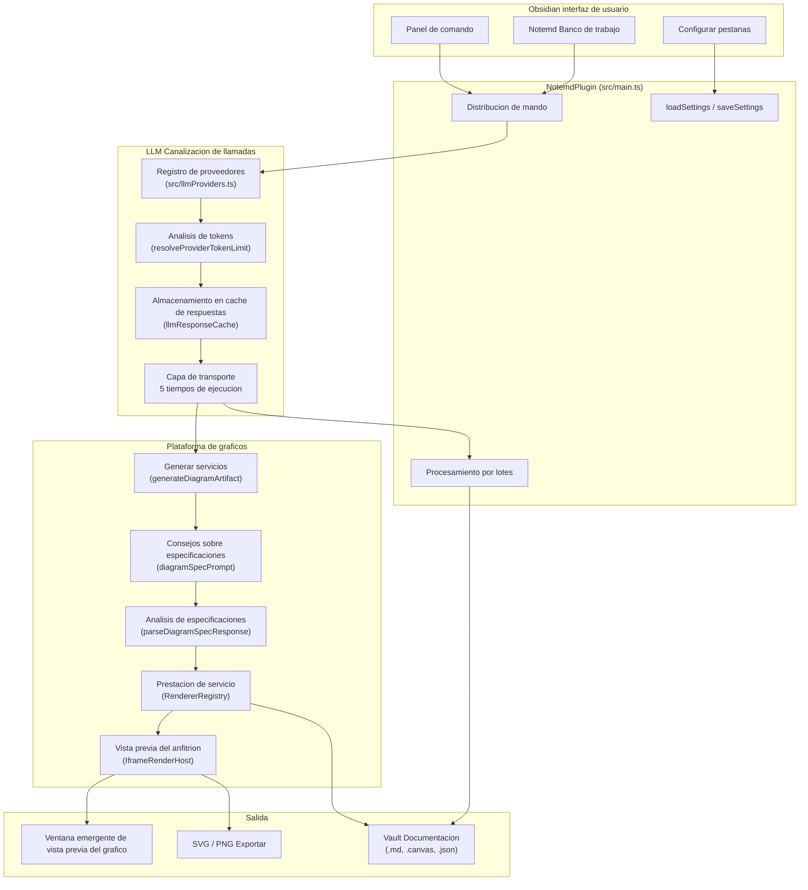
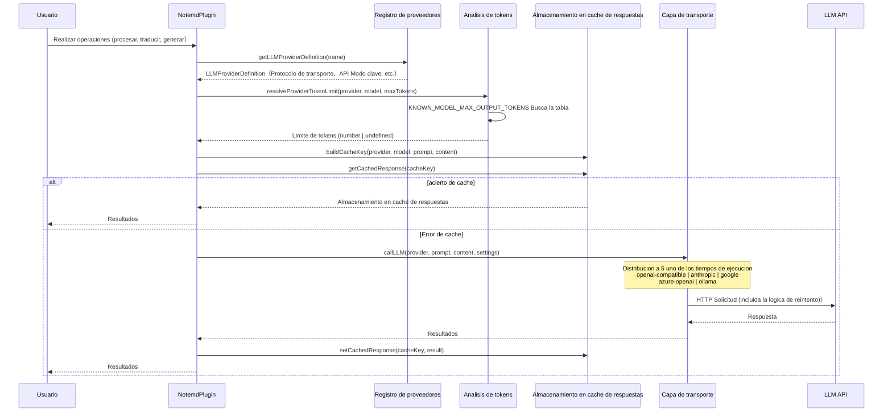
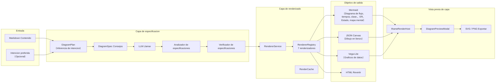

# Notemd Descripcion general de la arquitectura del sistema

> Actualizacion：2026-05-07

## Arquitectura del sistema



## LLM Canalizacion de llamadas



### Logica de analisis de tokens

```
Configuracion de usuario (maxTokens, provider.maxOutputTokens)
  → resolveProviderTokenLimit()
    → Prueba de conexion？ → Regresar 1
    → Proveedor maxOutputTokens Se establece la anulacion？
      → Modelos conocidos？ → min(Anular valor, Limite superior conocido)
      → Modelo desconocido？ → Anular valor (usar directamente）
    → Panorama general maxTokens Ya configurado？
      → Modelos conocidos？
        → maxTokens === DEFAULT？ → Limite superior del modelo conocido (automatico).）
        → De lo contrario → min(maxTokens, Limite superior conocido)
      → Modelo desconocido？
        → maxTokens === DEFAULT？ → undefined（API A tu propia discrecion，Cline Alineacion）
        → De lo contrario → maxTokens（Valores del usuario）
    → De lo contrario → Limite superior conocido ?? undefined
```

### Protocolos de transporte soportados

| Protocolo de transporte | Numero de proveedores | Acuerdo |
|---|---|---|
| `openai-compatible` | 22 proveedores | OpenAI Chat Completions API |
| `anthropic` | 1  | Anthropic Messages API |
| `google` | 1  | Google Gemini API |
| `azure-openai` | 1  | Azure OpenAI Deployment API |
| `ollama` | 1  | Ollama Native API |

## Plataforma de representacion de graficos



### Intenciones de graficos admitidas

| Intencion | Renderizar objetivo | Renderizador | Vista previa | Exportar |
|---|---|---|---|---|
| `mindmap` | mermaid | MermaidRenderer | Ventanas emergentes/iframe | SVG、PNG |
| `flowchart` | mermaid | MermaidRenderer | Ventanas emergentes/iframe | SVG、PNG |
| `sequence` | mermaid | MermaidRenderer | Ventanas emergentes/iframe | SVG、PNG |
| `classDiagram` | mermaid | MermaidRenderer | Ventanas emergentes/iframe | SVG、PNG |
| `erDiagram` | mermaid | MermaidRenderer | Ventanas emergentes/iframe | SVG、PNG |
| `stateDiagram` | mermaid | MermaidRenderer | Ventanas emergentes/iframe | SVG、PNG |
| `canvasMap` | json-canvas | JsonCanvasRenderer | Ventanas emergentes/iframe | SVG、Archivos fuente |
| `dataChart` | vega-lite | VegaLiteRenderer | Ventanas emergentes/iframe（Caja de arena） | SVG、Archivos fuente |

## Mapa del modulo

| Modulos | Responsabilidades |
|---|---|
| `src/main.ts` | Entrada de complementos, registro de comandos, orquestacion de procesos |
| `src/llmProviders.ts` | 26 Definiciones de proveedores, metadatos、KNOWN_MODEL mesa |
| `src/llmUtils.ts` | Distribucion de transporte, analisis de tokens, reintento, almacenamiento en cache de respuestas |
| `src/fileUtils.ts` | Procesamiento de documentos、Mermaid Reparacion, extraccion de conceptos. |
| `src/searchUtils.ts` | Busqueda en Internet、Tavily/DuckDuckGo Integracion |
| `src/translate.ts` | Proceso de traduccion (incluida la fragmentacion)） |
| `src/promptUtils.ts` | Palabras de indicacion de tarea (version anterior + spec-first） |
| `src/diagram/` | Modelo de dominio de grafico, adaptador y renderizador. |
| `src/rendering/` | Renderizar host, vista previa, exportar, tema |
| `src/ui/` | Configure pestanas, barras laterales, ventanas emergentes y paginas de bienvenida. |
| `src/i18n/` | 22 Lenguaje, estrategia linguistica de tareas. |
| `src/operations/` | operation registry、host adapter、capability/contract Disposicion de comando de exportacion y reutilizable. |
| `src/batchProgressStore.ts` | Recuperacion de interrupciones y persistencia del estado del lote. |
| `src/providerDiagnostics.ts` | LLM Diagnostico de conexion del proveedor |

## CLI Realidad fronteriza

Los hechos actuales del anfitrion deben expresarse claramente.：

- Envoltorio estable en nativo `obsidian-cli` Lo que se expone es `help`、`version`、`vaults`、`vault`、`doctor`、`native`、`gui`、`debug` Espere al escritorio/Entrada de depuracion
- Oficial inferior `obsidian` CLI Realmente apoyado `commands` Con `command id=<command-id>`，y se puede enumerar/Ejecute el comando de registro del complemento.
- Pero esto sigue siendo solo**Superficie de disparo de comando**，No es un protocolo de integracion de complementos maduro: tambien carece de parametros escritos, contratos de resultados de retorno, metadatos de capacidad y semantica de automatizacion estable.

Por lo tanto，Notemd El futuro de CLI La ruta aun no puede detenerse en "poner sidebar Mueva el boton al terminal”. Lo que realmente vale la pena extraer son las capacidades de bajo nivel que han comenzado a adoptar una forma independiente.：

- `src/providerDiagnostics.ts`
- `src/diagram/diagramGenerationService.ts`
- `src/workflowButtons.ts`
- `src/batchProgressStore.ts`
- `LLMProviderConfig.localOnly` Este tipo config/profile Semantica

La brecha en la arquitectura actual radica en：`src/main.ts` Todavia aguanto demasiado orchestration、UI Ciclo de vida y Obsidian runtime Acoplamiento. irrelevante en la formacion del anfitrion operation Antes de capas, complementos command IDs Aunque puede ser oficialmente CLI Disparadores, pero siguen siendo solo la superficie del producto y no deben considerarse como un proyecto de estabilizacion. API。

Pero la brecha es menor que antes：

- `src/operations/diagramGenerateOperation.ts` Ahora se puede reutilizar bajo la capa de comando. diagram Logica de ejecucion
- `src/operations/providerDiagnosticCommand.ts` Ahora toma el control de la capa de comando. provider diagnostic command orchestration
- `src/operations/diagramCommandHostAdapter.ts` Tomalo ahora Mermaid/artifact Guarda el final, directo Vega-Lite Vista previa del acuerdo y publico. diagram command wrapper（`runGenerateDiagramCommandWithHost`、`runPreviewExperimentalDiagramCommandWithHost`）
- `src/operations/configProfileCommands.ts` Tomalo ahora provider profile Importar, exportar y CLI capability/contract Acuerdo de exportacion
- `src/operations/providerDiagnosticReportPersistence.ts` Actualmente aceptando proyectos con evitacion de conflictos. provider diagnostic report Logica de creacion de archivos
- `src/operations/providerDiagnosticCommandHostAdapter.ts` Ahora realiza la carga del host, el cableado de descarga de informes y los comandos de diagnostico del desarrollador. notice Dar forma a la logica
- `src/operations/configProfileCommandHostAdapter.ts` Tomalo ahora config/profile Persistencia del Estado、CLI Exportar notice Dar forma e importar y exportar la logica de mapeo de errores
- `src/operations/providerConnectionTestCommandHostAdapter.ts` Ahora emprende el compartir provider Prueba de conexion settings Carga y pruebas subyacentes runner Interactivo con busy/reporter wrapper，Y ha sido reutilizado por la ruta de comando y la pagina de configuracion.
- `src/operations/noteProcessingCommandHostAdapter.ts` Ahora no solo emprendemos `process-current-add-links`、`process-folder-add-links`、`batch-generate-from-titles`、`generate-from-title` Con `research-and-summarize`，Aun asi seguir emprendiendo `translate-current-file`、`batch-translate-folder`、`extract-concepts-current`、`extract-concepts-folder`、`extract-original-text` Con `extract-concepts-and-generate-titles` de busy-guard、reporter ciclo de vida、notice/error-log Organizar la logica
- `src/operations/utilityCommandHostAdapter.ts` El expediente actual ahora tambien se acepta. duplicate check、duplicate cleanup、batch Mermaid fix Con single/batch formula fix de command orchestration；`check-for-duplicates` Ya no esta escrito en linea en el registro de comandos
- `src/operations/utilityCommandHostAdapter.ts` Ahora tambien aceptado duplicate cleanup Con batch Mermaid fix Eliminar confirmacion, sin archivo. notice Con exito notice Semantica, estos efectos secundarios del usuario ya no son `src/fileUtils.ts` Fuga
- `src/operations/registry.ts` El resto ahora tambien esta cubierto. selection/export Superficies de automatizacion adyacentes：`editor.create-link-and-generate`、`provider.profile.export`、`provider.profile.import`、`cli.capability-manifest.export` Con `cli.invocation-contract.export` Ya ingrese al mismo lote que los lotes anteriores. registry/capability/contract Superficie
- El primer lote `src/fileUtils.ts` La subseccion tambien se completa. write-heavy contract enrichment Verificacion：`processFile()` Regresa ahora `ProcessFileResult`，`generateContentForTitle()` Regresar `GenerateContentForTitleResult`，`batchGenerateContentForTitles()` Regresar `BatchGenerateContentForTitlesResult`，`runProcessFolderWithNotemdCommandWithHost()` Ahora tambien regresa la banda `savedCount`、`fileResults`、`errors` Con `cancelled` de `BatchProcessFolderResult`
- `src/fileUtils.ts` Ahora ya no decidas por tu cuenta que “no se puede hacer nada” Markdown Resultados de la generacion por lotes del lado del usuario para "Archivo"; solo regresa estructurado batch state，Este no-file notice Cambios semanticos `src/operations/noteProcessingCommandHostAdapter.ts` Emprender
- `src/fileUtils.ts` La cola restante del：`batchFixMermaidSyntaxInFolder()` Regresar `BatchMermaidFixResult`，`checkAndRemoveDuplicateConceptNotes()` Regresar `ConceptDedupeResult`，Confirmacion destructiva por host adapter Inyeccion，batch Mermaid El manejo sin archivos tambien se ha eliminado de utility-owned Cambiar a host-owned
- `src/operations/registry.ts` Ahora tambien se modela directamente `file.process-add-links`、`file.process-folder-add-links`、`content.generate-from-title`、`content.batch-generate-from-titles`、`mermaid.batch-fix`、`concept.dedupe`、`translate.*` Con `formula.*` de richer result schema，Por lo tanto capability export Con invocation-contract export No mas aplanamiento de estos flujos en una semantica de solo ruta o de solo conteo
- `src/fileUtils.ts` Con `src/extractOriginalText.ts` Ahora se aceptan mas estrechos runtime context，En lugar de depender directamente del concreto `NotemdPlugin` clase, que indica que el limite esta cambiando de wrapper El destacamento continua avanzando hacia utility Debilitamiento del acoplamiento tipo anfitrion.
- `src/main.ts` Ahora mantenga principalmente el registro de comandos.、host Estructura y mas diagram Ejecucion helper；Publico anterior de mayor valor direct command surface Ahora cambiado a Aprobado host adapter Proxy, ya no en linea busy/reporter/preview Logica del ciclo de vida
- Recien lanzado direct-surface wrapper El lote ha sido cubierto. `testLlmConnectionCommand`、`generateDiagramCommand` Con `previewExperimentalDiagramCommand`；Estas superficies ahora estan estructuradas. result Limites, no fire-and-forget de UI glue
- El ultimo nivel de refinamiento es：`diagram.generate` Debe entenderse como “independiente del anfitrion”. generation contract”，En lugar de mirar el presente active-file Otro nombre para el comando. esta en operation-level en `safe` / `read-only` Los metadatos describen explicitamente `sourceMarkdown -> DiagramGenerationResult` core；Mapeando el pasado command binding Aun mantenlo con sinceridad `requires-active-file` / `write-file` Semantica。
- Por lo tanto, la actual brecha real restante ya no es publica. command entrypoint mismo：`diagram.preview` Con `provider.connection.test` Ya disponible typed contract，save/artifact Tambien se ha ingresado la ruta de ejecucion real. `src/operations/diagramCommandExecution.ts`，y `diagram.generate` Ahora tambien devuelve explicito follow-through Detalles（`kind`、`outputPath`、`previewOpened`、`autoFixAttempted`、`artifactTarget`），Sin dejar de conservar la capa superior compatible con versiones anteriores `outputPath` / `previewOpened` Campo。
- La capa de verificacion semantica local del mantenedor ya no es solo una descripcion de texto.：`npm run verify:diagram-semantics` No se puede generar ninguno secrets de Markdown Consulte la plantilla, que contiene puertas duras de almacen.、vault Percibido CLI Verifique el comando y Mermaid / JSON Canvas / Vega-Lite El bloque de pruebas no depende del seguimiento en el almacen. vault Camino o live Credenciales。
- Se ha aclarado el orden de la siguiente etapa: primero `diagram.generate` Sea independiente del host core，Pon estos aterrizados typed follow-through Tratado como debajo command-completion Capa, hazlo de nuevo packaging / semantic verification La convergencia posterior, y finalmente reabierta con mas fuerza public CLI Declaracion o reordenamiento estructural mayor。

## Decisiones clave de diseno

1. **Especificacion: primera generacion de graficos**：LLM Estructuracion de la produccion `DiagramSpec` JSON，Mas que original Mermaid Gramatica. Intentos de desacoplamiento y renderizadores。
2. **Distribucion de conductores de transporte.**：OpenAI-compatible Los proveedores comparten un tiempo de ejecucion. Sin ruta de codigo por proveedor。
3. **Cline Analisis del token de alineacion**：El modelo desconocido viene dado por API A exclusivo criterio del proveedor. Tabla de metadatos de uso de modelo conocido。
4. **operation-core Con command-binding Capas**：registry en operation Los metadatos pueden describir reutilizables independientemente del host. core，La orden de envio actual permanece active-file、write-file o preview-bound Semantica del producto real de。`diagram.generate` Es la prueba mas clara en la actualidad.。
5. **Iframe Vista previa del anfitrion**：Vega-Lite y HTML En la caja de arena iframe Representacion media。Mermaid Representacion en linea。
6. **Configuracion del proveedor de almacenamiento local**：API La clave se puede conservar localmente en el dispositivo y la configuracion del flujo de trabajo se puede sincronizar.。
7. **Almacenamiento en cache de respuestas**：5 minutos TTL Lo mismo dentro de 0. LLM La llamada devuelve resultados almacenados en cache。

## Verificacion

- `npm run build` — TypeScript compilar + esbuild Embalaje
- `npm test -- --runInBand` — completo Jest La matriz es actualmente 137 Equipos、871 prueba; si en `/.worktrees/` checkout Validacion, utilice en su lugar `npx jest --runInBand --config /tmp/notemd-worktree-jest.cjs`，Porque el almacen esta por defecto Jest ignore Las reglas excluiran worktree Camino
- `npm run audit:i18n-ui` — Sin codificacion estricta UI cuerda
- `npm run audit:render-host` — El host de renderizado es autonomo en main.js
- `git diff --check` — Higiene de los espacios en blanco
